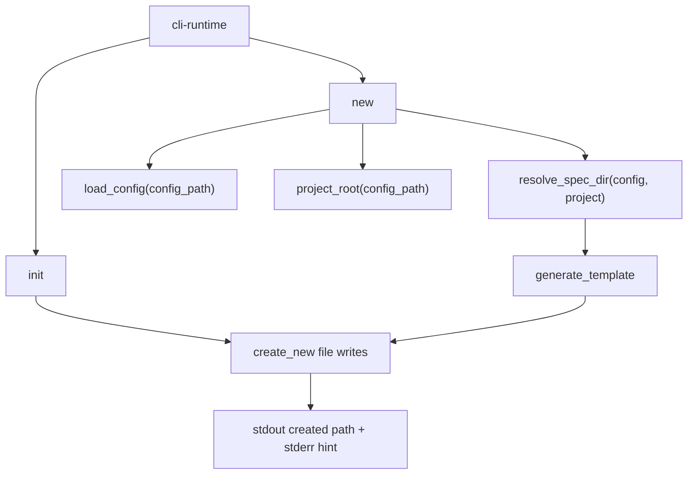

---
supersigil:
  id: authoring-commands/design
  type: design
  status: implemented
title: "CLI Authoring Commands"
---

```supersigil-xml
<Implements refs="authoring-commands/req" />
<DependsOn refs="cli-runtime/design, config/design, workspace-projects/design" />
<TrackedFiles paths="crates/supersigil-cli/src/commands/init.rs, crates/supersigil-cli/src/commands/new.rs, crates/supersigil-cli/tests/cmd_new.rs, crates/supersigil-cli/tests/clap_parse.rs" />
```

## Overview

`authoring-commands` is the CLI domain for bootstrapping and scaffolding:

- `init` creates the first `supersigil.toml`
- `new` creates a starter spec document

`init` still follows the single-project root-spec convention. `new` supports
both single-project mode (writes to `specs/`) and multi-project mode (writes
to the project-local spec root determined by `--project`).

## Architecture



## Runtime Flow

### `init`

1. Treat `init` as a config-free command.
2. Attempt to create `supersigil.toml` in the current directory with
   `OpenOptions::create_new(true)`.
3. Write the current default scaffold:

```toml
paths = ["specs/**/*.md"]
```

4. Map `AlreadyExists` to a command failure message rather than overwriting.
5. Print `Created supersigil.toml` to stdout.
6. Print the `new` plus `lint` next-step hint to stderr.

`init` does not currently branch on workspace mode or offer a `projects.*`
scaffold path.

### `new`

1. Treat `new` as a config-bound command.
2. Load config from the resolved `supersigil.toml`.
3. Determine whether the requested type is built-in or configured.
4. If the type is unknown, warn on stderr but continue anyway.
5. Resolve the spec directory via `resolve_spec_dir(config, project)`:
   - In single-project mode without `--project`: use `specs/`.
   - In single-project mode with `--project`: error.
   - In multi-project mode without `--project`: error.
   - In multi-project mode with `--project`: derive the directory prefix from
     the named project's first glob pattern using `glob_prefix`.
   - If the named project does not exist in config: error listing available
     project names.
6. Derive the current `type_short`:
   - `requirements` -> `req`
   - everything else -> unchanged
7. Derive the Generated_Doc_ID as `{feature}/{type_short}`.
8. Derive the Generated_Doc_Path as
   `{spec_dir}{feature}/{feature}.{type_short}.md`.
9. Resolve `project_root(config_path)` and probe for the sibling requirement
   file `{spec_dir}{feature}/{feature}.req.md`.
10. Generate the scaffold body.
11. Create parent directories as needed and create the file with
    `create_new(true)`.
12. Print the created path to stdout and the lint hint to stderr.

The `new` input is a feature slug rather than an arbitrary document ID.

## Template Model

### Requirements

The requirements template emits:

- front matter for `{feature}/req`
- `Introduction`
- `Definitions`
- `Requirement 1: Title`
- one starter `AcceptanceCriteria` block with `Criterion id="req-1-1"`

### Design

The design template emits:

- front matter for `{feature}/design`
- a live `<Implements refs="{feature}/req" />` only when the sibling
  requirement file exists
- otherwise a commented-out `Implements` placeholder
- commented `DependsOn` and `TrackedFiles` placeholders
- standard sections for overview, architecture, key types, error handling,
  testing strategy, and alternatives considered

### Tasks

The tasks template emits:

- front matter for `{feature}/tasks`
- `Overview`
- one starter `<Task id="task-1" status="draft">`
- commented examples for subtasks and dependency chains

Unknown document types fall through to a frontmatter-only scaffold. That is
current code behavior, but it is treated as product debt rather than as a
stable intended workflow.

## Key Helpers

```rust
fn type_short_name(doc_type: &str) -> &str {
    match doc_type {
        "requirements" => "req",
        other => other,
    }
}

fn resolve_spec_dir(config: &Config, project: Option<&str>) -> Result<String, CliError>

fn generate_template(doc_type: &str, id: &str, feature: &str, req_exists: bool) -> String
```

`resolve_spec_dir` determines the output directory by inspecting the config
mode and `--project` flag. In multi-project mode it uses the core
`glob_prefix` function to extract the static directory prefix from the
selected project's first glob pattern.

## Testing Strategy

- [cmd_new.rs](/home/joni/.local/src/supersigil/crates/supersigil-cli/tests/cmd_new.rs)
  covers lint-clean requirements/tasks scaffolds, graph-safe design scaffolds,
  auto-filled `Implements` when the sibling requirement exists, multi-project
  file placement, workspace project fallback to `specs/`, unknown project
  errors, single-project mode rejection of `--project`, and sibling req
  detection under project-local directories.
- [clap_parse.rs](/home/joni/.local/src/supersigil/crates/supersigil-cli/tests/clap_parse.rs)
  covers the parse surface for `init` and `new`, including `--project`/`-p`.

## Current Gaps

- There is no dedicated end-to-end CLI coverage for `init`, including success
  output and the existing-file failure path.
- `init` still scaffolds a single-project config only. It does not know how to
  bootstrap `projects.*`.
- `new` currently warns on unknown document types but still creates a
  frontmatter-only file. That behavior is observable, but it is not clearly
  intended.
- `new` accepts a Feature_Slug, not an arbitrary document ID, so it cannot
  currently scaffold nested IDs such as `auth/req/login`.
