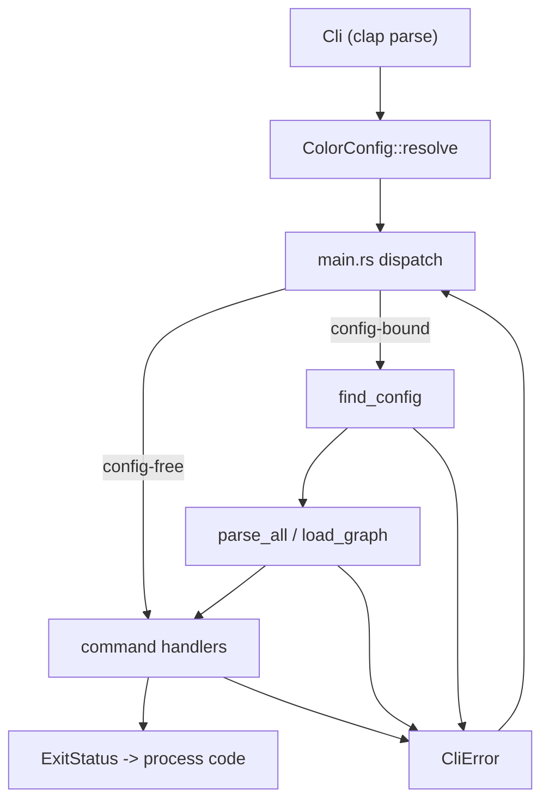

---
supersigil:
  id: cli-runtime/design
  type: design
  status: draft
title: "CLI Runtime"
---

<Implements refs="cli-runtime/req" />
<DependsOn refs="workspace-projects/design, config/design, document-graph/design, verification-engine/design" />
<TrackedFiles paths="crates/supersigil-cli/src/main.rs, crates/supersigil-cli/src/lib.rs, crates/supersigil-cli/src/commands.rs, crates/supersigil-cli/src/loader.rs, crates/supersigil-cli/src/format.rs, crates/supersigil-cli/src/error.rs, crates/supersigil-cli/tests/clap_parse.rs, crates/supersigil-cli/tests/loader.rs" />

## Overview

`cli-runtime` is the thin shell around the rest of supersigil. It owns:

- process startup in `main.rs`
- clap command and argument definitions
- locating `supersigil.toml`
- the shared parse/build loader pipeline
- semantic display configuration and shared writers
- top-level runtime error and exit mapping

It does not own the detailed behavior of `ls`, `plan`, `verify`, `new`, or the
other commands after dispatch. Those behaviors live in their command domains.

## Architecture



## Runtime Flow

### Startup

1. Parse `Cli` with clap.
2. Resolve `ColorConfig` from the global `--color` flag and environment.
3. Special-case `import` and `init` as config-free commands.
4. For every other command:
   - call `find_config(current_dir)`
   - derive `project_root(config_path)`
   - dispatch into the command handler with the resolved color config and
     config path
5. Convert the returned `ExitStatus` into the process exit code.
6. If any command or loader stage returns `CliError`, print `error: {e}` on
   stderr and exit 1.

### Loader Pipeline

`loader.rs` exposes two public entry points:

- `parse_all(config_path)` for commands that can tolerate parse errors and want
  document-plus-error collections
- `load_graph(config_path)` for commands that require a fully linked graph

Internally the loader:

1. loads `Config`
2. collects spec discovery globs from single-project `paths` or all
   `projects[*].paths`
3. discovers files relative to the project root
4. merges built-in and configured component definitions
5. parses files in parallel, bounded by available CPUs and a max of 8 workers
6. rewrites successful document paths to be relative to the project root
7. optionally builds the `DocumentGraph`

## Key Types

```rust
pub struct Cli {
    pub color: ColorChoice,
    pub command: Command,
}

pub enum ExitStatus {
    Success,
    VerifyFailed,
    VerifyWarnings,
}

pub struct ColorConfig {
    color: bool,
    unicode: bool,
}

pub enum CliError {
    ConfigNotFound { start_dir: PathBuf },
    Config(Vec<ConfigError>),
    Parse(Vec<ParseError>),
    Graph(Vec<GraphError>),
    ComponentDef(Vec<ComponentDefError>),
    Query(QueryError),
    Import(ImportError),
    Verify(VerifyError),
    Io(std::io::Error),
    LintFailed,
    CommandFailed(String),
}
```

`commands.rs` is also part of the runtime boundary because it defines the typed
clap argument structs that every command handler consumes after parse.

## Display Model

The runtime styling model is centralized in `format.rs`:

- `Token` defines semantic style roles such as `Header`, `DocId`, `Path`, and
  `Warning`
- `ColorConfig::paint(token, text)` returns a display wrapper rather than raw
  strings with embedded escape codes
- symbol helpers (`ok`, `err`, `warn`, `info`) are the shared status markers
- `hint()` is the shared stderr helper for "next step" messages
- `write_json` and `write_yaml` are shared stdout writers for data-mode output

The current implementation intentionally couples Unicode to the resolved color
decision. That keeps the terminal presentation model simple, but it also means
there is no separate "ASCII with color" mode.

## Testing Strategy

- [clap_parse.rs](/home/joni/.local/src/supersigil/crates/supersigil-cli/tests/clap_parse.rs)
  covers the public clap surface and argument parsing.
- [loader.rs](/home/joni/.local/src/supersigil/crates/supersigil-cli/tests/loader.rs)
  covers upward config discovery, parse-all behavior, and fatal graph loading.
- [format.rs](/home/joni/.local/src/supersigil/crates/supersigil-cli/src/format.rs)
  contains unit coverage for color resolution helpers, semantic paint behavior,
  symbol fallback, completed-task summaries, and dependency-graph rendering.

## Current Gaps

- The runtime has unit coverage for `ColorConfig`, but it does not have
  process-level tests for `FORCE_COLOR` / `NO_COLOR` precedence or for the
  top-level `--color` flag overriding those environment variables.
- Exit code 2 for verify warnings-only is implemented in `main.rs`, but there is
  not yet a binary-level test that exercises the full process exit path.
