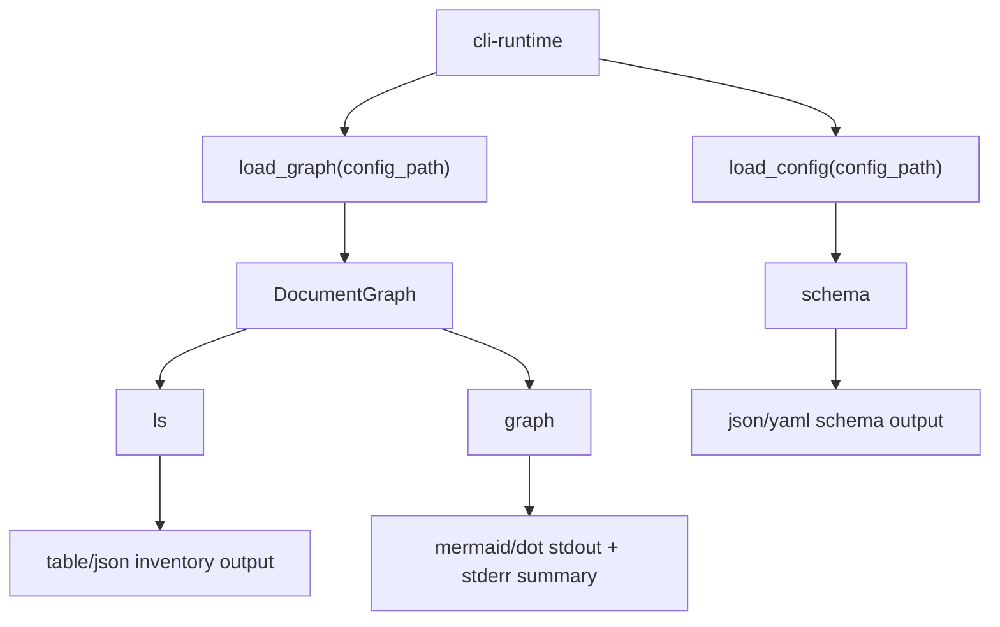

---
supersigil:
  id: inventory-queries/design
  type: design
  status: draft
title: "CLI Inventory Queries"
---

<Implements refs="inventory-queries/req" />
<DependsOn refs="cli-runtime/design, workspace-projects/design, config/design, document-graph/design" />
<TrackedFiles paths="crates/supersigil-cli/src/commands/ls.rs, crates/supersigil-cli/src/commands/schema.rs, crates/supersigil-cli/src/commands/graph.rs, crates/supersigil-cli/tests/cmd_ls.rs, crates/supersigil-cli/tests/cmd_schema.rs, crates/supersigil-cli/tests/clap_parse.rs" />

## Overview

`inventory-queries` is the CLI domain for exploring what the workspace looks
like right now rather than what work remains:

- `ls` inventories discovered documents
- `schema` exports the current authoring schema
- `graph` visualizes resolved document relationships

The important current boundary is that `ls` and `graph` are graph-backed
commands, while `schema` is intentionally config-backed only. That split means
schema export still works even when the current spec corpus would fail to parse
or link.

## Architecture



## Runtime Flow

### `ls`

1. Reuse the shared CLI runtime to load a fully linked graph.
2. Iterate discovered documents and apply the optional `type`, `status`, and
   `project` filters as an ANDed predicate.
3. Map each surviving document to a listing entry of ID, current type/status,
   and path.
4. Sort entries by ID for stable output.
5. Render either:
   - terminal: aligned table, relative paths when possible, count footer
   - JSON: array of listing entries

The current terminal output is richer than the older root CLI spec. It is not
"one line per document"; it is a padded table with headers and a trailing
document count.

### `schema`

1. Load config directly from `supersigil.toml`.
2. Merge built-in component definitions with configured component overrides and
   additions through `ComponentDefs::merge`.
3. Start from built-in document types and extend them with configured document
   types from `config.documents.types`.
4. Serialize the resulting schema as JSON or YAML.

Because `schema` never calls the shared discovery or parser pipeline, it stays
available even when the current `specs/**/*.mdx` files are malformed.

### `graph`

1. Reuse the shared CLI runtime to load a fully linked graph.
2. Emit either Mermaid or Graphviz DOT.
3. Render one node per document.
4. Render one edge per resolved top-level component whose attributes include
   `refs`.
5. Send the graph body to stdout.
6. Send the node/edge count summary and pipe-to-file hint to stderr.

The current implementation treats `graph` as workspace-wide only. It has no
project filter or alternate scope selection.

## Key Types

```rust
struct DocEntry {
    id: String,
    doc_type: Option<String>,
    status: Option<String>,
    path: String,
}

struct SchemaOutput {
    components: BTreeMap<String, SchemaComponentDef>,
    document_types: BTreeMap<String, SchemaDocumentTypeDef>,
}

pub enum GraphFormat {
    Mermaid,
    Dot,
}
```

Two current serialization details matter for downstream consumers:

- `ls --format json` omits absent `doc_type` and `status` fields instead of
  serializing them as explicit nulls.
- `schema` omits false or empty fields such as missing descriptions or empty
  attribute maps to keep the output compact.

## Testing Strategy

- [cmd_ls.rs](/home/joni/.local/src/supersigil/crates/supersigil-cli/tests/cmd_ls.rs)
  covers list success, `type` and `status` filtering, JSON output, empty
  results, the `list` alias, and multi-project `--project` filtering.
- [ls.rs](/home/joni/.local/src/supersigil/crates/supersigil-cli/src/commands/ls.rs)
  contains unit coverage for aligned table layout, Unicode-versus-ASCII
  separators, relative path display, empty-result messaging, and count output.
- [cmd_schema.rs](/home/joni/.local/src/supersigil/crates/supersigil-cli/tests/cmd_schema.rs)
  covers config-only schema export, JSON/YAML formats, built-in schema content,
  configured overrides, field omission, and missing-config failure.
- [clap_parse.rs](/home/joni/.local/src/supersigil/crates/supersigil-cli/tests/clap_parse.rs)
  covers the current parse surface for `graph` and its `--format` flag.

## Current Gaps

- There is no dedicated end-to-end CLI test for `graph` output. The current
  graph behavior is specified mainly from implementation plus clap parse tests.
- `ls` terminal behavior is well unit-tested, but the JSON shape is only lightly
  exercised at the CLI level.
- `graph` has no project-scoped mode today, so inventory visualization remains
  workspace-wide even in multi-project repos.
