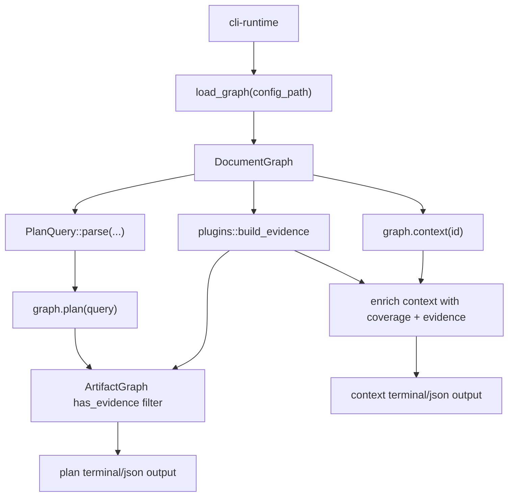

---
supersigil:
  id: work-queries/design
  type: design
  status: approved
title: "CLI Work Queries"
---

```supersigil-xml
<Implements refs="work-queries/req" />
<DependsOn refs="cli-runtime/design, document-graph/design, verification-engine/design" />
<TrackedFiles paths="crates/supersigil-cli/src/commands/context.rs, crates/supersigil-cli/src/commands/plan.rs, crates/supersigil-cli/src/commands/verify.rs, crates/supersigil-cli/src/format.rs, crates/supersigil-cli/tests/cmd_context.rs, crates/supersigil-cli/tests/cmd_plan.rs, crates/supersigil-core/src/graph/query.rs, crates/supersigil-verify/src/report.rs, crates/supersigil-verify/src/lib.rs" />
```

## Overview

`work-queries` is the CLI domain for inspecting current work state:

- `context` shows one document together with its verification targets,
  implementations, references, and linked tasks.
- `plan` shows outstanding verification work for one document, a prefix slice,
  or the whole workspace.

This domain sits above the core query model in `supersigil-core`, but below the
rest of the CLI feature set. It owns query-resolution hints, terminal shaping,
and the current evidence-aware filtering step that turns raw graph output into
operator-facing work views.

## Architecture



## Runtime Flow

### `context`

1. Reuse the shared CLI runtime to load config and graph.
2. Resolve one explicit document ID through `graph.context(id)`.
3. If the document is missing, print the shared `supersigil ls` hint and return
   a query failure.
4. Build plugin evidence via `plugins::build_evidence` to obtain an
   `ArtifactGraph` with coverage data. Warn about plugin findings on stderr.
5. Enrich each criterion with coverage state, VerifiedBy strategies, and
   evidence entries from the `ArtifactGraph`.
6. Render either:
   - JSON: an `EnrichedContextOutput` with `covered`, `verified_by`, and
     `evidence` fields on each criterion
   - terminal: heading, status, then non-empty sections for criteria (with
     coverage markers, verified-by lines, and evidence lines), implementing
     docs, referencing docs, and linked tasks

The CLI layer delegates graph queries to `supersigil-core` and evidence
assembly to `supersigil-verify`. It owns the enrichment step that merges
these two sources into the operator-facing output.

### `plan`

1. Reuse the shared CLI runtime to load config and graph.
2. Resolve the user query into `PlanQuery::All`, `PlanQuery::Document`, or
   `PlanQuery::Prefix`.
3. If the query matches nothing, print the shared `supersigil ls` hint and
   return a query failure.
4. Call `graph.plan(&query)` to get the raw outstanding targets and task sets.
5. Build plugin evidence and warn on stderr about non-fatal plugin findings.
6. Remove any outstanding target already backed by ArtifactGraph evidence.
7. Render either:
   - JSON: the filtered `PlanOutput`
   - terminal: dependency graph, then default actionable view or `--full`
     view, followed by any completed-task summary

## Actionable Filtering Model

The default terminal `plan` view is stricter than the raw graph plan. It
partitions filtered outstanding targets into actionable and blocked sets:

1. Compute completed task IDs from `completed_tasks`.
2. Compute pending task IDs from `pending_tasks`.
3. Mark a pending task as unblocked when every dependency is either completed
   or absent from the pending set.
4. Treat criteria implemented by at least one unblocked task as actionable.
5. Treat criteria with no pending implementing task as actionable too.
6. Treat the rest as blocked and collapse them to a count in default mode.

Verbose mode bypasses that collapse and shows the full outstanding-target set
plus the full pending task list.

## Key Types

```rust
pub struct ContextOutput {
    pub document: SpecDocument,
    pub criteria: Vec<TargetContext>,
    pub decisions: Vec<DecisionContext>,
    pub linked_decisions: Vec<LinkedDecision>,
    pub implemented_by: Vec<DocRef>,
    pub referenced_by: Vec<String>,
    pub tasks: Vec<TaskInfo>,
}

pub struct PlanOutput {
    pub outstanding_targets: Vec<OutstandingTarget>,
    pub pending_tasks: Vec<TaskInfo>,
    pub completed_tasks: Vec<TaskInfo>,
    pub actionable_tasks: Vec<String>,
    pub blocked_tasks: Vec<String>,
}

pub struct TaskInfo {
    pub tasks_doc_id: String,
    pub task_id: String,
    pub status: Option<String>,
    pub body_text: Option<String>,
    pub implements: Vec<(String, String)>,
    pub depends_on: Vec<String>,
}

pub enum PlanQuery {
    Document(String),
    Prefix(String),
    All,
}
```

The important current boundary is that `PlanQuery`, `ContextOutput`, and
`PlanOutput` are defined in `supersigil-core`, while the CLI owns:

- fallback hints on query errors
- plugin warning emission
- ArtifactGraph evidence suppression for `plan`
- terminal-only actionable versus `--full` presentation

## Qualified Task Identity

### Problem

`actionable_tasks`, `blocked_tasks`, and `depends_on` use bare `task_id`
strings. The `GraphRenderer` and `partition_tasks` also key by bare `task_id`.
When two task documents share a bare ID (e.g. both have `task-1`), the HashMap
overwrites one entry silently and the actionable/blocked partition produces
wrong results.

### Qualified_Task_Ref Format

Follow the existing `doc_id#fragment` convention used by criterion refs:

```
tasks_doc_id#task_id
```

For example: `auth/tasks/login#task-1-1`.

This keeps the format consistent with `CriterionRefEntry.ref_string` and
avoids introducing a second ref syntax. Agents already know how to split on
`#` to get the document and fragment parts.

### Changes to Key Types

`PlanOutput` fields change from `Vec<String>` of bare IDs to
`Vec<String>` of Qualified_Task_Refs:

```rust
pub struct PlanOutput {
    pub outstanding_targets: Vec<OutstandingTarget>,
    pub pending_tasks: Vec<TaskInfo>,
    pub completed_tasks: Vec<TaskInfo>,
    pub actionable_tasks: Vec<String>,  // now "doc#id" qualified
    pub blocked_tasks: Vec<String>,     // now "doc#id" qualified
}
```

`TaskInfo.depends_on` changes to always use Qualified_Task_Refs:

```rust
pub struct TaskInfo {
    pub tasks_doc_id: String,
    pub task_id: String,
    pub status: Option<String>,
    pub body_text: Option<String>,
    pub implements: Vec<(String, String)>,
    pub depends_on: Vec<String>,  // now "doc#id" qualified
}
```

The `depends` attribute on `<Task>` components contains bare task IDs scoped
to the same document. When building `TaskInfo`, the graph builder qualifies
each dependency by prepending the owning `tasks_doc_id`. Cross-document task
dependencies are not supported in the `depends` attribute; the graph pipeline
(cycle detection and topological sort) validates dependencies against sibling
tasks within the same document only.

### Changes to partition_tasks

`partition_tasks` currently builds `HashSet<&str>` from bare `task_id`. It
changes to build qualified keys:

```rust
fn qualified_ref(task: &TaskInfo) -> String {
    format!("{}#{}", task.tasks_doc_id, task.task_id)
}

fn partition_tasks(
    pending_tasks: &[TaskInfo],
    completed_tasks: &[TaskInfo],
) -> (Vec<String>, Vec<String>) {
    let completed_ids: HashSet<String> =
        completed_tasks.iter().map(qualified_ref).collect();
    let pending_ids: HashSet<String> =
        pending_tasks.iter().map(qualified_ref).collect();
    // ...compare depends_on against qualified sets...
}
```

### Changes to GraphRenderer

`GraphRenderer` currently uses bare `task_id` as HashMap keys. It changes to
use the qualified ref as the internal key while displaying the bare `task_id`
in terminal output (since the `tasks_doc_id` is already shown as a group
heading). The internal keying prevents collision; the display remains compact.

### Terminal Display

The terminal dependency graph already groups tasks by `tasks_doc_id` in the
completed-task summary. For the dependency graph itself, task IDs are shown
bare within their group since the group heading provides the document context.
If a cross-document dependency exists, the rendered label includes the full
qualified ref to disambiguate.

## Compact JSON Defaults

### Problem

`context --format json` includes the full `SpecDocument` with its raw
`components` tree, then re-derives `criteria`, `decisions`, etc. from that
same tree. Agents use the derived fields; the raw components are redundant
debug data that inflates the payload.

`verify --format json` always attaches `evidence_summary.records` and
`evidence_summary.coverage` when any evidence exists, even on clean runs.
Agents checking for clean status don't need per-record or per-target detail.

`plan --format json` includes the full `completed_tasks` array with `body_text`
on every task. When a project has hundreds of completed tasks, this can be
>100 KB of data that agents rarely need. The `body_text` field on remaining
items similarly inflates the payload with prose that duplicates the spec files.

### Detail Levels

Introduce a `--detail` flag with two levels:

| Level | Behavior |
|-------|----------|
| `compact` (default) | Omit `document.components` from context; omit `evidence_summary.records` and `evidence_summary.coverage` from verify when clean; omit `completed_tasks` and `body_text` from plan |
| `full` | Include everything |

The flag is `--detail compact|full`. The default is `compact` so existing
agent workflows get smaller payloads without changes. Human debugging
workflows use `--detail full`.

### Implementation: Context

Use `#[serde(skip_serializing_if)]` on `SpecDocument.components` is not
viable because the field is on a shared type. Instead, the CLI serialization
step conditionally strips the components before writing JSON:

```rust
// In context.rs JSON path:
if detail == Detail::Compact {
    ctx.document.components.clear();
}
write_json(&ctx)?;
```

This mutates the output struct before serialization rather than adding serde
annotations to the shared `SpecDocument` type. The struct is already owned by
the CLI at this point and not reused.

### Implementation: Verify

The `VerificationReport` already uses
`#[serde(skip_serializing_if = "Option::is_none")]` on `evidence_summary`.
For compact mode, strip the `records` vec from the summary before
serialization when the result is clean:

```rust
// In verify.rs JSON path:
if detail == Detail::Compact && report.overall_status == ResultStatus::Clean {
    if let Some(ref mut summary) = report.evidence_summary {
        summary.records.clear();
        summary.coverage.clear();
    }
}
```

This keeps `conflict_count` visible while removing the per-record and
per-target bulk that dominates clean-run payloads.

### Implementation: Plan

Strip `completed_tasks` and `body_text` from the output before serialization
in compact mode:

```rust
// In plan.rs JSON path:
if detail == Detail::Compact {
    plan.completed_tasks.clear();
    for task in &mut plan.pending_tasks {
        task.body_text = None;
    }
    for target in &mut plan.outstanding_targets {
        target.body_text = None;
    }
}
```

This keeps the structural data (IDs, status, implements, depends_on,
actionable/blocked) intact while dropping the prose that duplicates
the spec files.

### Detail Flag Placement

The `--detail` flag applies to JSON output only. In terminal mode it is
ignored (terminal rendering already selects what to show). The flag is added
to `ContextArgs` and `VerifyArgs`. If other commands later benefit from the
same flag, the `Detail` enum can be shared through the CLI format module.

```rust
#[derive(Clone, Copy, Default)]
pub enum Detail {
    #[default]
    Compact,
    Full,
}
```

## Context Verification State

### Problem

The `context` command shows the structural neighborhood of a document —
criteria, references, implementations, tasks — but not whether criteria are
actually covered by tests. Users must run `status <id>` separately to see
coverage, breaking their flow when exploring a document.

### Evidence Pipeline

`context` reuses the same evidence pipeline as `status` and `plan`:

```rust
let (config, graph) = loader::load_graph(config_path)?;
let project_root = loader::project_root(config_path);
let inputs = supersigil_verify::VerifyInputs::resolve(&config, project_root);
let (artifact_graph, plugin_findings) =
    plugins::build_evidence(&config, &graph, project_root, None, &inputs);
plugins::warn_plugin_findings(&plugin_findings, color);
```

This adds evidence discovery overhead to `context`, but the same overhead
already exists in `status` and `plan`, and users benefit from seeing coverage
inline.

### Enriched Output Types

The core `TargetContext` stays unchanged (supersigil-core remains
evidence-unaware). The CLI defines enrichment types:

```rust
#[derive(Debug, Serialize)]
struct EnrichedContextOutput {
    document: SpecDocument,
    criteria: Vec<EnrichedTargetContext>,
    decisions: Vec<DecisionContext>,
    linked_decisions: Vec<LinkedDecision>,
    implemented_by: Vec<DocRef>,
    referenced_by: Vec<String>,
    tasks: Vec<TaskInfo>,
}

#[derive(Debug, Serialize)]
struct EnrichedTargetContext {
    id: String,
    target_ref: String,
    body_text: Option<String>,
    covered: bool,
    verified_by: Vec<String>,
    evidence: Vec<EvidenceEntry>,
    referenced_by: Vec<DocRef>,
}

#[derive(Debug, Serialize)]
struct EvidenceEntry {
    test_name: String,
    file: String,
    line: usize,
}
```

The enrichment step walks each criterion's component children to extract
VerifiedBy strategy labels (reusing the same formatting as `status.rs`), looks
up `artifact_graph.has_evidence(doc_id, crit_id)` for the covered flag, and
queries `artifact_graph.evidence_for(doc_id, crit_id)` for evidence records.

Evidence file paths are made project-root-relative for display.

### Terminal Rendering

```
## Verification targets:
- login-succeeds: WHEN valid credentials ... [covered]
  verified by: tag:auth-login
  evidence: test_user_login (tests/auth.rs:42)
  evidence: test_login_with_mfa (tests/auth.rs:87)
  -> Referenced by: auth/design (in-progress)
- login-fails: WHEN invalid credentials ... [uncovered]
  verified by: tag:auth-fail
  -> Referenced by: auth/design (in-progress)
```

- `[covered]` uses `Token::StatusGood`, `[uncovered]` uses `Token::StatusBad`
- `verified by:` and `evidence:` lines are indented under the criterion
- Evidence lines appear after verified-by lines and before "Referenced by" lines

### JSON Rendering

For JSON output, the `EnrichedContextOutput` replaces `ContextOutput` as the
serialization target. The `--detail compact` behavior (clearing
`document.components`) applies to the enriched struct the same way.

## Testing Strategy

- [cmd_context.rs](../../tests/cmd_context.rs)
  covers basic success output, JSON output, and unknown-ID failure for
  `context`.
- [cmd_plan.rs](../../tests/cmd_plan.rs)
  covers exact and prefix query selection, dependency graph rendering,
  actionable filtering, `--full` mode, JSON output, and stderr-only plugin
  warnings.
- [query.rs](../../../supersigil-core/src/graph/query.rs)
  contains unit coverage for `PlanQuery::parse` and the task-blocking partition
  logic that the CLI reuses for default `plan` output.

New test coverage for Requirement 5:

- Unit tests in `query.rs` for `partition_tasks` with overlapping bare task
  IDs from different documents: verify they are classified independently.
- Unit tests in `format.rs` for `GraphRenderer` with duplicate bare IDs:
  verify both tasks appear in the rendered output without collision.
- Integration test in `cmd_plan.rs`: a fixture with two task documents sharing
  a bare `task-1`, asserting JSON `actionable_tasks` contains qualified refs
  and the terminal graph renders both tasks.

New test coverage for Requirement 6:

- Integration test in `cmd_context.rs`: default JSON output does not contain
  `components` key inside `document`; with `--detail full` it does.
- Integration test in `cmd_verify.rs`: default JSON for a clean verify run
  does not contain `evidence_summary.records` or non-empty
  `evidence_summary.coverage`; with `--detail full` it does.
- Integration test in `cmd_plan.rs`: default JSON output omits
  `completed_tasks` and `body_text`; with `--detail full` they are present.

New test coverage for Requirement 7:

- Unit tests in `context.rs` for the enrichment logic: a criterion with
  evidence shows `[covered]`, verified-by lines, and evidence lines in
  terminal output. A criterion without evidence shows `[uncovered]`.
- Unit tests for JSON enrichment: enriched output includes `covered`,
  `verified_by`, and `evidence` fields on each criterion.
- Existing integration tests in `cmd_context.rs` continue to pass (the output
  is a superset of the previous output).

## Design Notes

- The evidence-aware filtering step for `plan` lives in CLI glue rather than
  the lower-level query model. This is the intended boundary: `supersigil-core`
  stays evidence-unaware, the CLI assembles evidence and filters plan output.
- The `--detail` flag is scoped to JSON output. Terminal mode already curates
  what to show; adding a detail level there would conflict with the existing
  `--full` flag on `plan`.
- Qualifying `depends_on` at build time (when `TaskInfo` is constructed from
  parsed components) keeps the qualification logic in one place rather than
  scattering it across consumers.
- The `context` enrichment with verification state follows the same boundary:
  `supersigil-core` stays evidence-unaware, the CLI assembles evidence and
  enriches the context output. The enriched types are CLI-private.
