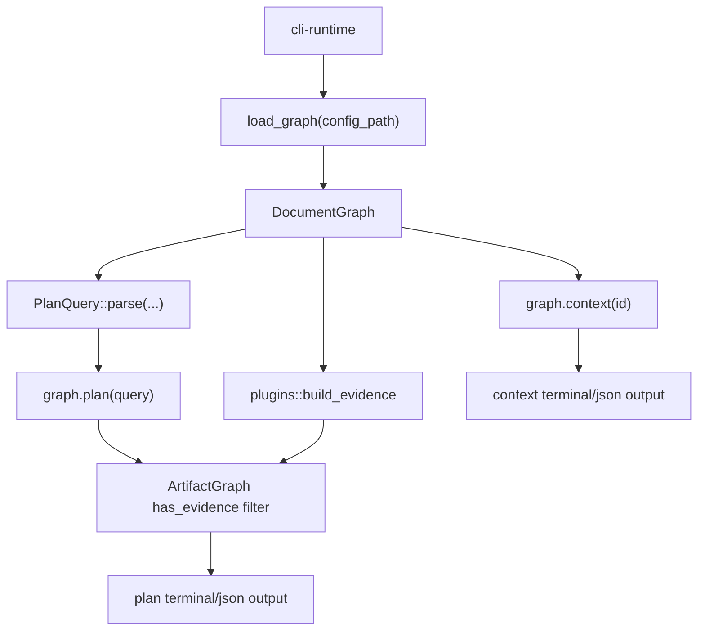

---
supersigil:
  id: work-queries/design
  type: design
  status: implemented
title: "CLI Work Queries"
---

<Implements refs="work-queries/req" />
<DependsOn refs="cli-runtime/design, document-graph/design, verification-engine/design" />
<TrackedFiles paths="crates/supersigil-cli/src/commands/context.rs, crates/supersigil-cli/src/commands/plan.rs, crates/supersigil-cli/tests/cmd_context.rs, crates/supersigil-cli/tests/cmd_plan.rs, crates/supersigil-core/src/graph/query.rs" />

## Overview

`work-queries` is the CLI domain for inspecting current work state:

- `context` shows one document together with its verification targets,
  implementations, references, and linked tasks.
- `plan` shows outstanding verification work for one document, a prefix slice,
  or the whole workspace.

This domain sits above the core query model in `supersigil-core`, but below the
rest of the CLI feature set. It owns query-resolution hints, terminal shaping,
and the current evidence-aware filtering step that turns raw graph output into
operator-facing work views.

## Architecture



## Runtime Flow

### `context`

1. Reuse the shared CLI runtime to load a fully linked graph.
2. Resolve one explicit document ID through `graph.context(id)`.
3. If the document is missing, print the shared `supersigil ls` hint and return
   a query failure.
4. Render either:
   - JSON: the `ContextOutput` structure as-is
   - terminal: heading, status, then non-empty sections for criteria,
     implementing docs, referencing docs, and linked tasks

The CLI layer does not compute the context graph itself. It delegates that to
`supersigil-core` and only shapes the operator-facing output.

### `plan`

1. Reuse the shared CLI runtime to load config and graph.
2. Resolve the user query into `PlanQuery::All`, `PlanQuery::Document`, or
   `PlanQuery::Prefix`.
3. If the query matches nothing, print the shared `supersigil ls` hint and
   return a query failure.
4. Call `graph.plan(&query)` to get the raw outstanding targets and task sets.
5. Build plugin evidence and warn on stderr about non-fatal plugin findings.
6. Remove any outstanding target already backed by ArtifactGraph evidence.
7. Render either:
   - JSON: the filtered `PlanOutput`
   - terminal: dependency graph, then default actionable view or verbose full
     view, followed by any completed-task summary

## Actionable Filtering Model

The default terminal `plan` view is stricter than the raw graph plan. It
partitions filtered outstanding targets into actionable and blocked sets:

1. Compute completed task IDs from `completed_tasks`.
2. Compute pending task IDs from `pending_tasks`.
3. Mark a pending task as unblocked when every dependency is either completed
   or absent from the pending set.
4. Treat criteria implemented by at least one unblocked task as actionable.
5. Treat criteria with no pending implementing task as actionable too.
6. Treat the rest as blocked and collapse them to a count in default mode.

Verbose mode bypasses that collapse and shows the full outstanding-target set
plus the full pending task list.

## Key Types

```rust
pub struct ContextOutput {
    pub document: SpecDocument,
    pub criteria: Vec<TargetContext>,
    pub implemented_by: Vec<DocRef>,
    pub referenced_by: Vec<String>,
    pub tasks: Vec<TaskInfo>,
}

pub struct PlanOutput {
    pub outstanding_targets: Vec<OutstandingTarget>,
    pub pending_tasks: Vec<TaskInfo>,
    pub completed_tasks: Vec<TaskInfo>,
}

pub enum PlanQuery {
    Document(String),
    Prefix(String),
    All,
}
```

The important current boundary is that `PlanQuery`, `ContextOutput`, and
`PlanOutput` are defined in `supersigil-core`, while the CLI owns:

- fallback hints on query errors
- plugin warning emission
- ArtifactGraph evidence suppression for `plan`
- terminal-only actionable versus verbose presentation

## Testing Strategy

- [cmd_context.rs](/home/joni/.local/src/supersigil/crates/supersigil-cli/tests/cmd_context.rs)
  covers basic success output, JSON output, and unknown-ID failure for
  `context`.
- [cmd_plan.rs](/home/joni/.local/src/supersigil/crates/supersigil-cli/tests/cmd_plan.rs)
  covers exact and prefix query selection, dependency graph rendering,
  actionable filtering, verbose mode, JSON output, and stderr-only plugin
  warnings.
- [query.rs](/home/joni/.local/src/supersigil/crates/supersigil-core/src/graph/query.rs)
  contains unit coverage for `PlanQuery::parse` and the task-blocking partition
  logic that the CLI reuses for default `plan` output.

## Design Notes

- The evidence-aware filtering step for `plan` lives in CLI glue rather than
  the lower-level query model. This is the intended boundary: `supersigil-core`
  stays evidence-unaware, the CLI assembles evidence and filters plan output.
