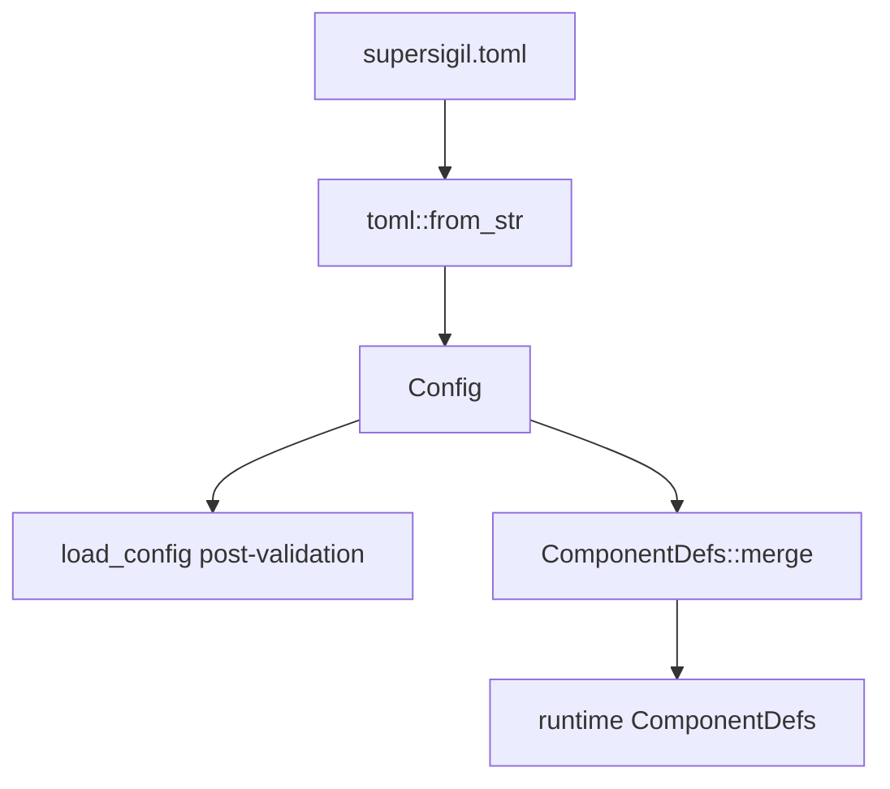

---
supersigil:
  id: config/design
  type: design
  status: approved
title: "Config"
---

```supersigil-xml
<Implements refs="config/req" />
<DependsOn refs="workspace-projects/design" />
<TrackedFiles paths="crates/supersigil-core/src/config.rs, crates/supersigil-core/src/component_defs.rs, crates/supersigil-core/src/error.rs, crates/supersigil-core/tests/config_deserialization_tests.rs, crates/supersigil-core/tests/config_validation_tests.rs, crates/supersigil-core/tests/config_ecosystem_tests.rs, crates/supersigil-core/tests/config_feature_tests.rs, crates/supersigil-core/tests/config_property_tests.rs, crates/supersigil-core/tests/component_defs_unit_tests.rs, crates/supersigil-core/tests/list_split_unit_tests.rs, crates/supersigil-core/tests/list_split_property_tests.rs" />
```

## Overview

The config subsystem owns the typed representation of `supersigil.toml` and
the runtime component-definition view derived from it. The loader is strict
about workspace shape, known rule/plugin names, and `id_pattern`, but it keeps
deserialization and runtime-merge concerns separate:

- `load_config` reads TOML and validates top-level config semantics.
- `ComponentDefs::merge` overlays user-defined components onto built-ins and
  validates `verifiable` invariants when a runtime parser or graph build needs
  them.

## Architecture



### Key Types

```rust
pub struct Config {
    pub paths: Option<Vec<String>>,
    pub tests: Option<Vec<String>>,
    pub projects: Option<HashMap<String, ProjectConfig>>,
    pub id_pattern: Option<String>,
    pub documents: DocumentsConfig,
    pub components: HashMap<String, ComponentDef>,
    pub verify: VerifyConfig,
    pub ecosystem: EcosystemConfig,
    pub hooks: HooksConfig,
    pub test_results: TestResultsConfig,
}

pub struct ProjectConfig {
    pub paths: Vec<String>,
    pub tests: Vec<String>,
    pub isolated: bool,
}

pub struct RustEcosystemConfig {
    pub validation: RustValidationPolicy,
    pub project_scope: Vec<RustProjectScope>,
}
```

## Validation Boundaries

### `load_config`

`load_config` handles:

- I/O and TOML syntax errors
- `deny_unknown_fields` deserialization
- workspace mode mutual exclusivity
- presence of at least one discovery mode
- known verification rule names
- known ecosystem plugin names
- `id_pattern` regex compilation

### `ComponentDefs::merge`

`ComponentDefs::merge` handles runtime invariants that depend on the merged
built-in and user-defined component set:

- `verifiable` implies `referenceable`
- `verifiable` implies a required `id` attribute

This split is deliberate in the current implementation. A raw `Config` can
exist even if its component definitions are not yet valid for graph or parser
runtime use.

## Built-In Surface

The current built-in component set is:

- `AcceptanceCriteria`
- `Criterion`
- `References`
- `VerifiedBy`
- `Implements`
- `Task`
- `TrackedFiles`
- `DependsOn`

Only `Criterion` is built in as both referenceable and verifiable. That is a
runtime default, not a hardcoded graph rule: user-defined components can become
verifiable if they satisfy the merge-time invariants.

## Testing Strategy

- `crates/supersigil-core/tests/config_deserialization_tests.rs`,
  `config_validation_tests.rs`, `config_ecosystem_tests.rs`, and
  `config_feature_tests.rs` cover config shape, defaults, and loader validation.
- `crates/supersigil-core/tests/config_property_tests.rs`
  covers round-trip behavior and mode invariants.
- `crates/supersigil-core/tests/component_defs_unit_tests.rs`
  covers built-ins, merge semantics, and `verifiable` invariants.
- `crates/supersigil-core/tests/list_split_unit_tests.rs`
  and `list_split_property_tests.rs`
  cover the shared comma-splitting helper.

## Current Gaps

- The config domain now includes Rust ecosystem plugin settings that were not
  captured in the old root-level spec.
- Project-aware authoring ergonomics such as `new` and `init` are not config
  responsibilities and remain documented in the CLI/workspace specs instead.
