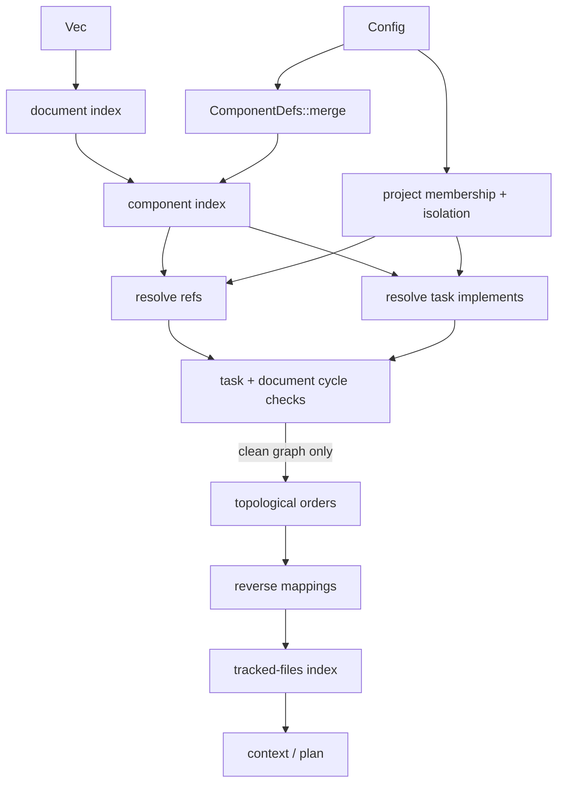

---
supersigil:
  id: document-graph/design
  type: design
  status: approved
title: "Document Graph"
---

<Implements refs="document-graph/req" />
<DependsOn refs="workspace-projects/design, parser-pipeline/design, config/design" />
<TrackedFiles paths="crates/supersigil-core/src/graph.rs, crates/supersigil-core/src/graph/**/*.rs, crates/supersigil-core/tests/serialize_roundtrip.rs" />

## Overview

`supersigil-core::graph` is the bridge between single-file parsing and all
cross-document operations. It consumes parsed `SpecDocument` values plus
runtime component definitions from config and produces one validated
`DocumentGraph` with the indexes and query helpers needed by the CLI and the
verification layer.

The recovered design is intentionally narrower than the old root-level spec:

- the graph layer no longer models `Illustrates`
- `References` is traceability data, not verification evidence
- `Task.implements` now targets any verifiable component, not only `Criterion`
  by hardcoded name

## Build Pipeline



## Key Types

```rust
pub struct DocumentGraph {
    doc_index: HashMap<String, SpecDocument>,
    component_index: HashMap<(String, String), ExtractedComponent>,
    resolved_refs: HashMap<(String, Vec<usize>), Vec<ResolvedRef>>,
    references_reverse: HashMap<(String, Option<String>), BTreeSet<String>>,
    implements_reverse: HashMap<String, BTreeSet<String>>,
    depends_on_reverse: HashMap<String, BTreeSet<String>>,
    task_topo_orders: HashMap<String, Vec<String>>,
    doc_topo_order: Vec<String>,
    tracked_files_index: HashMap<String, Vec<String>>,
    task_implements: HashMap<(String, String), Vec<(String, String)>>,
    doc_project: HashMap<String, Option<String>>,
}

pub struct ContextOutput {
    pub document: SpecDocument,
    pub criteria: Vec<TargetContext>,
    pub implemented_by: Vec<DocRef>,
    pub referenced_by: Vec<String>,
    pub tasks: Vec<TaskInfo>,
}

pub struct PlanOutput {
    pub outstanding_targets: Vec<OutstandingTarget>,
    pub pending_tasks: Vec<TaskInfo>,
    pub completed_tasks: Vec<TaskInfo>,
}
```

## Query Model

### `context`

`context` is document-centric. It extracts `Criterion` components from the
target document, decorates them with reverse references plus source-document
status, and then finds linked tasks documents by following resolved
`Task.implements` mappings back into the target document.

### `plan`

`plan` is outstanding-work centric. It accepts:

- an exact document ID
- a document-ID prefix
- or `All`

It computes linked tasks first, then marks a target as non-outstanding only if
at least one completed task implements it. Evidence-based suppression from
`VerifiedBy`, tags, or artifact discovery happens outside this graph layer.

## Determinism and Scope

- Task dependency ordering uses declaration order as the tiebreaker.
- Document dependency ordering uses alphabetical document IDs.
- Project filters do not create separate graphs. The graph remains workspace
  wide, and isolation only changes which cross-project refs are legal.

## Testing Strategy

- `crates/supersigil-core/src/graph/tests/prop_document_index.rs`
  and `prop_component_index.rs`
  cover the indexing surfaces.
- `prop_ref_resolution.rs` and `prop_task_implements.rs`
  cover ref legality and isolation.
- `prop_cycle.rs` and `prop_topo.rs`
  cover dependency analysis and ordering.
- `prop_reverse.rs`, `prop_context.rs`, `prop_plan.rs`, and `unit.rs`
  cover the derived indexes and query layer.
- `prop_error_aggregation.rs`
  covers multi-error reporting across build stages.

## Current Gaps

- Some test comments still refer to the older root-level requirement numbering
  and pre-split terminology.
- Verification evidence semantics now live above the graph layer, so the old
  validation-centric language should not be reintroduced into graph docs.
