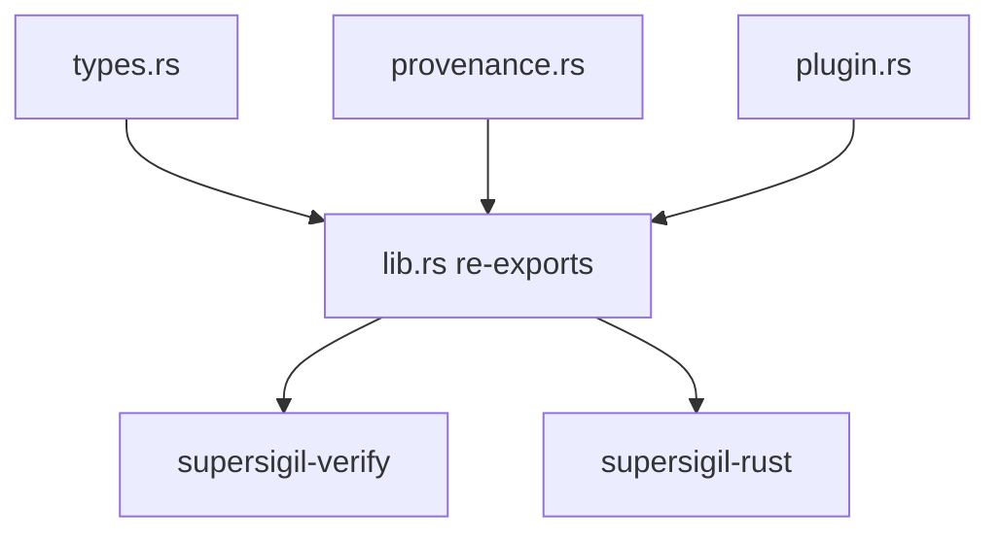

---
supersigil:
  id: evidence-contract/design
  type: design
  status: draft
title: "Evidence Contract"
---

<Implements refs="evidence-contract/req" />
<TrackedFiles paths="crates/supersigil-evidence/src/lib.rs, crates/supersigil-evidence/src/types.rs, crates/supersigil-evidence/src/provenance.rs, crates/supersigil-evidence/src/plugin.rs, crates/supersigil-evidence/src/tests.rs" />

## Overview

`evidence-contract` is the shared normalized evidence layer.

The important current boundary is that this crate defines shared data and trait
contracts only. It does not parse source code, load config, or run
verification rules.

That keeps ecosystem-specific discovery in plugin crates and merge/report logic
in `supersigil-verify` while still giving them one serializable contract.

## Architecture



## Module Boundaries

### `types.rs`

Owns the shared serializable primitives:

- `EvidenceId`
- `SourceLocation`
- `VerifiableRef`
- `VerificationTargets`
- `TestKind`
- `TestIdentity`
- `EvidenceKind`
- `VerificationEvidenceRecord`
- `ProjectScope`

The notable current constraint is that both `VerifiableRef` and
`VerificationTargets` are criterion-oriented. The shared contract intentionally
has no document-level or empty-target evidence shape.

### `provenance.rs`

Owns:

- `PluginProvenance`
- `EvidenceConflict`

These types let downstream consumers preserve where evidence came from without
embedding plugin-specific logic into the record shape itself.

### `plugin.rs`

Owns:

- `PluginError`
- `EcosystemPlugin`

The current plugin trait depends on `DocumentGraph` from `supersigil-core` and
returns already-normalized `VerificationEvidenceRecord` values.

## Re-Export Surface

`lib.rs` re-exports the public contract directly:

```rust
pub use plugin::{EcosystemPlugin, PluginError};
pub use provenance::{EvidenceConflict, PluginProvenance};
pub use types::{
    EvidenceId, EvidenceKind, ProjectScope, SourceLocation, TestIdentity, TestKind,
    VerifiableRef, VerificationEvidenceRecord, VerificationTargets,
};
```

This keeps downstream crates on a flat public API even though the
implementation is split across three modules.

## Testing Strategy

- `crates/supersigil-evidence/src/tests.rs`
  covers public-type behavior such as `VerifiableRef::parse`, stable string
  conversions, equality semantics, record construction, provenance variants,
  and the plugin trait/error surface.

## Current Gaps

- The crate exports the plugin contract but does not help with partial-warning
  reporting; plugin implementations still need their own strategy for
  recoverable per-file issues.
- `ProjectScope` is intentionally minimal and does not encode ecosystem-
  specific discovery configuration.
