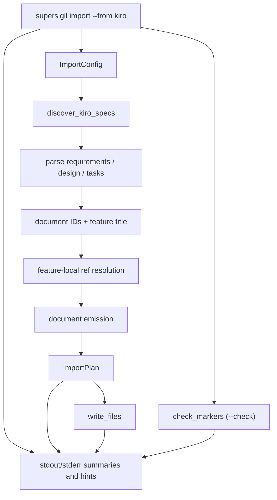

---
supersigil:
  id: kiro-import/design
  type: design
  status: active
title: "Kiro Import"
---

```supersigil-xml
<Implements refs="kiro-import/req" />
<DependsOn refs="cli-runtime/design, parser-pipeline/design, document-graph/design, workspace-projects/design" />
<TrackedFiles paths="crates/supersigil-import/src/lib.rs, crates/supersigil-import/src/discover.rs, crates/supersigil-import/src/ids.rs, crates/supersigil-import/src/refs.rs, crates/supersigil-import/src/write.rs, crates/supersigil-import/src/check.rs, crates/supersigil-import/src/emit.rs, crates/supersigil-import/src/emit/requirements.rs, crates/supersigil-import/src/emit/design.rs, crates/supersigil-import/src/emit/tasks.rs, crates/supersigil-cli/src/commands.rs, crates/supersigil-cli/src/commands/import.rs, crates/supersigil-import/tests/e2e_pipeline.rs, crates/supersigil-import/tests/prop_plan.rs, crates/supersigil-import/tests/prop_write.rs, crates/supersigil-import/tests/serialize_import.rs, crates/supersigil-import/tests/unit.rs, crates/supersigil-cli/tests/cmd_import.rs" />
```

## Overview

`kiro-import` is the migration-oriented import domain for converting Kiro's
three-file feature bundles into supersigil spec documents.

The important current boundary is split cleanly:

- `supersigil-import` owns discovery, parsing, feature-local ref resolution,
  document emission, planning, and file writing.
- `supersigil-cli` owns operator-facing defaults, dry-run rendering, and the
  post-import hint surface.

The importer is intentionally library-first. The CLI adapter is thin glue over
`ImportConfig`, `plan_kiro_import`, and `import_kiro`.

## Architecture



## Runtime Flow

### CLI Adapter

1. Parse `supersigil import --from kiro`.
2. Resolve `kiro_specs_dir` from `--source-dir`, then
   `SUPERSIGIL_IMPORT_SOURCE_DIR`, then `.kiro/specs`.
3. Resolve `output_dir` from `--output-dir` or default it to `specs`.
4. Build `ImportConfig { kiro_specs_dir, output_dir, id_prefix, force }`.
5. In dry-run mode, call `plan_kiro_import`.
6. In write mode, call `import_kiro`.
7. Print diagnostics to stderr using `Diagnostic`'s `Display` output.
8. Print the document list and summary to stdout.
9. In write mode, emit a config-aware next-step hint based on whether
   `supersigil.toml` exists in the current working directory.

### Planning Pipeline

1. Discover importable feature directories under the configured Kiro spec root.
2. For each discovered feature, read whichever of `requirements.md`,
   `design.md`, and `tasks.md` are present.
3. Parse each present source file into a lightweight internal representation.
4. Build document IDs as `{feature}/req`, `{feature}/design`, and
   `{feature}/tasks`, or prefix them as `{prefix}/{feature}/req` and so on,
   matching the convention used by `supersigil new`.
5. Choose one feature title in precedence order:
   requirements title, then design title, then tasks title, then feature name.
6. Emit requirements, design, and tasks spec documents for the files that were
   actually present in the Kiro feature directory.
7. Accumulate diagnostics, summary counters, and ambiguity markers into one
   Import_Plan.

### Emission Model

- Requirements emission preserves introduction and glossary prose, then emits
  one `<AcceptanceCriteria>` block per parsed requirement section.
- Design emission preserves prose and fenced blocks, inserts
  `<Implements refs="{req_doc_id}" />` only when the same feature also has
  requirements, and converts resolved `Validates` lines into
  `<References refs="..." />`.
- Tasks emission preserves task ordering as sibling `depends` chains, resolves
  task traceability into `implements`, and appends TODO markers when Kiro data
  cannot be represented exactly by the current `<Task>` model.

### Marker Format

All ambiguity markers use visible Markdown blockquotes:

```
> **TODO(supersigil-import):** {message}
```

This format renders visibly in Markdown preview (unlike the previous HTML
comment format) and contains the `TODO(supersigil-import)` substring for
scanning. Each marker is categorized by `AmbiguityKind` during emission, and
the `AmbiguityBreakdown` accumulates per-kind counts through the pipeline.

### Check Mode

When `--check` is set, the CLI skips the import pipeline entirely and runs
`check::check_markers()` against the output directory. This function:

1. Recursively finds `.md` files under the output directory.
2. Scans each file line-by-line for the `TODO(supersigil-import):` needle.
3. Categorizes each match by message content into an `AmbiguityKind`.
4. Returns `CheckResult` with marker locations and a breakdown.

The scanner recognizes both blockquote and legacy HTML comment formats.

## Key Types

```rust
pub struct ImportConfig {
    pub kiro_specs_dir: PathBuf,
    pub output_dir: PathBuf,
    pub id_prefix: Option<String>,
    pub force: bool,
}

pub struct ImportPlan {
    pub documents: Vec<PlannedDocument>,
    pub ambiguity_breakdown: AmbiguityBreakdown,
    pub summary: ImportSummary,
    pub diagnostics: Vec<Diagnostic>,
}

pub struct ImportSummary {
    pub criteria_converted: usize,
    pub validates_resolved: usize,
    pub tasks_converted: usize,
    pub features_processed: usize,
}

pub enum AmbiguityKind {
    DuplicateId,
    UnresolvedRef,
    UnparseableRef,
    MissingContext,
    UnsupportedFeature,
}

pub struct AmbiguityBreakdown {
    pub duplicate_id: usize,
    pub unresolved_ref: usize,
    pub unparseable_ref: usize,
    pub missing_context: usize,
    pub unsupported_feature: usize,
}

pub enum Diagnostic {
    SkippedDir { path: PathBuf, reason: String },
    Warning { message: String },
}
```

The public surface is deliberately small. Most behavior lives behind the two
library entry points:

```rust
pub fn plan_kiro_import(config: &ImportConfig) -> Result<ImportPlan, ImportError>;
pub fn import_kiro(config: &ImportConfig) -> Result<ImportResult, ImportError>;
```

## Compatibility Boundary

The importer does not construct `SpecDocument` values directly. It emits spec
documents and relies on downstream parser and graph layers to accept that output.

That is why the strongest end-to-end compatibility test is not inside the
planner itself:

1. Generate the plan from real `.kiro/specs` content.
2. Write the planned spec documents to a temp output tree.
3. Parse each emitted file through `supersigil-parser`.
4. Build a `DocumentGraph` from the parsed documents.

The recovered domain therefore depends on the parser and graph contracts, but
only at the compatibility boundary.

## Error Handling

- Missing Kiro spec roots fail with `ImportError::SpecsDirNotFound`.
- Filesystem read and write failures map to `ImportError::Io`.
- When `force` is false, existing targets fail with `ImportError::FileExists`.
- Empty or unrecognized feature directories are skipped with diagnostics rather
  than failing the whole run.
- Unresolvable refs, optional tasks, duplicate IDs, and other lossy conversion
  cases stay in-band as TODO markers instead of becoming broken supersigil refs.

## Testing Strategy

- `crates/supersigil-import/tests/e2e_pipeline.rs`
  covers parseability and graph-build compatibility of generated real-world
  output.
- `crates/supersigil-import/tests/prop_plan.rs`
  covers plan completeness and ambiguity-count accounting.
- `crates/supersigil-import/tests/prop_write.rs`
  covers conflict handling, force overwrites, and directory creation.
- `crates/supersigil-import/tests/serialize_import.rs`
  covers JSON serialization of the planning surface.
- `crates/supersigil-import/tests/unit.rs`
  covers edge cases like empty requirements, optional tasks, duplicate IDs,
  and output filename shape.
- `crates/supersigil-cli/tests/cmd_import.rs`
  covers the CLI adapter's dry-run and write-mode surface.

## Current Gaps

- The CLI adapter only supports `--from kiro`.
- Import targeting is not project-aware. Output roots and ID prefixes are still
  explicit/manual rather than selected from `projects.*`.
- The write phase is best-effort and non-transactional.
- The CLI tests cover the main command surface, but not every next-step hint
  branch or every write-conflict path end-to-end.

## Alternatives Considered

- Making the CLI own the import pipeline. Rejected because the current
  library-first split keeps conversion logic reusable and testable without
  shelling through the binary.
- Building `SpecDocument` values directly instead of emitting document strings.
  Rejected for the current implementation in favor of simpler text emission
  plus downstream parse/build compatibility tests.
