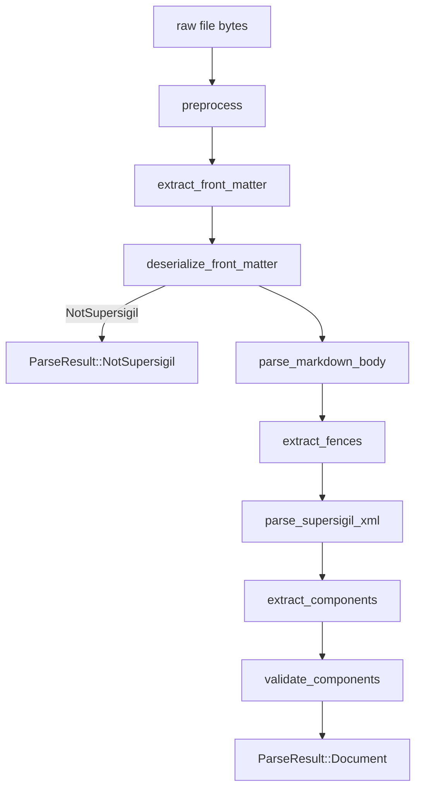

---
supersigil:
  id: parser-pipeline/design
  type: design
  status: approved
title: "Parser Pipeline"
---

```supersigil-xml
<Implements refs="parser-pipeline/req" />
<DependsOn refs="config/design, document-format/adr" />
<TrackedFiles paths="crates/supersigil-parser/src/lib.rs, crates/supersigil-parser/src/preprocess.rs, crates/supersigil-parser/src/frontmatter.rs, crates/supersigil-parser/src/markdown_fences.rs, crates/supersigil-parser/src/xml_parser.rs, crates/supersigil-parser/src/xml_extract.rs, crates/supersigil-parser/src/util.rs" />
```

## Overview

The parser pipeline is intentionally single-file and side-effect free. It does
not know about document graphs, cross-document refs, or verification rules. It
accepts bytes from one `.md` file plus runtime component definitions and
returns either a structured `SpecDocument`, a `NotSupersigil` signal, or a
vector of parse errors.

Documents are standard Markdown with YAML front matter. Structured components
live inside `supersigil-xml` fenced code blocks containing an XML subset.

## Architecture



### Public API

```rust
pub fn preprocess(raw: &[u8], path: &Path) -> Result<String, ParseError>;

pub fn extract_front_matter<'a>(
    content: &'a str,
    path: &Path,
) -> Result<Option<(&'a str, &'a str)>, ParseError>;

pub fn deserialize_front_matter(
    yaml: &str,
    path: &Path,
) -> Result<FrontMatterResult, ParseError>;

/// Parse body as standard Markdown and extract supersigil-xml fenced code
/// blocks.
pub fn parse_markdown_body(
    body: &str,
    body_offset: usize,
) -> MarkdownFences;

/// Parse the XML content of a single supersigil-xml fence.
pub fn parse_supersigil_xml(
    content: &str,
    fence_offset: usize,
    path: &Path,
) -> Result<Vec<XmlNode>, ParseError>;

/// Extract typed components from parsed XML nodes.
pub fn extract_components(
    nodes: &[XmlNode],
    path: &Path,
    component_defs: &ComponentDefs,
    errors: &mut Vec<ParseError>,
) -> Vec<ExtractedComponent>;

pub fn validate_components(
    components: &[ExtractedComponent],
    component_defs: &ComponentDefs,
    path: &Path,
    errors: &mut Vec<ParseError>,
);

pub fn parse_file(
    path: impl AsRef<Path>,
    component_defs: &ComponentDefs,
) -> Result<ParseResult, Vec<ParseError>>;

pub fn parse_content(
    path: &Path,
    content: &str,
    component_defs: &ComponentDefs,
) -> Result<ParseResult, Vec<ParseError>>;
```

### Key Types

```rust
/// Collected fences from Markdown parsing.
pub struct MarkdownFences {
    /// Content of supersigil-xml fenced code blocks with byte offsets.
    pub xml_fences: Vec<XmlFence>,
}

pub struct XmlFence {
    pub content: String,
    pub offset: usize,
}
```

## Key Design Decisions

### Markdown Parsing Without MDX

The body is parsed as standard Markdown, not MDX. The `markdown` crate is
used without `Constructs::mdx()`. This means the parser does not recognize
JSX syntax in the Markdown body — components exist only inside
`supersigil-xml` fences. This eliminates MDX-specific complexity and makes
the parser compatible with any standard Markdown tooling.

### XML Subset, Not Full XML

The content of `supersigil-xml` fences is parsed as a restricted XML subset:
PascalCase elements, double-quoted string attributes, nesting, and text
content. No processing instructions, CDATA, DTD, namespaces, comments, or
entity references beyond `&amp;`, `&lt;`, `&gt;`, `&quot;`. This can be
implemented with `quick-xml` configured strictly, or with a small custom
parser.

### Validation Uses Runtime Component Definitions

The parser never loads `supersigil.toml` itself. Instead, callers pass
`ComponentDefs`, which allows the parser to stay single-file while still
supporting configurable required attributes and custom components.

### List Semantics Are Deferred

Attribute extraction preserves raw strings. Splitting list-like attributes such
as `refs`, `paths`, `implements`, and `depends` is deferred to downstream
consumers that already know the component schema.

## Error Boundaries

- Preprocessing, front matter extraction, and front matter deserialization are
  fatal stage boundaries.
- XML parsing errors within individual fences are non-fatal to other fences:
  each fence is parsed independently, and errors are accumulated.
- Component extraction and lint-time validation share an error accumulator so
  one file can report multiple structural issues in a single pass.

## Testing Strategy

- Unit tests cover each pipeline stage independently: preprocessing, front
  matter, Markdown fence extraction, XML parsing, component extraction,
  and lint-time validation.
- Property tests cover normalization, non-supersigil detection, metadata
  preservation, and extraction invariants.
- Fixture integration tests cover full `parse_file` behavior against fixture
  documents in the new `.md` + `supersigil-xml` format.
