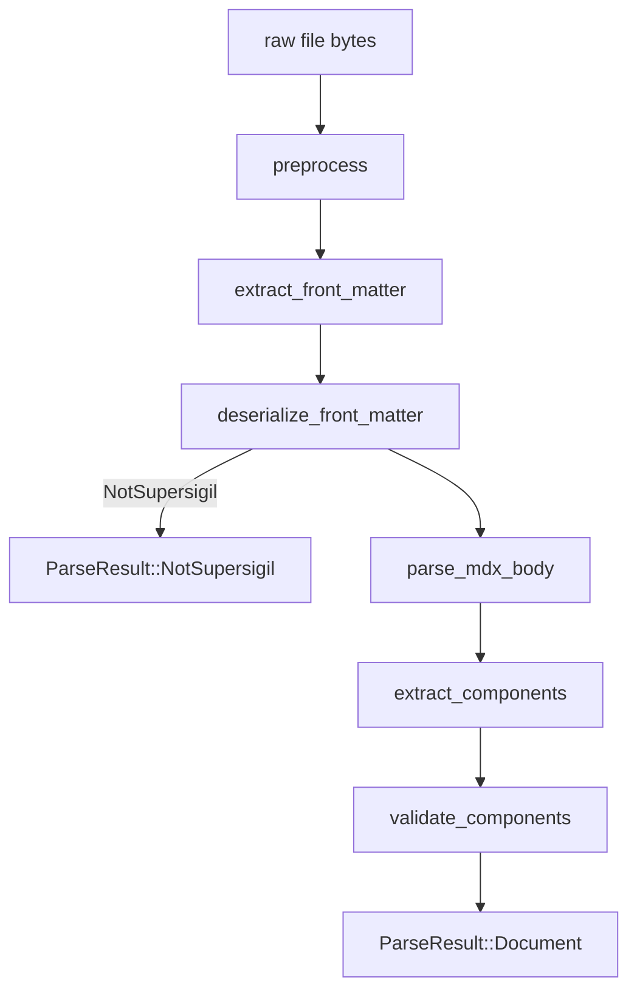

---
supersigil:
  id: parser-pipeline/design
  type: design
  status: approved
title: "Parser Pipeline"
---

<Implements refs="parser-pipeline/req" />
<DependsOn refs="config/design" />
<TrackedFiles paths="crates/supersigil-parser/src/lib.rs, crates/supersigil-parser/src/preprocess.rs, crates/supersigil-parser/src/frontmatter.rs, crates/supersigil-parser/src/extract.rs, crates/supersigil-parser/tests/unit_tests.rs, crates/supersigil-parser/tests/property_tests.rs, crates/supersigil-parser/tests/fixture_integration_tests.rs" />

## Overview

The parser pipeline is intentionally single-file and side-effect free. It does
not know about document graphs, cross-document refs, or verification rules. It
accepts bytes from one `.mdx` file plus runtime component definitions and
returns either a structured `SpecDocument`, a `NotSupersigil` signal, or a
vector of parse errors.

Current behavior differs from the old root-level spec in three important ways:

- PascalCase inline JSX is extracted, not ignored.
- YAML front matter is currently deserialized through `yaml_serde`.
- Component extraction and component validation are separate functions:
  `extract_components` followed by `validate_components`.

## Architecture



### Public API

```rust
pub fn preprocess(raw: &[u8], path: &Path) -> Result<String, ParseError>;

pub fn extract_front_matter<'a>(
    content: &'a str,
    path: &Path,
) -> Result<Option<(&'a str, &'a str)>, ParseError>;

pub fn deserialize_front_matter(
    yaml: &str,
    path: &Path,
) -> Result<FrontMatterResult, ParseError>;

pub fn parse_mdx_body(body: &str, path: &Path) -> Result<mdast::Node, ParseError>;

pub fn extract_components(
    node: &mdast::Node,
    body_offset: usize,
    path: &Path,
    errors: &mut Vec<ParseError>,
) -> Vec<ExtractedComponent>;

pub fn validate_components(
    components: &[ExtractedComponent],
    component_defs: &ComponentDefs,
    path: &Path,
    errors: &mut Vec<ParseError>,
);

pub fn parse_file(
    path: impl AsRef<Path>,
    component_defs: &ComponentDefs,
) -> Result<ParseResult, Vec<ParseError>>;
```

## Key Design Decisions

### Inline JSX Is Part of the Component Surface

`markdown-rs` emits some nested one-line JSX as `MdxJsxTextElement`. The
parser treats PascalCase text-level JSX the same way it treats flow-level JSX
so that inline `Criterion` or similar components are not silently dropped.
Lowercase inline JSX remains body content and is traversed for text.

### Validation Uses Runtime Component Definitions

The parser never loads `supersigil.toml` itself. Instead, callers pass
`ComponentDefs`, which allows the parser to stay single-file while still
supporting configurable required attributes and custom components.

### List Semantics Are Deferred

Attribute extraction preserves raw strings. Splitting list-like attributes such
as `refs`, `paths`, `implements`, and `depends` is deferred to downstream
consumers that already know the component schema.

## Error Boundaries

- Preprocessing, front matter extraction, front matter deserialization, and MDX
  parsing are fatal stage boundaries.
- Extraction and lint-time validation share an error accumulator so one file
  can report multiple structural issues in a single pass.
- Expression attributes are reported as parse errors and omitted from the
  extracted attribute map rather than coerced.

## Testing Strategy

- `crates/supersigil-parser/tests/unit_tests.rs`
  covers concrete edge cases for each pipeline stage.
- `crates/supersigil-parser/tests/property_tests.rs`
  covers normalization, non-supersigil detection, metadata preservation, and
  extraction invariants.
- `crates/supersigil-parser/tests/fixture_integration_tests.rs`
  covers full `parse_file` behavior against fixture documents.

## Current Gaps

- Several legacy comments and examples in the old root-level docs still
  described flow-only extraction and older API shapes. This recovered doc set
  treats the code and parser-local tests as authoritative instead.
