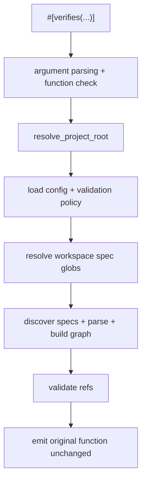

---
supersigil:
  id: verifies-macro/design
  type: design
  status: approved
title: "Verifies Macro"
---

<Implements refs="verifies-macro/req" />
<DependsOn refs="config/design, workspace-projects/design" />
<TrackedFiles paths="crates/supersigil-rust-macros/src/lib.rs, crates/supersigil-core/src/rust_scope.rs, crates/supersigil-core/src/rust_validation_inputs.rs, crates/supersigil-rust/tests/trybuild.rs, crates/supersigil-rust/tests/fixtures/pass/*.rs, crates/supersigil-rust/tests/fixtures/fail/*.rs, crates/supersigil-rust/tests/fixtures/validation-project/supersigil.toml, crates/supersigil-rust/tests/fixtures/validation-project/specs/test-req.mdx" />

## Overview

`verifies-macro` is the compile-time half of the Rust ecosystem story.

The macro parses `#[verifies(...)]`, optionally validates the provided refs
against the current supersigil graph, and then emits the annotated item
unchanged.

## Architecture

## Parse and Emission Model

The proc macro performs three local checks before any graph work:

1. parse the attribute arguments as a comma-separated list
2. require at least one string literal
3. require every ref string to use the `document-id#criterion-id` shape
4. require the annotated item to parse as `syn::ItemFn`

If those checks pass, the macro eventually emits the original function token
stream unchanged.

The shared Rust validation input set is now resolved by
`supersigil-core::rust_validation_inputs`, so the proc macro no longer carries
its own separate spec-discovery logic.

## Validation Root Resolution

`resolve_project_root` currently behaves in this order:

1. use `SUPERSIGIL_PROJECT_ROOT` when set
2. treat an empty env var as an explicit skip
3. error if an explicit env path does not contain `supersigil.toml`
4. otherwise walk upward from `CARGO_MANIFEST_DIR` looking for
   `supersigil.toml`
5. if nothing is found, skip validation

That means the macro has both hard-error and silent-skip branches depending on
how root discovery fails.

## Validation Policy

`should_validate` reads `ecosystem.rust.validation` from the loaded config:

- `off` skips all graph validation
- `dev` validates unless `PROFILE == "release"`
- `all` always validates

The policy is only consulted after config load succeeds.

## Graph Build and Cache

When validation is active, the macro:

1. loads `supersigil.toml`
2. resolves spec globs from all configured projects (or top-level `paths`)
3. discovers spec files
4. parses them with merged component definitions
5. builds a `DocumentGraph`
6. validates each ref against a criterion in that graph

The built graph is cached in a thread-local `Rc<DocumentGraph>` keyed by:

- the absolute `supersigil.toml` path
- all workspace spec files
- file metadata used to detect freshness for those inputs

## Workspace-Wide Validation

The proc macro builds a graph from ALL workspace specs regardless of which
project the current crate belongs to. This allows a test in one crate to
`#[verifies]` criteria from any project's specs.

In multi-project mode, `resolve_workspace_validation_inputs` collects spec
globs from every `[projects.*]` entry. In single-project mode, it uses the
top-level `paths`. The macro does not use `ecosystem.rust.project_scope` or
`CARGO_MANIFEST_DIR` for validation scoping — those remain available for
build-support freshness tracking (`resolve_project_validation_inputs`) and
runtime plugin scope resolution.

## Testing Strategy

- `crates/supersigil-core/src/rust_validation_inputs.rs`
  covers both the workspace-wide resolution helper used by the proc macro
  and the project-scoped resolution helper used by build-support freshness
  tracking.
- `crates/supersigil-rust/tests/trybuild.rs`
  covers the macro's compile-pass and compile-fail surface.
- `crates/supersigil-rust/tests/fixtures/pass/*.rs`
  covers basic success cases, multiple refs, async functions, and
  validation-off behavior.
- `crates/supersigil-rust/tests/fixtures/fail/*.rs`
  covers empty args, non-string args, invalid ref shape, unsupported
  attachment, and unresolved refs under active graph validation.

## Current Gaps

- The proc macro only supports function attachment, even though the runtime
  Rust discovery logic also understands `proptest!` macro items with outer
  `#[verifies(...)]` attributes in parsed source.
