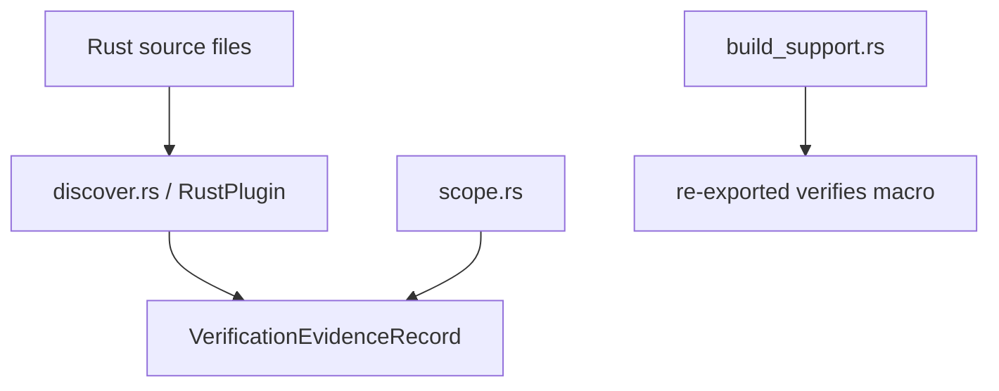

---
supersigil:
  id: rust-plugin/design
  type: design
  status: draft
title: "Rust Plugin"
---

<Implements refs="rust-plugin/req" />
<DependsOn refs="evidence-contract/design, config/design" />
<TrackedFiles paths="crates/supersigil-rust/src/lib.rs, crates/supersigil-rust/src/discover.rs, crates/supersigil-rust/src/scope.rs, crates/supersigil-rust/src/build_support.rs, crates/supersigil-rust/tests/trybuild.rs, crates/supersigil-rust/tests/fixtures/discover/**/*.rs" />

## Overview

`rust-plugin` is the runtime Rust ecosystem layer.

The crate currently owns three closely related but distinct behaviors:

- source discovery through `RustPlugin`
- Rust workspace scope resolution helpers in `scope.rs`
- build freshness helpers in `build_support.rs`

The proc macro is re-exported from this crate, but its compile-time behavior is
specified separately in `verifies-macro`.

## Architecture

## Discovery Flow

1. `RustPlugin::discover` filters the discovery input down to `.rs` files.
2. For each file:
   - read the file
   - pre-filter by whether the source contains `verifies`
   - if needed, parse the file with `syn`
   - walk functions, macro items, and inline module contents
3. `extract_verifies_targets` recognizes both `verifies` and
   `supersigil_rust::verifies`.
4. `determine_fn_test_kind` classifies:
   - `#[tokio::test]` or async test functions as `async`
   - snapshot tests via `insta::assert_snapshot`
   - plain `#[test]` functions as `unit`
5. `process_macro` handles `proptest!` items with outer `#[verifies(...)]`.
6. `extract_verifies_targets` requires every string literal ref to parse as a
   full criterion ref before record construction.
7. `build_record` produces one normalized evidence record per discovered test.

The current implementation normalizes criterion refs into non-empty
`VerificationTargets`. Fragmentless or empty-fragment refs are rejected as
discovery errors instead of being normalized into targetless records.

## Metadata Model

The current metadata extraction is intentionally narrow:

- proptest macro items add `framework = "proptest"`
- snapshot tests add `framework = "insta"`
- snapshot tests also add `snapshot_name` when the macro literal is available

No other framework-specific metadata is currently normalized.

## Fault-Tolerance Boundary

The current runtime plugin has two different failure paths:

- per-file read or parse failures are handled locally in `discover` by printing
  a warning and continuing
- invalid `#[verifies(...)]` ref shapes become `PluginError::Discovery`
- whole-scope "no supported Rust test items found" becomes
  `PluginError::Discovery`

This means the plugin still tolerates unreadable or unparsable files, but it no
longer tolerates invalid `#[verifies(...)]` annotations as recoverable input.

## Scope Helpers

`scope.rs` owns Rust workspace project resolution:

- single-project mode returns `project: None`
- explicit `ecosystem.rust.project_scope` entries use longest-prefix matching
- otherwise path-based inference checks which configured project name appears in
  the relative manifest directory path

This logic is mirrored in `supersigil-rust-macros`, because the proc-macro
crate cannot depend on `supersigil-rust`.

## Build Support

`build_support.rs` is intentionally small. It does not discover specs itself.
It just takes already-loaded spec paths and emits Cargo
`rerun-if-changed` lines for:

- `supersigil.toml`
- each loaded spec file

## Testing Strategy

- `crates/supersigil-rust/src/discover.rs`
  covers supported test forms, metadata extraction, source locations,
  path-qualified attributes, invalid ref rejection, mod recursion, non-Rust
  inputs, and fault tolerance.
- `crates/supersigil-rust/src/scope.rs`
  covers single-project, explicit-scope, and path-inference resolution.
- `crates/supersigil-rust/src/build_support.rs`
  covers validation-input collection and emitted Cargo freshness lines.

## Current Gaps

- `RustPlugin::discover` currently ignores the `ProjectScope` argument.
- Per-file plugin failures go directly to stderr instead of returning through a
  structured partial-warning channel.
- Async framework detection is currently specific to `tokio::test`.
