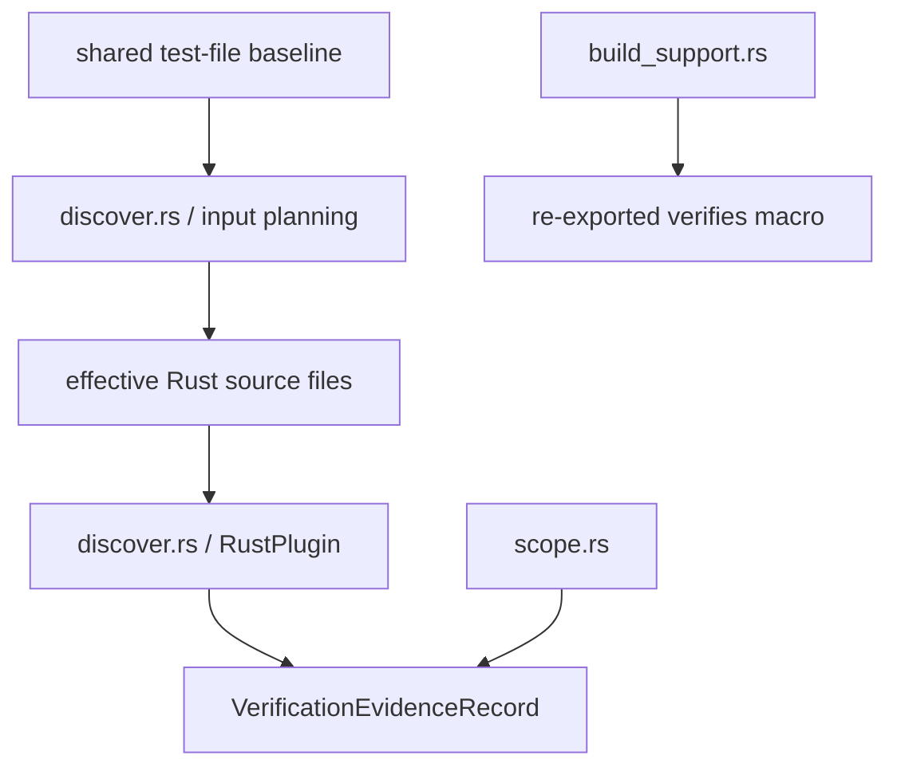

---
supersigil:
  id: rust-plugin/design
  type: design
  status: approved
title: "Rust Plugin"
---

<Implements refs="rust-plugin/req" />
<DependsOn refs="evidence-contract/design, config/design" />
<TrackedFiles paths="crates/supersigil-rust/src/lib.rs, crates/supersigil-rust/src/discover.rs, crates/supersigil-rust/src/scope.rs, crates/supersigil-rust/src/build_support.rs, crates/supersigil-core/src/rust_scope.rs, crates/supersigil-core/src/rust_validation_inputs.rs, crates/supersigil-rust/tests/trybuild.rs, crates/supersigil-rust/tests/fixtures/discover/**/*.rs" />

## Overview

`rust-plugin` is the runtime Rust ecosystem layer.

The crate currently owns three closely related but distinct behaviors:

- source discovery through `RustPlugin`, including Rust-specific discovery-
  input planning
- Rust workspace scope resolution helpers in `scope.rs`
- build freshness helpers in `build_support.rs`

The proc macro is re-exported from this crate, but its compile-time behavior is
specified separately in `verifies-macro`.

## Architecture

## Discovery Flow

1. The Rust plugin starts from a shared resolved test-file baseline.
2. It broadens that baseline by inferring Rust source files from conventional
   `src/`, `tests/`, `benches/`, and `examples/` locations, including
   workspace-member crates, while excluding fixture directories and
   deduplicating paths.
3. `RustPlugin::discover` filters the effective discovery input down to `.rs`
   files.
4. For each file:
   - read the file
   - pre-filter by whether the source contains `verifies`
   - if needed, parse the file with `syn`
   - walk functions, macro items, and inline module contents
5. `extract_verifies_targets` recognizes both `verifies` and
   `supersigil_rust::verifies`.
6. `determine_fn_test_kind` classifies:
   - `#[tokio::test]` or async test functions as `async`
   - snapshot tests via `insta::assert_snapshot`
   - plain `#[test]` functions as `unit`
7. `process_macro` handles `proptest!` items with outer `#[verifies(...)]`.
8. `extract_verifies_targets` requires every string literal ref to parse as a
   full criterion ref before record construction.
9. `build_record` produces one normalized evidence record per discovered test.

The current implementation normalizes criterion refs into non-empty
`VerificationTargets`. Fragmentless or empty-fragment refs are rejected as
discovery errors instead of being normalized into targetless records.

## Metadata Model

The current metadata extraction is intentionally narrow:

- proptest macro items add `framework = "proptest"`
- snapshot tests add `framework = "insta"`
- snapshot tests also add `snapshot_name` when the macro literal is available

No other framework-specific metadata is currently normalized.

## Fault-Tolerance Boundary

The current runtime plugin has two different failure paths:

- per-file read or parse failures are handled locally in `discover` by adding
  a non-fatal `PluginDiagnostic` to the successful discovery result and
  continuing
- invalid `#[verifies(...)]` ref shapes become `PluginError::Discovery`
- whole-scope "no supported Rust test items found" becomes
  `PluginError::Discovery`

This means the plugin still tolerates unreadable or unparsable files, but it no
longer tolerates invalid `#[verifies(...)]` annotations as recoverable input,
and it no longer writes recoverable warnings directly to stderr.

## Scope Helpers

`scope.rs` now acts as the runtime adapter over the shared Rust workspace
project-resolution helper in `supersigil-core`.

The current algorithm is:

- single-project mode returns `project: None`
- explicit `ecosystem.rust.project_scope` entries use longest-prefix matching
- explicit scope mappings to undefined projects are rejected
- otherwise path-based inference checks which configured project name appears in
  the relative manifest directory path

## Build Support

`build_support.rs` is intentionally small. It delegates validation-input
resolution to the shared `supersigil-core` helper and emits Cargo
`rerun-if-changed` lines for:

- `supersigil.toml`
- each active spec file in the current Rust validation scope

## Testing Strategy

- `crates/supersigil-core/src/rust_scope.rs`
  covers the shared Rust workspace project-resolution helper consumed by the
  runtime scope adapter and build-support freshness tracking.
- `crates/supersigil-rust/src/discover.rs`
  covers supported test forms, metadata extraction, source locations,
  path-qualified attributes, invalid ref rejection, mod recursion, non-Rust
  inputs, and fault tolerance.
- `crates/supersigil-rust/src/scope.rs`
  covers single-project, explicit-scope, and path-inference resolution.
- `crates/supersigil-rust/src/build_support.rs`
  covers emitted Cargo freshness lines over the shared validation-input set.

## Current Gaps

- Recoverable diagnostics currently carry file paths and warning text, but not
  richer span-level source positions.
- Async framework detection is currently specific to `tokio::test`.
