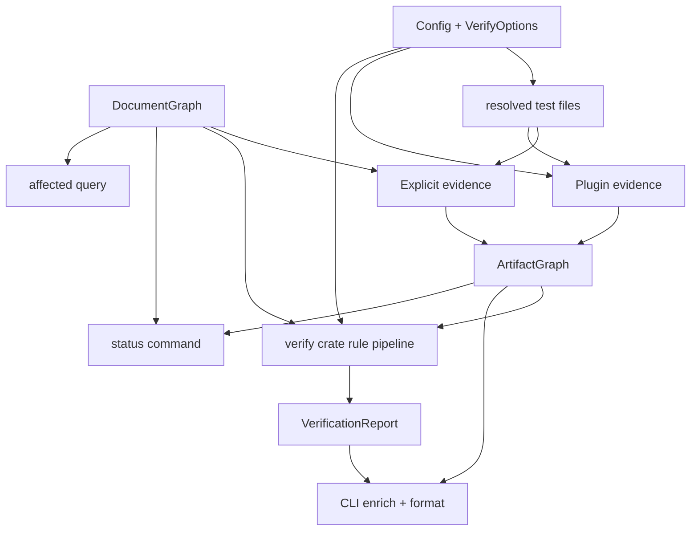

---
supersigil:
  id: verification-engine/design
  type: design
  status: implemented
title: "Verification Engine"
---

```supersigil-xml
<Implements refs="verification-engine/req" />
<DependsOn refs="workspace-projects/design, document-graph/design, config/design" />
<TrackedFiles paths="crates/supersigil-verify/src/lib.rs, crates/supersigil-verify/src/report.rs, crates/supersigil-verify/src/severity.rs, crates/supersigil-verify/src/artifact_graph.rs, crates/supersigil-verify/src/explicit_evidence.rs, crates/supersigil-verify/src/affected.rs, crates/supersigil-verify/src/rules.rs, crates/supersigil-verify/src/rules/**/*.rs, crates/supersigil-cli/src/plugins.rs, crates/supersigil-cli/src/commands/verify.rs, crates/supersigil-cli/src/commands/status.rs, crates/supersigil-cli/src/commands/affected.rs" />
```

## Overview

The current verification design is split across two layers:

- `supersigil-verify` owns rule execution, severity resolution, tracked-file
  validation, affected-document queries, report types, and report formatting.
- `supersigil-cli` owns evidence assembly for the operator-facing commands:
  building the ArtifactGraph, surfacing plugin failures and evidence conflicts,
  enriching the final report with Evidence_Summary data, and surfacing
  affected-document context in `verify`.

That split matters because the verify crate no longer infers coverage from
graph references. The CLI first turns authored and discovered evidence into an
ArtifactGraph, then the verify crate evaluates criteria against that merged
evidence graph.

## Architecture



## Verification Pipeline

### 1. Evidence Assembly

The CLI performs evidence assembly before `verify()` runs:

1. Resolve test files from top-level `tests` plus all `projects[*].tests`.
2. Resolve plugin source files by combining those test files with inferred Rust
   source locations when the Rust plugin is enabled.
3. Run enabled plugins and collect Plugin_Evidence plus non-fatal plugin
   failure findings.
4. Extract Explicit_Evidence from authored criterion-nested `VerifiedBy`
   components.
5. Merge the explicit and plugin records into one ArtifactGraph with
   deduplication, secondary indexes, and conflict detection by `TestIdentity`.

### 2. Built-In Rule Execution

`supersigil_verify::verify` runs these groups in order:

1. coverage
2. test mapping (`file-glob` and `tag`)
3. tracked files (`empty_tracked_glob`)
4. structural checks
5. status check

Rules emit `Finding` values directly. They do not short-circuit one another.
Project filtering still governs the final document-scoped findings, but
selected-project runs may narrow shared test-file inputs and skip out-of-scope
per-document checks before report assembly. Rule logic still uses the
workspace-wide graph for reference semantics and any remaining global checks.

### 3. Report Enrichment

After the library run, the CLI:

- resolves plugin-failure severities with the same severity resolver
- turns ArtifactGraph conflicts into `plugin_discovery_failure` findings
- recomputes the summary counts
- attaches `EvidenceSummary` when evidence records exist
- when `since_ref` is present, computes affected-document overlap from tracked
  files, appends a non-failing affected-doc hint in terminal output, renders a
  reviewer-oriented GitHub comment dashboard in GitHub output, and adds an
  `affected_summary` object to JSON
- formats the result for terminal, JSON, or GitHub output

## Key Types

```rust
pub struct VerifyOptions {
    pub project: Option<String>,
    pub since_ref: Option<String>,
    pub committed_only: bool,
    pub use_merge_base: bool,
}

pub struct ArtifactGraph<'g> {
    pub documents: &'g DocumentGraph,
    pub evidence: Vec<VerificationEvidenceRecord>,
    pub evidence_by_target: HashMap<VerifiableRef, Vec<EvidenceId>>,
    pub evidence_by_test: HashMap<TestIdentity, Vec<EvidenceId>>,
    pub conflicts: Vec<EvidenceConflict>,
}

pub struct VerificationReport {
    pub findings: Vec<Finding>,
    pub summary: Summary,
    pub evidence_summary: Option<EvidenceSummary>,
}
```

- `ArtifactGraph::has_evidence(doc_id, target_id)` is the coverage rule's
  actual source of truth.
- `RuleName` spans the built-in configurable verification rules.
- `EvidenceSummary` is derived from the final ArtifactGraph, not from the raw
  report findings.

## Coverage and Evidence Model

### Coverage

Coverage is recursive over `Criterion` components. A criterion is considered
covered only when the ArtifactGraph index contains one or more evidence records
for that criterion target.

### Explicit Evidence

Explicit evidence is intentionally narrow:

- only criterion-nested `VerifiedBy` components are evidence-bearing
- `strategy="tag"` becomes one evidence record per discovered tag match
- `strategy="file-glob"` becomes one evidence record per matched file

Document-level `VerifiedBy` placement is not silently accepted as evidence. It
is reported separately as `invalid_verified_by_placement`.

### Plugin Evidence

Plugin evidence is normalized to the same `VerificationEvidenceRecord` type and
merged by `TestIdentity`. Compatible target sets are coalesced; conflicting
target sets are kept separate and recorded as evidence conflicts.

## Query and Output Surfaces

### `verify`

The terminal formatter groups findings by document and then by rule. Repeated
findings above the collapse threshold are summarized with a preview. JSON
preserves the full finding set and optional evidence summary. GitHub output
renders a PR-comment-oriented dashboard with status badges, a capped
`Needs attention` block for warning/error runs, a visible `Review for drift`
section for directly affected docs, and collapsible sections for the full
verification report and full affected-doc breakdown. When `since_ref` is
present, terminal emits a short affected-doc hint only when overlap exists,
GitHub output includes the drift-review/dashboard material only when overlap
exists, and JSON adds a structured `affected_summary` object with `doc_count`
and `changed_file_count`.

### `status`

`status` is a read-only coverage view over the ArtifactGraph:

- project-wide output counts documents by type and status, then reports total
  versus covered verification targets
- per-document output reports each criterion's covered/uncovered state, the
  authored `VerifiedBy` strategies nested under that criterion, and the
  document's tracked files

### `affected`

`affected` is independent of ArtifactGraph. It uses the tracked-files index
plus git diff results to report which documents are in the affected review
scope relative to a ref.

## Testing Strategy

- `crates/supersigil-verify/src/rules/coverage.rs`
  covers ArtifactGraph-backed criterion coverage, including the fact that
  `References` does not satisfy coverage.
- `crates/supersigil-verify/src/explicit_evidence.rs`
  covers normalization from authored `VerifiedBy` components into evidence
  records.
- `crates/supersigil-verify/src/artifact_graph.rs`
  covers evidence deduplication and conflict detection.
- `crates/supersigil-verify/src/rules/tests_rule.rs`,
  `scan.rs`, `tracked.rs`, and `affected.rs`
  cover the remaining built-in rule and query surfaces.
- `crates/supersigil-cli/src/plugins.rs`,
  `commands/verify.rs`, and `commands/status.rs`
  cover the CLI glue that assembles evidence and renders the enriched outputs.

## Design Notes

- `status_inconsistency` is a fully implemented configurable rule that checks
  tasks-doc internal drift, sibling design-doc drift, and sibling
  requirements-doc drift.
- Plugin failure and evidence-conflict findings are assembled in CLI glue after
  the library run. This is intentional: the verify library stays
  evidence-unaware, and the CLI is the only consumer.
- Project filtering happens after shared test-file resolution and rule
  execution, so project-scoped verify runs still inspect evidence assembled
  from the whole workspace.
