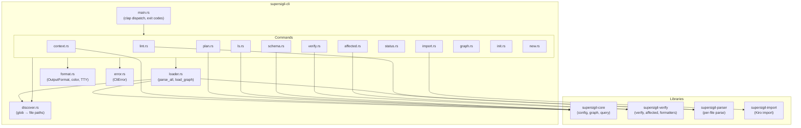

---
supersigil:
  id: cli/design
  type: design
  status: approved
title: "CLI"
---

<Implements refs="cli/req" />
<DependsOn refs="verification-engine/design, document-graph/design, kiro-import/design" />
<TrackedFiles paths="crates/supersigil-cli/src/**/*.rs" />

## Overview

The `supersigil-cli` crate is the CLI entry point. It is a thin dispatch layer: argument parsing (clap 4), config discovery, output formatting, and exit codes. All domain logic lives in the library crates.

The crate depends on:
- `supersigil-core` — config loading, document parsing, graph building, query logic (`context`, `plan`)
- `supersigil-verify` — verification engine (`verify`, `affected`), report formatters
- `supersigil-parser` — per-file parsing for `lint`
- `supersigil-import` — Kiro import logic

## Architecture



## Module Structure

```
crates/supersigil-cli/src/
├── main.rs              # clap derive, dispatch, exit codes
├── lib.rs               # Public re-exports (Cli, Command, etc.)
├── discover.rs          # Config path globs → Vec<PathBuf>
├── loader.rs            # parse_all() and load_graph() orchestration
├── format.rs            # OutputFormat, color/TTY detection, JSON/YAML writers
├── error.rs             # CliError enum
└── commands/
    ├── lint.rs          # Per-file structural checks
    ├── ls.rs            # List/filter documents
    ├── schema.rs        # Component/type definitions
    ├── context.rs       # Agent-friendly document view
    ├── plan.rs          # Outstanding work
    ├── import.rs        # Kiro import
    ├── verify.rs        # Wire supersigil-verify
    ├── status.rs        # Project/document health summary
    ├── affected.rs      # TrackedFiles × git diff
    ├── graph.rs         # Graph visualization (mermaid, dot)
    ├── init.rs          # Create supersigil.toml
    └── new.rs           # Scaffold new document
```

## Config Discovery

`loader::find_config()` searches upward from CWD. The algorithm:

1. Start at `std::env::current_dir()`
2. Check for `supersigil.toml` in the current directory
3. If not found, move to the parent directory
4. Repeat until found or root is reached
5. If root reached without finding config, return `CliError::ConfigNotFound`

The project root is the parent directory of the found config file. All relative paths (globs, test paths, tracked files) resolve against this root.

## Loader Pipeline

Two entry points shared by most commands:

- `parse_all(config_path)` — discover files + parse each. Returns `(Config, Vec<SpecDocument>, Vec<ParseError>)`. Used by `lint`.
- `load_graph(config_path)` — calls `parse_all`, then `supersigil_core::build_graph`. Parse errors and graph errors are fatal (exit 1). Used by `ls`, `context`, `plan`, `verify`, `status`, `affected`, `graph`.

Parsing is parallelized across available CPUs (up to 8 workers) using scoped threads.

## Color and TTY Detection

Color output follows a priority chain:

1. `--color always|never|auto` flag (highest priority)
2. `FORCE_COLOR` env var (enables color)
3. `NO_COLOR` env var (disables color, per https://no-color.org)
4. TTY detection on stdout (auto: color if TTY, no color if pipe/redirect)

When color is disabled, Unicode symbols are replaced with ASCII equivalents:
- `✓` → `ok`
- `✗` → `ERR`
- `⚠` → `WARN`
- `ℹ` → `info`
- `✔` → `OK`

Implementation: a `ColorConfig` struct resolved once at startup, passed to all formatting functions.

### Semantic Color Tokens

All terminal coloring uses a `Token` enum with semantic roles, not ad-hoc ANSI escapes. `ColorConfig::paint(token, text)` returns a `Painted` wrapper whose `Display` impl emits ANSI escapes (or plain text when color is disabled). This keeps style definitions centralized and guarantees zero-overhead plain output.

Uses `anstyle` (v1, already in the dependency tree via clap 4) — no new color crate.

| Token | Style | Usage |
|-------|-------|-------|
| `Header` | Bold | Section headers, table column headers |
| `Label` | Bold | Key-value labels ("Documents:", etc.) |
| `DocId` | Cyan | Document IDs (`cli/req`) |
| `DocType` | Blue | Document types (`requirement`) |
| `Status` | Yellow | Neutral statuses (`draft`) |
| `StatusGood` | Green | Positive statuses (`done`, `approved`) |
| `StatusBad` | Red | Negative statuses (`uncovered`) |
| `Count` | Bold | Numeric values, percentages |
| `Path` | Dim | File paths |
| `Success` | Green + Bold | Success messages, `ok` symbol |
| `Error` | Red + Bold | Error text, `err` symbol |
| `Warning` | Yellow + Bold | Warning text, `warn` symbol |
| `Hint` | Dim | Hint prefix, secondary info |

The existing symbol methods (`ok()`, `err()`, `warn()`, `info()`) return `Painted<'static>` with their natural token color, maintaining backward compatibility with `Display`-based call sites.

## Command Wiring

### verify

1. `load_graph()` to get `(Config, DocumentGraph)`
2. Construct `VerifyOptions` from CLI flags (`--project`, `--since`, `--committed-only`, `--merge-base`)
3. Call `supersigil_verify::verify(graph, config, project_root, options)`
4. Format `VerificationReport` using `format_terminal`, `format_json`, or `format_markdown` from `supersigil-verify`. The terminal formatter must respect both color and unicode settings — when color/unicode is off, symbols must fall back to ASCII (`[ok]`, `[err]`, `[warn]`, `[info]`) to match the rest of the CLI's output conventions.
5. Print to stdout
6. Exit code from `report.result_status()`: Clean → 0, HasErrors → 1, WarningsOnly → 2

### plan

1. `load_graph()` to get `(Config, DocumentGraph)`
2. Parse query (exact ID, prefix, or all)
3. Call `graph.plan(&query)` to get `PlanOutput`
4. For terminal output:
   a. **Dependency graph**: Build a forward adjacency map from `pending_tasks` + `completed_tasks`. Trace chains from roots (tasks with no pending deps). At fork points (multiple successors), render `├──`/`└──` branches. At merge points (task depending on multiple branches), emit `(merge) →`. Task IDs colored by status.
   b. **Actionable criteria** (default mode): Compute unblocked tasks (all `depends_on` satisfied or completed). A criterion is actionable if at least one implementing task is unblocked. Uncovered criteria (no implementing task) are always shown. Blocked criteria collapsed to a count.
   c. **Verbose mode** (`--verbose`): Show all outstanding criteria with full body text. Add numbered task list with `implements` refs after the graph.
   d. **Illustrated by**, **completed summary**: unchanged.
5. JSON output unchanged — always full `PlanOutput`.

### status

1. `load_graph()` to get `(Config, DocumentGraph)`
2. For project-wide: count documents by type/status, compute criteria coverage. Criteria are nested inside `AcceptanceCriteria` wrappers, so component iteration must walk children recursively (not just top-level `doc.components`).
3. For per-document: call `graph.context(id)` for criteria/validation status. Additionally extract `TrackedFiles` and `VerifiedBy` components directly from `graph.document(id).components` to report tracked files and test mapping state. This avoids duplicating verify logic — the status command reads component data, it does not re-run verification rules.
4. Terminal output ends with next-step suggestions

### affected

1. `load_graph()` to get the graph
2. Call `supersigil_verify::affected::affected(graph, project_root, since_ref, committed_only, use_merge_base)`
3. Format `Vec<AffectedDocument>` for terminal or JSON

### graph

1. `load_graph()` to get the graph
2. Iterate `graph.documents()` for nodes
3. For each document, extract ref components (`References`, `Implements`, `DependsOn`) for edges
4. Emit mermaid or graphviz dot syntax

### init

1. Check if `supersigil.toml` exists in CWD
2. If exists, exit 1 with message
3. If not, write minimal config: `paths = ["specs/**/*.mdx"]`
4. Print next-step hint

### new

1. Load config to get document type definitions
2. Validate the requested type exists
3. Derive file path from ID using the existing convention: `specs/{feature}/{feature}.{type}.mdx` (e.g., ID `auth/req/login` with feature `auth` → `specs/auth/auth.req.mdx`). The feature is the first segment of the ID. This matches the Kiro importer output and existing spec layout.
4. Write MDX file with front matter and type-appropriate placeholder components. Templates must:
   - Use MDX comments (`{/* ... */}`) instead of HTML comments (`<!-- -->`) — the MDX parser rejects HTML comments inside JSX component bodies
   - Never emit empty `refs=""` — `split_list_attribute("")` returns a `BrokenRef` error that makes all graph-based commands fail
   - Include all required attributes for each component (e.g., `VerifiedBy` requires `strategy`)
   - Pass `supersigil lint` without errors immediately after generation
5. Print file path and next-step hint

## Error Handling

All errors flow through `CliError`:

```rust
pub enum CliError {
    ConfigNotFound { start_dir: PathBuf },
    Config(Vec<ConfigError>),
    Parse(Vec<ParseError>),
    Graph(Vec<GraphError>),
    Query(QueryError),
    Import(ImportError),
    Verify(VerifyError),
    Io(std::io::Error),
    LintFailed,
}
```

Error messages follow the remediation pattern: what happened, why, and what to do. Examples:

- "config file not found (searched upward from /foo/bar). Run `supersigil init` to create one."
- "document `auth/req/login` not found. Run `supersigil ls` to see available documents."
- "parse error in specs/auth/req/login.mdx:15: unknown component `Verifies`. Did you mean `References`?"

## Exit Code Policy

| Command | 0 | 1 | 2 |
|---------|---|---|---|
| All except `verify` | Success | Fatal error | — |
| `verify` | Clean | Errors | Warnings-only |

## Next-Step Hints

Commands print contextual hints on stderr after successful completion:

| Command | Hint |
|---------|------|
| `init` | "Created supersigil.toml. Next: `supersigil new requirement my-feature/req/name`" |
| `new` | "Created {path}. Edit the file, then run `supersigil lint` to validate." |
| `import` | "Imported {n} documents. Next: `supersigil lint` to check, or `supersigil ls` to browse." |
| `lint` (clean) | "All clean. Run `supersigil verify` to check cross-document rules." |
| `verify` (clean) | "{n} documents verified, no findings." |
| `verify` (errors) | "Run `supersigil plan` to see outstanding work." |
| `status` | Context-dependent (see req-9-4) |
| `affected` (none) | "No documents affected by changes since {ref}." |

## Design Decisions

### Thin CLI over library crates

The CLI crate contains no domain logic. All verification, graph building, import logic, and query logic live in their respective library crates. This enables other consumers (e.g., a desktop app, LSP server, or WASM module) to use the same logic without depending on clap or terminal formatting.

### Color detection as a resolved config

Color/TTY state is computed once at startup and threaded through as a `ColorConfig` value rather than checked ad-hoc in each formatter. This avoids inconsistent behavior when stdout and stderr have different TTY states and makes testing deterministic.

### Remediation-first error messages

Every error message answers three questions: what happened, why, and what to do next. This is not just polish — it's a core UX requirement for a tool consumed by both humans and AI agents. Agents parsing error output benefit from structured suggestions just as humans do.

### verify exit code 2 for warnings-only

Most CLI tools use only 0 and 1. The `verify` command adds exit code 2 for the "warnings but no errors" case, allowing CI pipelines to distinguish "needs attention" from "blocking failure." This is opt-in — pipelines that only care about pass/fail can check `!= 0`.
