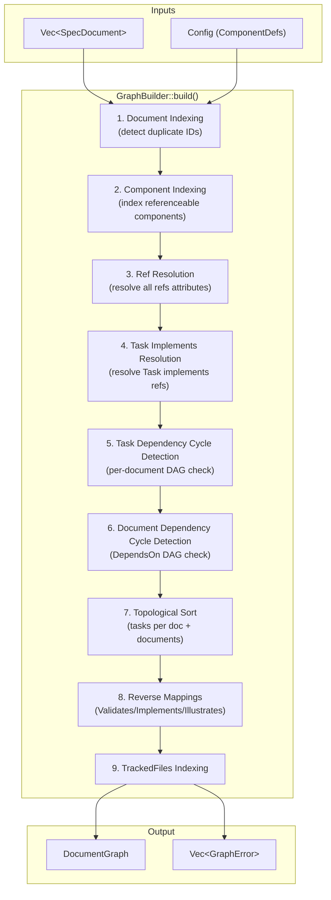
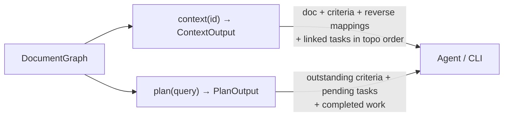

---
supersigil:
  id: design/document-graph
  type: design
  status: draft
title: "Document Graph"
---

<Implements refs="req/document-graph" />

## Overview

The Document Graph module (`supersigil-core::graph`) builds the cross-document relationship graph from parsed `SpecDocument` values and a `Config`. It is the central data structure that all downstream consumers (verification engine, CLI queries) operate on.

The module takes a flat collection of parsed documents and produces an indexed, validated graph with:
- O(1) document lookup by ID
- O(1) referenceable component lookup by (document_id, fragment)
- Resolved and validated cross-document references
- Cycle-free task and document dependency orderings
- Precomputed reverse mappings (who validates/implements/illustrates what)
- Structured query outputs for `context` and `plan` commands
- TrackedFiles index for code-to-doc routing

The graph builder follows an error-aggregation strategy: it collects all errors in a single pass rather than failing on the first error, enabling users to fix multiple issues at once.

## Architecture



The build pipeline is sequential within a single pass. Each stage may produce errors that are collected into a shared error vector. Stages that depend on earlier results (e.g., ref resolution depends on the document index) proceed with best-effort data even when earlier errors exist, maximizing the number of errors reported per pass.

### Query Layer

The `DocumentGraph` exposes two structured query methods:



## Components and Interfaces

### Public API

The module exposes a single entry point and the resulting graph type:

```rust
/// Build a DocumentGraph from parsed documents and config.
///
/// Returns Ok(DocumentGraph) if no hard errors occur, or
/// Err(Vec<GraphError>) if any hard errors are found.
pub fn build_graph(
    documents: Vec<SpecDocument>,
    config: &Config,
) -> Result<DocumentGraph, Vec<GraphError>>;
```

### `DocumentGraph`

The primary output type. Holds all indexes, orderings, and reverse mappings. Provides query methods for `context` and `plan`.

```rust
pub struct DocumentGraph {
    /// O(1) lookup: document ID → SpecDocument
    doc_index: HashMap<String, SpecDocument>,
    
    /// O(1) lookup: (document_id, fragment) → (owning_doc_id, ExtractedComponent)
    component_index: HashMap<(String, String), (String, ExtractedComponent)>,
    
    /// Resolved refs keyed by source component path.
    /// The key is (source_doc_id, component_path) where component_path is a Vec<usize>
    /// representing the index path from root to the component. For top-level components,
    /// this is a single-element vec (e.g., [2] for the 3rd component). For nested
    /// components (e.g., Criterion inside AcceptanceCriteria), this is a multi-element
    /// path (e.g., [0, 1] for the 2nd child of the 1st top-level component).
    resolved_refs: HashMap<(String, Vec<usize>), Vec<ResolvedRef>>,
    
    /// Reverse mapping: target (doc_id, Option<fragment>) → set of source doc IDs per relationship type.
    /// Fragmentless Validates refs (e.g., `<Validates refs="auth/req/login" />`) are stored
    /// with `fragment: None`. They are preserved for traceability but do NOT satisfy
    /// `uncovered_criterion` coverage (which requires a specific criterion fragment).
    validates_reverse: HashMap<(String, Option<String>), BTreeSet<String>>,
    implements_reverse: HashMap<String, BTreeSet<String>>,
    illustrates_reverse: HashMap<(String, Option<String>), BTreeSet<String>>,
    
    /// Task topological orderings per tasks document
    task_topo_orders: HashMap<String, Vec<String>>,
    
    /// Document topological ordering (from DependsOn edges)
    doc_topo_order: Vec<String>,
    
    /// TrackedFiles index: document ID → list of path globs
    tracked_files_index: HashMap<String, Vec<String>>,
    
    /// Resolved task implements: (doc_id, task_id) → Vec<(target_doc_id, criterion_id)>
    task_implements: HashMap<(String, String), Vec<(String, String)>>,
    
    /// Project membership: document ID → project name (None for single-project)
    doc_project: HashMap<String, Option<String>>,
}
```

#### Read-Only Accessors

`DocumentGraph` exposes read-only accessors for all internal indexes, enabling downstream consumers (verification engine, CLI) to query the graph without owning or copying it:

```rust
impl DocumentGraph {
    /// Look up a document by ID. Returns None if not found.
    pub fn document(&self, id: &str) -> Option<&SpecDocument>;

    /// Iterate over all (id, document) pairs.
    pub fn documents(&self) -> impl Iterator<Item = (&str, &SpecDocument)>;

    /// Look up a referenceable component by (document_id, fragment).
    pub fn component(&self, doc_id: &str, fragment: &str) -> Option<&ExtractedComponent>;

    /// Get resolved refs for a component at the given index path in a document.
    /// For top-level components use &[idx], for nested use &[parent_idx, child_idx].
    pub fn resolved_refs(&self, doc_id: &str, component_path: &[usize]) -> Option<&[ResolvedRef]>;

    /// Get all documents that validate a given target.
    /// - `fragment: Some("id")` → returns validators of that specific criterion.
    /// - `fragment: None` → returns validators that referenced the document without a fragment.
    /// To get ALL validators of a document (union of doc-level + all criterion-level),
    /// callers must query once with None and once per criterion.
    /// Returns empty set for unreferenced targets.
    pub fn validates(&self, doc_id: &str, fragment: Option<&str>) -> &BTreeSet<String>;

    /// Get all documents that implement a given document.
    /// Returns empty set for unreferenced targets.
    pub fn implements(&self, doc_id: &str) -> &BTreeSet<String>;

    /// Get all documents that illustrate a given target.
    /// Returns empty set for unreferenced targets.
    pub fn illustrates(&self, doc_id: &str, fragment: Option<&str>) -> &BTreeSet<String>;

    /// Get the topological ordering of tasks within a tasks document.
    pub fn task_order(&self, doc_id: &str) -> Option<&[String]>;

    /// Get the document-level topological ordering.
    pub fn doc_order(&self) -> &[String];

    /// Get TrackedFiles globs for a document. Returns None if no TrackedFiles declared.
    pub fn tracked_files(&self, doc_id: &str) -> Option<&[String]>;

    /// Iterate over all (doc_id, globs) pairs in the TrackedFiles index.
    pub fn all_tracked_files(&self) -> impl Iterator<Item = (&str, &[String])>;

    /// Get resolved task implements for a specific task.
    pub fn task_implements(&self, doc_id: &str, task_id: &str) -> Option<&[(String, String)]>;

    /// Get the project a document belongs to.
    /// Returns Some(project_name) for multi-project configs, None for single-project configs.
    /// Returns None if the document ID is not in the graph (callers should check
    /// document() first if they need to distinguish "not found" from "single-project").
    pub fn doc_project(&self, doc_id: &str) -> Option<&str>;

    /// Structured context query.
    pub fn context(&self, id: &str) -> Result<ContextOutput, QueryError>;

    /// Structured plan query.
    pub fn plan(&self, query: PlanQuery) -> Result<PlanOutput, QueryError>;
}
```

### `ResolvedRef`

Represents a successfully resolved reference:

```rust
#[derive(Debug, Clone, PartialEq)]
pub struct ResolvedRef {
    /// The raw ref string as written in the source
    pub raw: String,
    /// Target document ID
    pub target_doc_id: String,
    /// Target fragment (criterion/task ID), if present
    pub fragment: Option<String>,
}
```

### `GraphError`

Hard errors produced during graph construction:

```rust
#[derive(Debug, thiserror::Error)]
pub enum GraphError {
    #[error("duplicate document ID `{id}`: found in {}", paths.iter().map(|p| p.display().to_string()).collect::<Vec<_>>().join(", "))]
    DuplicateId {
        id: String,
        paths: Vec<PathBuf>,
    },
    
    #[error("{doc_id}: duplicate component ID `{component_id}` at positions {}", positions.iter().map(|p| format!("{}:{}", p.line, p.column)).collect::<Vec<_>>().join(", "))]
    DuplicateComponentId {
        doc_id: String,
        component_id: String,
        positions: Vec<SourcePosition>,
    },
    
    #[error("{doc_id}:{}:{}: broken ref `{ref_str}`: {reason}", position.line, position.column)]
    BrokenRef {
        doc_id: String,
        ref_str: String,
        reason: String,
        position: SourcePosition,
    },
    
    #[error("dependency cycle in tasks document `{doc_id}`: {}", cycle.join(" → "))]
    TaskDependencyCycle {
        doc_id: String,
        cycle: Vec<String>,
    },
    
    #[error("dependency cycle in document graph: {}", cycle.join(" → "))]
    DocumentDependencyCycle {
        cycle: Vec<String>,
    },
}
```

### `ContextOutput`

Structured output for the `context` command:

```rust
#[derive(Debug, Clone, PartialEq)]
pub struct ContextOutput {
    /// The target document
    pub document: SpecDocument,
    /// Criteria with their validation/illustration status
    pub criteria: Vec<CriterionContext>,
    /// Documents that implement this document
    pub implemented_by: Vec<DocRef>,
    /// Documents that illustrate this document (document-level)
    pub illustrated_by: Vec<String>,
    /// Tasks from linked tasks documents, in topological order
    pub tasks: Vec<TaskContext>,
}

#[derive(Debug, Clone, PartialEq)]
pub struct CriterionContext {
    pub id: String,
    pub body_text: Option<String>,
    /// Documents that validate this criterion, with their status
    pub validated_by: Vec<DocRef>,
    /// Documents that illustrate this criterion
    pub illustrated_by: Vec<String>,
}

#[derive(Debug, Clone, PartialEq)]
pub struct DocRef {
    pub doc_id: String,
    pub status: Option<String>,
}

#[derive(Debug, Clone, PartialEq)]
pub struct TaskContext {
    /// Which tasks document this task belongs to
    pub tasks_doc_id: String,
    pub task_id: String,
    pub status: Option<String>,
    pub body_text: Option<String>,
    /// Criteria this task implements
    pub implements: Vec<(String, String)>,
    /// Task IDs this task depends on
    pub depends_on: Vec<String>,
}
```

### `PlanOutput`

Structured output for the `plan` command:

```rust
#[derive(Debug, Clone, PartialEq)]
pub struct PlanOutput {
    /// Criteria with no validating document
    pub outstanding_criteria: Vec<OutstandingCriterion>,
    /// Tasks not yet done, in topological order, grouped by tasks document
    pub pending_tasks: Vec<PlanTask>,
    /// Completed tasks with the criteria they implement
    pub completed_tasks: Vec<PlanTask>,
    /// Documents that illustrate the target
    pub illustrated_by: Vec<IllustrationRef>,
}

#[derive(Debug, Clone, PartialEq)]
pub struct OutstandingCriterion {
    /// The requirement document containing this criterion
    pub doc_id: String,
    pub criterion_id: String,
    pub body_text: Option<String>,
}

#[derive(Debug, Clone, PartialEq)]
pub struct PlanTask {
    pub tasks_doc_id: String,
    pub task_id: String,
    pub status: Option<String>,
    pub body_text: Option<String>,
    pub implements: Vec<(String, String)>,
    pub depends_on: Vec<String>,
}

#[derive(Debug, Clone, PartialEq)]
pub struct IllustrationRef {
    pub doc_id: String,
    /// The target criterion or document being illustrated
    pub target_doc_id: String,
    pub target_fragment: Option<String>,
}
```

### `PlanQuery`

Input type for the `plan` method, supporting the three query modes:

```rust
#[derive(Debug, Clone, PartialEq)]
pub enum PlanQuery {
    /// Plan for a single document by exact ID
    Document(String),
    /// Plan for all documents matching a prefix (e.g., "auth/")
    Prefix(String),
    /// Project-wide plan covering all documents
    All,
}

impl PlanQuery {
    /// Parse a user-provided string into a PlanQuery.
    ///
    /// Disambiguation logic (matches Req 10 AC5-7):
    /// 1. If input is empty or None → PlanQuery::All
    /// 2. If input matches an exact document ID in the graph → PlanQuery::Document
    /// 3. If input matches as a prefix of any document ID → PlanQuery::Prefix
    /// 4. Otherwise → QueryError::NoMatchingDocuments
    pub fn parse(input: Option<&str>, graph: &DocumentGraph) -> Result<PlanQuery, QueryError>;
}
```

### Internal Helper: `RefParser`

Parses a raw ref string into its document ID and optional fragment:

```rust
/// Parse a ref string like "auth/req/login#valid-creds" into
/// (doc_id: "auth/req/login", fragment: Some("valid-creds")).
fn parse_ref(raw: &str) -> (String, Option<String>) {
    match raw.find('#') {
        Some(pos) => (raw[..pos].to_owned(), Some(raw[pos + 1..].to_owned())),
        None => (raw.to_owned(), None),
    }
}
```

## Data Models

### Document Index

A `HashMap<String, SpecDocument>` keyed by `frontmatter.id`. Built in O(n) time from the input document collection. Duplicate IDs are detected during insertion and produce `GraphError::DuplicateId`.

### Component Index

A `HashMap<(String, String), (String, ExtractedComponent)>` where:
- Key: `(document_id, component_id)` — the compound key ensures uniqueness since component IDs are only unique within a document
- Value: `(owning_doc_id, component)` — the owning document ID and the component itself

Built by iterating all documents and their components recursively. For each component whose `ComponentDef` has `referenceable = true`, the component's `id` attribute is extracted and indexed. Duplicate component IDs within the same document produce `GraphError::DuplicateComponentId`.

### Ref Resolution Data

For each component with a `refs` attribute (determined by checking `ComponentDefs`), the raw attribute value is split using `split_list_attribute`, and each ref is parsed into `(doc_id, Option<fragment>)`. Resolution checks:

1. `doc_id` exists in the document index
2. If `fragment` is present, `(doc_id, fragment)` exists in the component index
3. If the referring component's `ComponentDef` has `target_component`, the resolved component's `name` matches

For cross-project resolution: if the referring document belongs to an isolated project, only documents in the same project are valid targets. The `doc_project` map tracks project membership.

### Task Dependency Graph

Per tasks document, a directed graph where:
- Nodes: task IDs (from `Task` components, including nested ones)
- Edges: B → A for "A depends on B" (i.e., edges point from dependency to dependent, meaning "B is needed by A")

This edge direction is required by Kahn's algorithm: zero-in-degree nodes have no unsatisfied dependencies and are processed first.

Scoping rules for `depends` resolution:
- Top-level tasks: `depends` resolves to other top-level tasks in the same document
- Nested tasks: `depends` resolves to sibling tasks within the same parent

Cycle detection uses a DFS-based algorithm with coloring. When a back edge is found (Gray → Gray), the cycle is recorded and the DFS continues from the next unvisited node, collecting all independent cycles. If any cycles are found, `GraphError::TaskDependencyCycle` is emitted for each. If acyclic, a topological sort is computed using Kahn's algorithm with declaration-order tiebreaking.

### Document Dependency Graph

A directed graph where:
- Nodes: document IDs
- Edges: B → A for "A DependsOn B" (same convention as task dependencies — edges from dependency to dependent)

Cycle detection and topological sort follow the same approach as task dependencies, but with alphabetical-by-ID tiebreaking for determinism.

**Cycle detection:** The DFS algorithm collects all cycles it encounters across all connected components. For task cycles, each document is checked independently. For document dependency cycles, the DFS traverses all unvisited nodes, recording each back edge as a separate cycle. Equivalent cycles (same set of nodes discovered via different back edges) are deduplicated by normalizing each cycle to start at the lexicographically smallest node before comparison. This keeps error output stable and noise-free. This aligns with the error aggregation contract (Req 13) — all independent cycles are reported in a single pass.

### Reverse Mappings

Three separate reverse indexes, built by iterating all resolved refs:

1. **Validates reverse**: `(target_doc_id, Option<criterion_fragment>) → BTreeSet<validating_doc_id>`. Fragmentless Validates refs (pointing at a document as a whole) are resolved for validation but stored with `fragment: None`. They do not satisfy `uncovered_criterion` coverage (which is criterion-level), but they are preserved in the mapping for traceability.
2. **Implements reverse**: `target_doc_id → BTreeSet<implementing_doc_id>` (fragments discarded per design doc)
3. **Illustrates reverse**: `(target_doc_id, Option<fragment>) → BTreeSet<illustrating_doc_id>`

`BTreeSet` ensures deterministic iteration order. Duplicate refs within the same attribute are deduplicated.

### TrackedFiles Index

A `HashMap<String, Vec<String>>` mapping document ID to aggregated path globs from all `TrackedFiles` components in that document. Built by iterating all documents, finding `TrackedFiles` components, splitting their `paths` attribute, and collecting under the document ID.

### Algorithm Details

#### Cycle Detection (DFS with coloring)

```
enum Color { White, Gray, Black }

fn detect_cycles(graph: &HashMap<String, Vec<String>>) -> Vec<Vec<String>> {
    let mut colors: HashMap<&str, Color> = all nodes → White
    let mut path: Vec<String> = []
    let mut cycles: Vec<Vec<String>> = []
    
    for each node in graph.keys() (sorted for determinism):
        if colors[node] == White:
            dfs(node, graph, &mut colors, &mut path, &mut cycles)
    
    cycles
}

fn dfs(node, graph, colors, path, cycles) {
    colors[node] = Gray
    path.push(node)
    
    for neighbor in graph[node]:
        match colors[neighbor]:
            Gray => cycles.push(extract_cycle(path, neighbor))
            White => dfs(neighbor, ..., cycles)
            Black => continue
    
    colors[node] = Black
    path.pop()
}
```

#### Topological Sort (Kahn's algorithm with tiebreaking)

```
fn topo_sort(graph, tiebreak_fn) -> Vec<String> {
    let in_degree: HashMap<String, usize> = compute in-degrees
    let mut queue: BTreeSet or priority queue ordered by tiebreak_fn
    
    // Seed with zero in-degree nodes
    for node where in_degree[node] == 0:
        queue.insert(node)
    
    let mut result = []
    while let Some(node) = queue.pop_first():  // smallest by tiebreak
        result.push(node)
        for neighbor in graph[node]:
            in_degree[neighbor] -= 1
            if in_degree[neighbor] == 0:
                queue.insert(neighbor)
    
    result
}
```

Tiebreak functions:
- Tasks: declaration order (index in the source document's component list)
- Documents: alphabetical by document ID

## Correctness Properties

*A property is a characteristic or behavior that should hold true across all valid executions of a system — essentially, a formal statement about what the system should do. Properties serve as the bridge between human-readable specifications and machine-verifiable correctness guarantees.*

### Property 1: Document index round-trip

*For any* collection of `SpecDocument` values with unique `frontmatter.id` values (across single-project or multi-project configs), building the graph and looking up each document by its ID should return the original document.

<Validates refs="req/document-graph#req-1-1, req/document-graph#req-1-4" />

### Property 2: Duplicate document ID detection

*For any* collection of `SpecDocument` values where two or more documents share the same `frontmatter.id`, `build_graph` should return a `DuplicateId` error that identifies the conflicting ID and all file paths involved.

<Validates refs="req/document-graph#req-1-2" />

### Property 3: Referenceable component index round-trip

*For any* `SpecDocument` containing components whose `ComponentDef` has `referenceable = true` (including nested components like `Criterion` inside `AcceptanceCriteria`), each such component should be retrievable from the component index by `(document_id, component_id)` and should match the original component.

<Validates refs="req/document-graph#req-2-1, req/document-graph#req-2-3, req/document-graph#req-2-4" />

### Property 4: Duplicate component ID detection

*For any* `SpecDocument` containing two referenceable components with the same `id` attribute, `build_graph` should return a `DuplicateComponentId` error identifying the conflicting ID and source positions.

<Validates refs="req/document-graph#req-2-2" />

### Property 5: Valid refs resolve successfully

*For any* ref string in a `refs` attribute that points to an existing document (and optionally a `#fragment` matching a referenceable component of the correct `target_component` type), ref resolution should succeed and produce a `ResolvedRef` with the correct target document ID and fragment.

<Validates refs="req/document-graph#req-3-2, req/document-graph#req-3-3, req/document-graph#req-3-4" />

### Property 6: Invalid refs produce broken_ref errors

*For any* ref string in a `refs` attribute where the target document ID does not exist, or the `#fragment` does not match a referenceable component, or the resolved component's name does not match the expected `target_component`, `build_graph` should return a `BrokenRef` error identifying the referring document, the ref string, and the reason.

<Validates refs="req/document-graph#req-3-5, req/document-graph#req-3-6, req/document-graph#req-3-7" />

### Property 7: Non-isolated cross-project refs resolve globally

*For any* multi-project config where no project has `isolated = true`, a ref from a document in one project to a document in another project should resolve successfully against the global document index.

<Validates refs="req/document-graph#req-4-1, req/document-graph#req-4-4" />

### Property 8: Isolated project refs are restricted

*For any* project configured with `isolated = true`, a ref from a document in that project to a document in a different project should produce a `BrokenRef` error, even if the target document exists in the global index.

<Validates refs="req/document-graph#req-4-2, req/document-graph#req-4-3" />

### Property 9: Acyclic task graphs produce no cycle errors

*For any* tasks document where the `depends` edges between `Task` components form a DAG (no cycles), `build_graph` should produce no `TaskDependencyCycle` errors for that document.

<Validates refs="req/document-graph#req-5-2" />

### Property 10: Cyclic task graphs produce cycle errors

*For any* tasks document where the `depends` edges between `Task` components contain a cycle (including self-references), `build_graph` should return a `TaskDependencyCycle` error whose `cycle` field contains the participating task IDs.

<Validates refs="req/document-graph#req-5-3" />

### Property 11: Task depends scoping and resolution

*For any* `Task` component with a `depends` attribute, each referenced task ID must exist as a sibling (same parent for nested tasks, same document for top-level tasks). A `depends` reference to a non-sibling or nonexistent task ID should produce a `BrokenRef` error.

<Validates refs="req/document-graph#req-5-4, req/document-graph#req-5-5" />

### Property 12: Acyclic document dependency graphs produce no cycle errors

*For any* set of documents where `DependsOn` refs form a DAG, `build_graph` should produce no `DocumentDependencyCycle` errors.

<Validates refs="req/document-graph#req-6-2" />

### Property 13: Cyclic document dependency graphs produce cycle errors

*For any* set of documents where `DependsOn` refs form a cycle (including self-references), `build_graph` should return a `DocumentDependencyCycle` error whose `cycle` field contains the participating document IDs.

<Validates refs="req/document-graph#req-6-3" />

### Property 14: Topological order invariant

*For any* valid DAG (task dependencies within a document, or document dependencies via `DependsOn`), the computed topological order should satisfy: for every edge (A depends on B), B appears at a lower index than A in the ordering.

<Validates refs="req/document-graph#req-7-1, req/document-graph#req-7-2, req/document-graph#req-7-3" />

### Property 15: Topological sort determinism

*For any* valid DAG, calling the topological sort twice on identical input should produce identical output. The tiebreaker is declaration order for tasks and alphabetical by ID for documents.

<Validates refs="req/document-graph#req-7-4" />

### Property 16: Reverse mapping completeness

*For any* document containing a `Validates`, `Implements`, or `Illustrates` component with resolved refs, the corresponding reverse mapping should contain the source document ID in the set for each target. For `Implements`, fragment portions are discarded — the mapping is document-level. Duplicate refs within the same attribute contribute only once.

<Validates refs="req/document-graph#req-8-1, req/document-graph#req-8-2, req/document-graph#req-8-3, req/document-graph#req-8-6" />

### Property 17: Context output completeness

*For any* valid document ID in the graph, the `ContextOutput` should contain: the target document's frontmatter and criteria, the reverse mappings of validating/implementing/illustrating documents (with status), and tasks from linked tasks documents in topological order.

<Validates refs="req/document-graph#req-9-1, req/document-graph#req-9-2, req/document-graph#req-9-3, req/document-graph#req-9-4, req/document-graph#req-9-5" />

### Property 18: Plan output correctness

*For any* valid document ID in the graph, the `PlanOutput` should contain: outstanding criteria (those with no validating document), pending tasks (status ≠ done) in topological order, completed tasks with their implements refs, and illustrating documents.

<Validates refs="req/document-graph#req-10-1, req/document-graph#req-10-2, req/document-graph#req-10-3, req/document-graph#req-10-4" />

### Property 19: Plan prefix aggregation

*For any* feature prefix string, the `PlanOutput` should aggregate all documents whose IDs start with that prefix. Outstanding criteria should be grouped by source requirement document. Tasks should be listed per tasks document in topological order.

<Validates refs="req/document-graph#req-10-5" />

### Property 20: Task implements resolution

*For any* `Task` component with an `implements` attribute, each ref must include a `#fragment` targeting a `Criterion` component. A ref without a fragment, or a ref that does not resolve to an existing criterion, should produce a `BrokenRef` error. Successfully resolved refs should be available in context and plan outputs.

<Validates refs="req/document-graph#req-11-1, req/document-graph#req-11-2" />

### Property 21: TrackedFiles index completeness

*For any* document containing one or more `TrackedFiles` components, the TrackedFiles index should contain all path globs from all such components aggregated under the document's ID, and should be retrievable by document ID.

<Validates refs="req/document-graph#req-12-1, req/document-graph#req-12-2, req/document-graph#req-12-4" />

### Property 22: Error aggregation

*For any* input with multiple independent errors (duplicate IDs, broken refs, cycles), `build_graph` should return all errors in a single collection rather than stopping at the first. When no errors occur, `build_graph` should return `Ok(DocumentGraph)`.

<Validates refs="req/document-graph#req-13-1, req/document-graph#req-13-2, req/document-graph#req-13-3" />

### Property 23: Reverse mapping queryability

*For any* successfully built `DocumentGraph`, the reverse mapping accessors (`validates`, `implements`, `illustrates`) should be queryable by target document ID or by `(document_id, fragment)` pair. Querying for a target that no document references should return an empty set (not an error).

<Validates refs="req/document-graph#req-8-4, req/document-graph#req-8-5" />

### Property 24: Context query error for nonexistent document

*For any* document ID that does not exist in the `DocumentGraph`, calling `context(id)` should return `QueryError::DocumentNotFound`.

<Validates refs="req/document-graph#req-9-6" />

### Property 25: Plan query error for nonexistent target

*For any* string that does not match an exact document ID and does not match any document ID as a prefix, `PlanQuery::parse` should return `QueryError::NoMatchingDocuments`.

<Validates refs="req/document-graph#req-10-7" />

### Property 26: Project-wide plan

*For any* successfully built `DocumentGraph`, calling `plan(PlanQuery::All)` should produce a `PlanOutput` covering all documents in the graph — outstanding criteria from all requirement documents, pending and completed tasks from all tasks documents.

<Validates refs="req/document-graph#req-10-6" />

### Property 27: TrackedFiles index iteration

*For any* successfully built `DocumentGraph` containing documents with `TrackedFiles` components, iterating `all_tracked_files()` should yield every `(doc_id, globs)` pair in the index, enabling downstream consumers to match changed files against all tracked globs.

<Validates refs="req/document-graph#req-12-3" />

### Property 28: Task-to-criterion mappings in query outputs

*For any* `Task` component with resolved `implements` refs, the `ContextOutput` and `PlanOutput` should include the resolved criterion refs in the task's `implements` field, making the task-to-criterion association available to consumers.

<Validates refs="req/document-graph#req-11-3" />

## Error Handling

### Hard Errors (always fatal)

All graph construction errors are hard errors — they indicate structural integrity failures that prevent downstream consumers from operating correctly.

| Error | Trigger | Recovery |
|---|---|---|
| `DuplicateId` | Two+ documents share the same `frontmatter.id` | Fix conflicting IDs in source documents |
| `DuplicateComponentId` | Two+ referenceable components in the same document share the same `id` | Fix conflicting component IDs |
| `BrokenRef` | A `refs`/`implements`/`depends` attribute points to a nonexistent target, missing fragment, or wrong component type | Fix the ref string or create the missing target |
| `TaskDependencyCycle` | `Task` `depends` edges form a cycle within a document | Remove or restructure the circular dependency |
| `DocumentDependencyCycle` | `DependsOn` refs form a cycle between documents | Remove or restructure the circular dependency |

### Error Aggregation Strategy

The graph builder uses a collect-all-errors approach:

1. **Indexing phase**: Collect all `DuplicateId` and `DuplicateComponentId` errors. Continue building indexes with the first occurrence of each duplicate.
2. **Ref resolution phase**: Collect all `BrokenRef` errors. Continue resolving other refs even when some fail.
3. **Cycle detection phase**: Collect all cycle errors. Each tasks document is checked independently, and the document dependency graph DFS collects all cycles across all connected components.
4. **Return**: If any errors were collected, return `Err(Vec<GraphError>)`. Otherwise return `Ok(DocumentGraph)`.

### Query Errors

The `context` and `plan` query methods return `Result` types with a simple error for "document not found" or "no matching documents for prefix." These are not graph construction errors — they occur at query time on a successfully built graph.

```rust
#[derive(Debug, thiserror::Error)]
pub enum QueryError {
    #[error("document `{id}` not found")]
    DocumentNotFound { id: String },
    #[error("no documents match query `{query}`")]
    NoMatchingDocuments { query: String },
}
```

### ListSplitError Handling

The existing `split_list_attribute` function returns `ListSplitError` for malformed list values (empty items, trailing commas). During graph construction, these are converted to `BrokenRef` errors with the malformed value as context, since they occur while processing `refs`/`implements`/`depends` attributes.

## Testing Strategy

### Property-Based Testing

The project uses `proptest` for property-based testing (already a dev-dependency of `supersigil-core`). Each correctness property from the design maps to a single `proptest!` test.

**Configuration:**
- Minimum 100 cases per property test (proptest default is 256, which exceeds this)
- Each test is tagged with a comment: `// Feature: document-graph, Property N: <title>`
- Tests live in `crates/supersigil-core/src/graph/tests.rs` (or a `tests/` submodule)

**Generator Strategy:**

Property tests require generators for the core input types. Key generators:

- `arb_frontmatter()` — generates `Frontmatter` with random IDs (alphanumeric + `/` + `-`), optional `doc_type`, optional `status`
- `arb_extracted_component(name, attrs)` — generates `ExtractedComponent` with given name and attributes
- `arb_spec_document(components)` — generates `SpecDocument` with given components and random frontmatter
- `arb_document_set(n)` — generates a collection of `n` documents with unique IDs
- `arb_dag(n)` — generates a random DAG with `n` nodes (for task/document dependency testing)
- `arb_config()` — generates `Config` with optional multi-project setup

Generators ensure valid inputs for success-path properties and intentionally invalid inputs for error-path properties.

### Unit Testing

Unit tests complement property tests by covering:

- Specific examples from the supersigil design document (e.g., the `auth/req/login` example)
- Edge cases: empty document collections, documents with no components, self-referencing `depends`, single-node cycles
- Integration between phases: a document with both broken refs and cycles should report both errors
- Query edge cases: context/plan for documents with no criteria, no tasks, no reverse mappings

### Test Organization

```
crates/supersigil-core/src/
├── graph/
│   ├── mod.rs          # Public API: build_graph, DocumentGraph, query methods
│   ├── index.rs        # Document and component indexing
│   ├── resolve.rs      # Ref resolution logic
│   ├── cycle.rs        # Cycle detection (DFS with coloring)
│   ├── topo.rs         # Topological sort (Kahn's with tiebreaking)
│   ├── reverse.rs      # Reverse mapping computation
│   ├── query.rs        # context() and plan() query methods
│   ├── error.rs        # GraphError, QueryError
│   └── tests/
│       ├── mod.rs
│       ├── generators.rs    # proptest generators for SpecDocument, Config, etc.
│       ├── prop_index.rs    # Property tests for Properties 1-4
│       ├── prop_resolve.rs  # Property tests for Properties 5-8
│       ├── prop_cycle.rs    # Property tests for Properties 9-13
│       ├── prop_topo.rs     # Property tests for Properties 14-15
│       ├── prop_reverse.rs  # Property tests for Property 16
│       ├── prop_query.rs    # Property tests for Properties 17-19
│       ├── prop_task.rs     # Property tests for Property 20
│       ├── prop_tracked.rs  # Property tests for Property 21
│       ├── prop_errors.rs   # Property tests for Property 22
│       ├── prop_accessors.rs # Property tests for Properties 23, 24, 25, 26, 27, 28
│       └── unit.rs          # Unit tests for examples and edge cases
```

### TDD Approach

Following the project's TDD guidelines:

1. Write property test (red) — define the property, implement the generator, assert the invariant
2. Write minimal implementation (green) — make the property test pass
3. Refactor — clean up, extract helpers, ensure `cargo clippy` and `cargo fmt` pass
4. Repeat for each property

Each implementation task should start with writing the corresponding property test, then implementing the code to make it pass.

