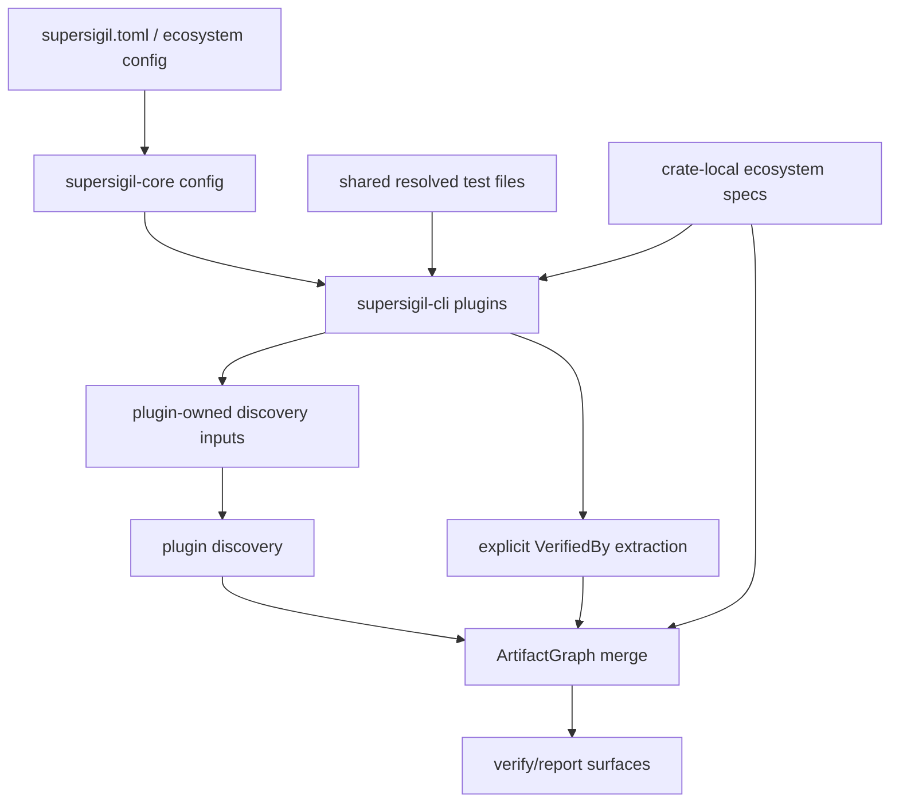

---
supersigil:
  id: ecosystem-plugins/design
  type: design
  status: approved
title: "Ecosystem Plugins"
---

<Implements refs="ecosystem-plugins/req" />
<DependsOn refs="workspace-projects/design, cli-runtime/design, verification-engine/design, config/design, evidence-contract/design, rust-plugin/design, verifies-macro/design" />
<TrackedFiles paths="crates/supersigil-core/src/config.rs, crates/supersigil-core/src/rust_scope.rs, crates/supersigil-core/src/rust_validation_inputs.rs, crates/supersigil-cli/src/plugins.rs, crates/supersigil-evidence/src/plugin.rs, crates/supersigil-rust/src/discover.rs, crates/supersigil-rust/src/build_support.rs, crates/supersigil-verify/src/explicit_evidence.rs, crates/supersigil-verify/src/artifact_graph.rs, crates/supersigil-verify/src/report.rs, crates/supersigil-core/tests/config_unit_tests.rs" />

## Overview

`ecosystem-plugins` is now the root cross-cutting layer for ecosystem-backed
verification.

The important current split is:

- `supersigil-core` owns configuration for plugin activation and Rust policy
- `supersigil-cli` owns built-in plugin assembly and top-level evidence
  orchestration
- enabled plugins own plugin-specific discovery-input planning starting from
  the shared test-file baseline
- `supersigil-verify` owns explicit-evidence extraction, artifact-graph merge,
  rule consumption, and report serialization
- `supersigil-evidence`, `supersigil-rust`, and `supersigil-rust-macros` own
  the ecosystem-project-local contracts and Rust-specific behavior

The current single `ecosystem` project is an intentional transitional shape
because only one built-in plugin family exists today.

## Architecture

## Cross-Cutting Flow

1. Load config and determine the enabled built-in plugins.
2. Resolve shared test files from the current verification scope.
3. Assemble plugin instances from the enabled plugin set.
4. Let each enabled plugin plan its own discovery inputs from the shared
   test-file baseline and workspace scope.
5. Run plugin discovery over each plugin's effective source files.
6. Extract explicit `VerifiedBy` evidence from the document graph and shared
   test-file baseline.
7. Merge explicit and plugin-derived evidence into one `ArtifactGraph`.
8. Feed the merged evidence into report and query surfaces.

## Boundary Choices

### Config Boundary

`supersigil-core` owns:

- default `ecosystem.plugins = ["rust"]`
- unknown-plugin rejection during config load
- Rust validation policy and project-scope config parsing

This keeps plugin activation policy in the shared config model, not in CLI-only
flags.

### CLI Boundary

`supersigil-cli::plugins` owns:

- built-in plugin assembly
- shared test-file resolution handoff into the plugin layer
- conversion of plugin diagnostics and fatal plugin errors into verification
  findings
- the top-level `build_evidence` orchestration function

This keeps the CLI responsible for orchestration while leaving Rust-specific
discovery assumptions outside the CLI glue.

### Plugin Boundary

Enabled ecosystem plugins own:

- plugin-specific discovery-input planning starting from shared resolved test
  files
- any ecosystem-specific source-file inference needed to discover evidence
- evidence discovery over the plugin's effective file set

In this pass, project filtering remains a verification/report concern rather
than a plugin-discovery filter. The shared `ProjectScope` stays minimal and is
not meant to change the current workspace-wide ArtifactGraph semantics.

### Verification Boundary

`supersigil-verify` owns:

- normalization of explicit `VerifiedBy` evidence
- artifact-graph merge and conflict handling
- evidence summary serialization and markdown rendering

That behavior remains part of the verification domain even though it consumes
ecosystem-defined types.

## Future Project Topology

Once a second built-in ecosystem exists, the chosen project split is:

- keep root `specs/ecosystem-plugins/*` docs in the `workspace` project for
  cross-cutting activation, orchestration, and reporting behavior
- move `crates/supersigil-evidence/specs/**/*` into a shared
  `ecosystem-common` project
- keep the Rust-family docs together in an `ecosystem-rust` project spanning
  `crates/supersigil-rust/specs/**/*` and
  `crates/supersigil-rust-macros/specs/**/*`
- give each additional built-in ecosystem family its own project, such as
  `ecosystem-python`

This keeps `plan`, `context`, and `status` queries aligned with real plugin
families instead of collapsing unrelated ecosystems into one broad crate-local
project.

## Testing Strategy

- `crates/supersigil-core/tests/config_unit_tests.rs`
  covers plugin defaults, explicit disabling, unknown-plugin rejection, and
  Rust ecosystem policy parsing.
- `crates/supersigil-cli/src/plugins.rs`
  covers built-in plugin assembly, plugin-orchestration behavior,
  plugin-failure and plugin-diagnostic findings, and end-to-end
  evidence-pipeline assembly.
- `crates/supersigil-cli/tests/cmd_status.rs` and
  `crates/supersigil-cli/tests/cmd_plan.rs`
  cover CLI stderr/stdout discipline for ecosystem-backed warnings on query
  surfaces.
- `crates/supersigil-cli/tests/cmd_verify.rs`
  covers verification-report surfacing for plugin discovery warnings and
  failures, explicit plugin disabling, unknown-plugin config rejection, and
  plugin-finding severity overrides.
- `crates/supersigil-evidence/src/plugin.rs`
  covers the shared plugin contract for plugin-owned discovery-input planning
  and normalized discovery results.
- `crates/supersigil-rust/src/discover.rs`
  covers Rust-specific input planning, supported test forms, metadata
  extraction, source locations, invalid ref rejection, and fault tolerance.
- `crates/supersigil-verify/src/artifact_graph.rs`
  covers merge, deduplication, provenance preservation, and conflict handling.
- `crates/supersigil-verify/src/report.rs`
  covers evidence-summary rendering in JSON and markdown.

## Current Gaps

- The current pipeline intentionally keeps project filters workspace-wide at
  report time rather than narrowing plugin discovery by project.
