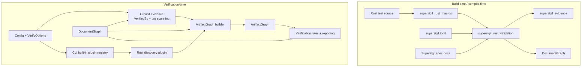
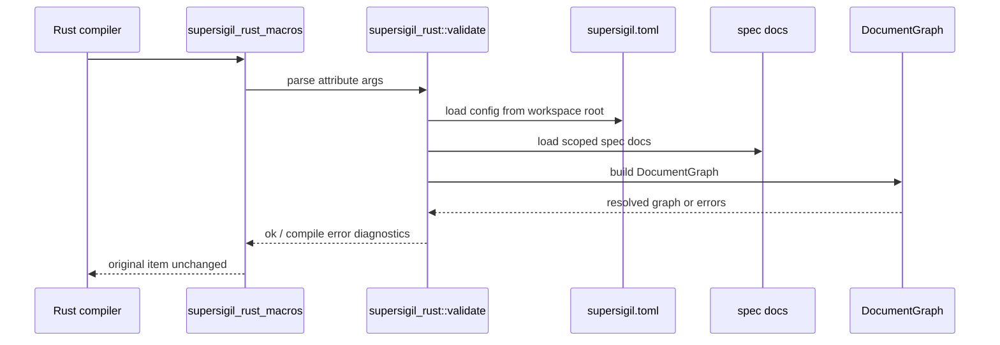

---
supersigil:
  id: ecosystem-plugins/design
  type: design
  status: draft
title: "Ecosystem Plugins"
---

<Implements refs="ecosystem-plugins/req" />
<DependsOn refs="document-graph/design, verification-engine/design, parser-and-config/design" />
<TrackedFiles paths="Cargo.toml, crates/supersigil-verify/src/**/*.rs, crates/supersigil-core/src/config.rs, crates/supersigil-cli/src/**/*.rs" />

## Overview

The ecosystem plugin design adds a second verification-time layer above the
existing `DocumentGraph`. `DocumentGraph` stays document-only and remains the
input to lint, ref resolution, and compile-time criterion validation.
`ArtifactGraph` is constructed only when verification needs evidence from
source code or other artifact systems.

Rust is the first ecosystem integration. The design introduces one new
language-agnostic crate for normalized evidence and two Rust-specific crates:

- `supersigil-evidence`: shared normalized evidence types and the
  `EcosystemPlugin` trait
- `supersigil-rust`: shared Rust ecosystem support used by verification-time
  discovery and by build-time validation helpers
- `supersigil-rust-macros`: proc-macro crate exporting the public
  `#[supersigil::verified_by(...)]` attribute

This split keeps `supersigil-core` language-agnostic while still allowing a
public Rust annotation API. It also gives all ecosystem integrations one shared
normalized evidence surface without forcing Rust-specific concepts into
`supersigil-core`.

## Architecture



The architecture has two distinct integrity levels:

- `DocumentGraph` failures are structural errors and remain the responsibility
  of the document/config pipeline.
- `ArtifactGraph` enrichment failures are verification findings scoped to the
  producing evidence source or plugin.

## Crate Boundaries

### Existing Crates

- `supersigil-core`: continues to own `Config`, `DocumentGraph`, component
  definitions, and graph building. It gains config structs for Rust ecosystem
  policy, but it does not gain Rust parsing or proc-macro code.
- `supersigil-verify`: gains `ArtifactGraph`, explicit-evidence extraction,
  evidence merging, and rule updates that operate on merged evidence. It
  depends on language-agnostic evidence abstractions, not directly on
  Rust-specific discovery code.
- `supersigil-cli`: continues to orchestrate lint, verify, context, and status.
  It gains built-in plugin assembly from config and only needs output
  formatting updates where evidence records are shown.

### New Crates

```text
crates/
├── supersigil-evidence/
│   └── src/
│       ├── lib.rs
│       ├── types.rs         # CriterionRef, VerificationEvidenceRecord, TestIdentity
│       ├── provenance.rs    # PluginProvenance, EvidenceConflict
│       └── plugin.rs        # EcosystemPlugin trait + plugin error surface
├── supersigil-rust/
│   └── src/
│       ├── lib.rs
│       ├── target.rs        # Criterion target parsing
│       ├── validate.rs      # DocumentGraph-backed validation helpers
│       ├── discover.rs      # syn-based source discovery
│       ├── normalize.rs     # Rust test -> VerificationEvidenceRecord
│       ├── scope.rs         # Single-project / multi-project resolution
│       └── build_support.rs # Optional build.rs freshness helpers
└── supersigil-rust-macros/
	    └── src/
	        └── lib.rs           # #[supersigil::verified_by(...)]
```

`supersigil-rust-macros` depends on `supersigil-rust`, `supersigil-evidence`,
and `supersigil-core`. Consumers depend on `supersigil-rust`, which re-exports
the proc macro from `supersigil-rust-macros`.

### Dependency Graph

```text
supersigil-evidence     -> supersigil-core
supersigil-verify       -> supersigil-core, supersigil-evidence
supersigil-rust         -> supersigil-core, supersigil-evidence
supersigil-rust-macros  -> supersigil-rust
supersigil-cli          -> supersigil-verify, supersigil-rust
```

Design choices:

- `supersigil-core` does not depend on `supersigil-evidence`.
- `supersigil-verify` consumes `EcosystemPlugin` and normalized evidence types
  from `supersigil-evidence`, but it does not know about `syn` or Rust parsing.
- `supersigil-cli` assembles built-in plugins from config and passes them to
  `supersigil-verify`.
- `supersigil-rust` is just one implementation of the generic plugin contract.

## Key Types

All normalized evidence types in this section live in the `supersigil-evidence`
package, not in `supersigil_rust` or `supersigil-verify`.

### `ArtifactGraph`

`ArtifactGraph` lives in `supersigil-verify`. It borrows or references the
existing `DocumentGraph` rather than replacing it.

```rust
pub struct ArtifactGraph<'g> {
    pub documents: &'g DocumentGraph,
    pub evidence: Vec<VerificationEvidenceRecord>,
    pub evidence_by_criterion: HashMap<CriterionRef, Vec<EvidenceId>>,
    pub evidence_by_test: HashMap<TestIdentity, Vec<EvidenceId>>,
    pub conflicts: Vec<EvidenceConflict>,
}
```

The graph is intentionally evidence-centric in v1. It does not attempt to
represent arbitrary source AST nodes as first-class graph vertices yet.

### `VerificationEvidenceRecord`

```rust
pub struct VerificationEvidenceRecord {
    pub id: EvidenceId,
    pub criterion_targets: BTreeSet<CriterionRef>,
    pub test: TestIdentity,
    pub source_location: SourceLocation,
    pub evidence_kind: EvidenceKind,
    pub provenance: Vec<PluginProvenance>,
    pub metadata: BTreeMap<String, String>,
}
```

Important design choices:

- `criterion_targets` is always criterion-level in the normalized model.
- `provenance` is a collection, not a single enum value, because one effective
  record may be contributed by multiple compatible sources.
- `metadata` stays stringly typed in v1, matching the existing design's plugin
  metadata approach and avoiding an early rigid schema.

### `CriterionRef`

```rust
pub struct CriterionRef {
    pub doc_id: String,
    pub criterion_id: String,
}
```

Parsing rejects fragmentless document refs in the Rust attribute path, but the
type itself is ecosystem-neutral and reused by all evidence producers.

### `TestIdentity`

```rust
pub struct TestIdentity {
    pub file: PathBuf,
    pub name: String,
    pub kind: TestKind,
}

pub enum TestKind {
    Unit,
    Async,
    Property,
    Snapshot,
    Unknown,
}
```

`TestIdentity` is the deduplication key for same-test evidence merging. Two
sources refer to the "same test" only when they normalize to the same file and
test name. This avoids accidental dedup across unrelated tests in the same
file.

### `ProjectScope`

```rust
pub struct ProjectScope {
    pub project: Option<String>,
    pub project_root: PathBuf,
}
```

`ProjectScope` is a language-agnostic description of the Supersigil project
context used for evidence discovery. Rust-specific path inference lives in
`supersigil_rust::scope`, but the normalized plugin contract receives the
resolved scope in this shared form.

### `PluginProvenance`

```rust
pub enum PluginProvenance {
    VerifiedByTag { doc_id: String, tag: String },
    VerifiedByFileGlob { doc_id: String, paths: Vec<String> },
    RustAttribute { attribute_span: SourceLocation },
}
```

The design keeps explicit authored evidence and plugin evidence comparable
without hiding where they came from.

### `EvidenceConflict`

```rust
pub struct EvidenceConflict {
    pub test: TestIdentity,
    pub left: BTreeSet<CriterionRef>,
    pub right: BTreeSet<CriterionRef>,
    pub sources: Vec<PluginProvenance>,
}
```

Conflicts are computed after normalization to criterion sets. Compatible sources
merge; incompatible criterion sets become findings.

### `EcosystemPlugin`

The extension contract for built-in and future ecosystem integrations is a
small trait in `supersigil-evidence`:

```rust
pub trait EcosystemPlugin {
    fn name(&self) -> &'static str;

    fn discover(
        &self,
        files: &[PathBuf],
        scope: &ProjectScope,
        documents: &DocumentGraph,
    ) -> Result<Vec<VerificationEvidenceRecord>, PluginError>;
}
```

Design choices:

- the trait returns normalized evidence records, not ecosystem-specific AST
  data
- `DocumentGraph` is available for plugins that need document-aware
  normalization
- plugin failures are reported through a generic `PluginError` surface that
  `supersigil-verify` turns into findings
- v1 ships only one implementation, but the trait makes the extension point
  concrete for future ecosystems

## Config Extensions

The existing `[ecosystem] plugins = ["rust"]` setting stays intact. Rust gains
an optional nested config section for validation policy and project scoping:

```toml
[ecosystem]
plugins = ["rust"]

[ecosystem.rust]
validation = "dev" # one of: off, dev, all

[[ecosystem.rust.project_scope]]
manifest_dir_prefix = "services/api"
project = "backend"
```

Design choices:

- `validation = "dev"` matches the requirement's default "development and
  test-oriented builds only" policy.
- `project_scope` is optional. Single-project mode needs no extra scope.
- In multi-project mode, explicit longest-prefix matching wins. If there is no
  explicit match, `supersigil-rust` attempts path-based inference. If inference
  is ambiguous, validation fails with a clear compile-time error.

The config lives in `supersigil-core::config` so both the proc-macro and the
verify path can consume the same policy.

Unknown built-in plugin identifiers are rejected during config loading in
`supersigil-core::config`, before CLI plugin assembly begins.

## Compile-Time Validation Flow

The proc macro validates only against `DocumentGraph`, never against the full
`ArtifactGraph`.



### Workspace Root Resolution

The proc macro derives the starting crate root from `CARGO_MANIFEST_DIR`. From
there, `supersigil_rust::scope` walks upward looking for `supersigil.toml`.
This matches the current CLI assumption that config is repository-root scoped.

### Build Policy Detection

The proc macro reads:

- Cargo environment variables exposed during compilation
- the Rust validation policy from config

Policy mapping:

- `off`: parse and attach the attribute, but skip graph loading
- `dev`: validate in test/dev-oriented compilations and skip release-oriented
  builds by default
- `all`: always validate

The macro does not rewrite the annotated item. It only emits diagnostics or
passes the item through unchanged.

### Build Freshness Strategy

Stable procedural macros do not provide a fully portable freshness contract for
external file inputs. The design therefore uses two layers:

1. Best available tracked-input support when the toolchain/build integration
   exposes it
2. An optional helper in `supersigil_rust::build_support` for `build.rs`
   integration that emits `cargo:rerun-if-changed=` lines for `supersigil.toml`
   and every discovered spec document

Consumer pattern:

```rust
fn main() {
    supersigil_rust::build_support::emit_rerun_if_changed().unwrap();
}
```

This keeps compile-time validation correct when it runs, while giving projects
an explicit path to better build freshness on stable Cargo.

## Rust Discovery Flow

Verification-time discovery is separate from compile-time validation and does
not rely on macro expansion artifacts. `supersigil_rust` implements
`EcosystemPlugin`.

```rust
impl EcosystemPlugin for RustPlugin {
    fn discover(
        &self,
        files: &[PathBuf],
        scope: &ProjectScope,
        documents: &DocumentGraph,
    ) -> Result<Vec<VerificationEvidenceRecord>, PluginError>;
}
```

The implementation uses `syn` to parse Rust source files and walk:

- `#[test] fn ...`
- `#[tokio::test] async fn ...`
- test items generated or wrapped through `proptest` macros when their test
  function names and attribute sites are discoverable in the source
- snapshot-oriented test functions containing `insta` assertions

Rust-specific intermediate discovery structs may exist inside
`supersigil_rust`, but the public plugin boundary returns normalized
criterion-level evidence records.

### Discovery Scope Resolution

Rust discovery resolves its candidate source files in two phases:

1. If the project config declares Rust-specific test globs, use those globs as
   the authoritative discovery scope.
2. Otherwise infer a default Rust discovery scope from conventional project
   locations such as `tests/**/*.rs`, `src/**/*.rs`, `benches/**/*.rs`, and
   `examples/**/*.rs`.

This keeps explicit project configuration authoritative while preventing the
"plugin enabled but nothing was scanned" failure mode for simple Rust projects.
Inference only expands the candidate file set. Evidence extraction still
requires supported Rust test item shapes.

If the configured or inferred scope yields zero candidate files, or files are
found but no supported test items are discovered, the Rust integration returns
a structured plugin-scoped finding with remediation guidance instead of failing
silently.

### Normalization Rules

1. Parse each Rust attribute into one or more `CriterionRef` values.
2. Identify a stable `TestIdentity` from the containing test item.
3. Derive `TestKind`.
4. Attach optional metadata:
   - proptest: known regression file or case-related metadata when derivable
   - insta: snapshot identifier when derivable from the assertion macro call
5. Emit `VerificationEvidenceRecord`.

If a source file cannot be parsed or an annotation cannot be normalized, the
plugin returns structured errors that become plugin-scoped findings.

## Explicit Evidence Extraction

`ArtifactGraph` construction begins by turning existing authored evidence into
the same normalized form as plugin evidence.

### `VerifiedBy strategy="tag"`

1. Read the property or other validating document that owns the `VerifiedBy`
   component.
2. Resolve its `References` refs to a criterion set.
3. Scan configured test files for matching comment tags.
4. Produce one normalized evidence record per discovered test, with:
   - `criterion_targets = Effective_Criterion_Set`
   - `provenance = VerifiedByTag { ... }`

This is the key step that makes tag evidence comparable to Rust attribute
evidence. The tag string itself is not the normalized target.

### `VerifiedBy strategy="file-glob"`

`file-glob` evidence remains coarse. It contributes evidence records with a
test identity at file granularity rather than function granularity:

```rust
TestIdentity {
    file,
    name: "<file-glob>".into(),
    kind: TestKind::Unknown,
}
```

This allows file-glob evidence to coexist with fine-grained evidence while
making its coarse nature visible in reports.

## Merge And Conflict Algorithm

The merge lives in `supersigil-verify::artifact_graph`.

```rust
pub fn build_artifact_graph(
    documents: &DocumentGraph,
    config: &Config,
    project_root: &Path,
    options: &VerifyOptions,
) -> ArtifactGraph;
```

Algorithm:

1. Collect normalized explicit evidence from authored `<VerifiedBy>` sources.
2. Ask the caller for the enabled built-in plugin instances.
3. Run those plugins and collect normalized implicit evidence.
4. Group all evidence by `TestIdentity`.
5. Within each group, compare `criterion_targets`:
   - same set: merge into one effective record, append provenance
   - different set: emit `EvidenceConflict`, keep records separate for
     diagnostics
6. Build secondary indexes by criterion and by test.

This design makes the "same test, same effective criterion set" rule explicit
and leaves no special-case branch for comment tags versus Rust attributes.

## Rule Changes In `supersigil-verify`

The existing verification engine remains rule-oriented, but several rules now
consume `ArtifactGraph` instead of only authored components.

### `unverified_validation`

Old behavior:

- emit when a document has `References` and no authored `<VerifiedBy>`

New behavior:

- emit when a document has `References` refs whose effective criterion targets
  have no backing evidence in the `ArtifactGraph`

The rule still starts from authored validation claims. What changes is the
definition of "backing evidence."

### `uncovered_criterion`

Old behavior:

- emit when a criterion has no authored validating document

New behavior:

- emit when a criterion has neither an authored validating document nor direct
  ArtifactGraph evidence that targets the criterion

This keeps authored validation docs valuable, but it prevents direct
source-derived evidence such as Rust `#[verified_by(...)]` annotations from
appearing in the report as "covered" while the same criterion still fails the
coverage rule.

### `zero_tag_matches`

This remains tied to explicit `VerifiedBy strategy="tag"` declarations. The
ArtifactGraph uses its discovered matches for normalized evidence, but the
rule still reports when a declared tag matched no tests.

### New Plugin-Scoped Findings

The verify crate gains synthetic finding categories for:

- plugin discovery failure
- evidence conflict
- invalid source annotation observed at verification time

These findings are scoped like existing hook-related synthetic findings: they
do not change `DocumentGraph` construction semantics.

## Query And Reporting Integration

`verify` is the primary ArtifactGraph consumer in v1, but `context` and
`status` need visibility into merged evidence summaries.

Design choice:

- `DocumentGraph::context()` remains document-only
- CLI-level `context` and `status` commands may optionally enrich the
  document-only result with ArtifactGraph evidence summaries when config and
  evidence sources are available

This avoids forcing every graph query to instantiate source scanning by
default, while still allowing richer CLI output.

Report output additions:

- evidence kind (`tag`, `file-glob`, `rust-attribute`)
- test identity (`file`, `name`, `kind`)
- criterion target list
- merged provenance list when a deduped record has multiple sources

## Failure Model

The design draws a hard line between structural and enrichment failures.

### Structural Failures

- invalid config keys
- broken criterion refs in docs
- duplicate IDs
- graph cycles
- compile-time criterion resolution failure when validation policy is active

These are still hard failures in their respective pipelines.

### Enrichment Failures

- a Rust file cannot be parsed during verification-time discovery
- a plugin crashes or times out
- two evidence sources disagree on the effective criterion set for the same
  test
- a source annotation becomes invalid in a build where compile-time validation
  was skipped

These become findings in verification output.

## Testing Strategy

The implementation is split into testable slices:

- `supersigil-rust`
  - unit tests for criterion target parsing
  - fixture-based tests for `syn` discovery across supported test styles
  - multi-project scope resolution tests
  - build-support tests for discovered rerun-if-changed inputs
- `supersigil-rust-macros`
  - `trybuild` tests for accepted and rejected attribute syntax
  - compile-fail tests for unresolved criterion refs and ambiguous project
    scope
- `supersigil-verify`
  - unit tests for explicit evidence normalization
  - unit tests for merge/dedup/conflict behavior
  - integration tests for `verify` using mixed evidence sources

## Alternatives Considered

### Put ArtifactGraph In `supersigil-core`

Rejected because it would force the language-agnostic core to take on source
scanning concerns and ecosystem-specific data structures.

### Store Plugin Evidence Back Into MDX

Rejected because source-derived evidence is build- and repository-state
dependent. Rewriting spec files would create churn and conflate authored intent
with discovered state.

### Use Only Comment Tags For Rust

Rejected because the user requirement is compile-time criterion validation, and
comment tags cannot provide compile-time graph resolution or criterion-only
syntax with the same rigor.
