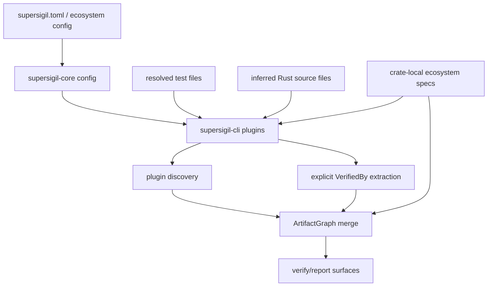

---
supersigil:
  id: ecosystem-plugins/design
  type: design
  status: draft
title: "Ecosystem Plugins"
---

<Implements refs="ecosystem-plugins/req" />
<DependsOn refs="workspace-projects/design, cli-runtime/design, verification-engine/design, config/design, evidence-contract/design, rust-plugin/design, verifies-macro/design" />
<TrackedFiles paths="crates/supersigil-core/src/config.rs, crates/supersigil-cli/src/plugins.rs, crates/supersigil-verify/src/explicit_evidence.rs, crates/supersigil-verify/src/artifact_graph.rs, crates/supersigil-verify/src/report.rs, crates/supersigil-core/tests/config_unit_tests.rs" />

## Overview

`ecosystem-plugins` is now the root cross-cutting layer for ecosystem-backed
verification.

The important current split is:

- `supersigil-core` owns configuration for plugin activation and Rust policy
- `supersigil-cli` owns built-in plugin assembly and source-file inference
- `supersigil-verify` owns explicit-evidence extraction, artifact-graph merge,
  rule consumption, and report serialization
- `supersigil-evidence`, `supersigil-rust`, and `supersigil-rust-macros` own
  the ecosystem-project-local contracts and Rust-specific behavior

## Architecture

## Cross-Cutting Flow

1. Load config and determine the enabled built-in plugins.
2. Resolve test files from the current verification scope.
3. If the Rust plugin is enabled, infer additional Rust source files from
   conventional source locations and workspace members.
4. Assemble plugin instances from the enabled plugin set.
5. Run plugin discovery over the resolved source files.
6. Extract explicit `VerifiedBy` evidence from the document graph.
7. Merge explicit and plugin-derived evidence into one `ArtifactGraph`.
8. Feed the merged evidence into report and query surfaces.

## Boundary Choices

### Config Boundary

`supersigil-core` owns:

- default `ecosystem.plugins = ["rust"]`
- unknown-plugin rejection during config load
- Rust validation policy and project-scope config parsing

This keeps plugin activation policy in the shared config model, not in CLI-only
flags.

### CLI Boundary

`supersigil-cli::plugins` owns:

- built-in plugin assembly
- Rust source-file inference across workspace members
- conversion of plugin diagnostics and fatal plugin errors into verification
  findings
- the top-level `build_evidence` orchestration function

This means the runtime Rust crate does not currently own end-to-end discovery
scope selection on its own.

### Verification Boundary

`supersigil-verify` owns:

- normalization of explicit `VerifiedBy` evidence
- artifact-graph merge and conflict handling
- evidence summary serialization and markdown rendering

That behavior remains part of the verification domain even though it consumes
ecosystem-defined types.

## Testing Strategy

- `crates/supersigil-core/tests/config_unit_tests.rs`
  covers plugin defaults, explicit disabling, unknown-plugin rejection, and
  Rust ecosystem policy parsing.
- `crates/supersigil-cli/src/plugins.rs`
  covers built-in plugin assembly, Rust source-file inference, plugin-failure
  and plugin-diagnostic findings, and end-to-end evidence-pipeline assembly.
- `crates/supersigil-verify/src/artifact_graph.rs`
  covers merge, deduplication, provenance preservation, and conflict handling.
- `crates/supersigil-verify/src/report.rs`
  covers evidence-summary rendering in JSON and markdown.

## Current Gaps

- Rust source-file inference lives in CLI glue rather than in the Rust plugin
  implementation itself.
- Cross-cutting scope resolution is still duplicated between
  `supersigil-rust::scope` and `supersigil-rust-macros`.
- Plugin diagnostics use `plugin_discovery_warning` and fatal failures use
  `plugin_discovery_failure`, allowing consumers to distinguish severity.
