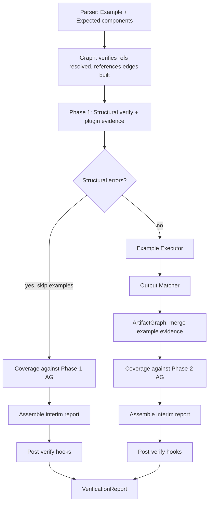

---
supersigil:
  id: executable-examples/design
  type: design
  status: approved
title: Executable Examples
---

```supersigil-xml
<Implements refs="executable-examples/req" />
<DependsOn refs="verification-engine/design, ecosystem-plugins/design, config/design" />
```

## Overview

Executable Examples adds two new built-in components (`Example`,
`Expected`), a runner dispatch and output matching engine, and a
two-phase verify pipeline that runs examples after structural checks
and merges example evidence into the `ArtifactGraph` before coverage
evaluation.

The design follows the principle of delegating execution to external
tools. For subprocess-based runners (`sh`, `cargo-test`, and
user-defined runners), supersigil writes code to a temp file, invokes
a shell command, and captures stdout/stderr/exit code. The `http`
runner is a native built-in that sends HTTP requests directly. In both
cases, the captured output is fed through the same matching engine.

### Authoring Syntax

Code content for `Example` and `Expected` can be provided in two ways:

**Inline** — for trivial content with no XML-special characters:

````md
```supersigil-xml
<Example id="echo-test" runner="sh" verifies="demo/req#demo-1">
  echo hello
  <Expected status="0">
    hello
  </Expected>
</Example>
```
````

**External code fences** — for complex content that needs syntax
highlighting or contains characters like `<`, `>`, `&`:

````md
```http supersigil-ref=create-task
POST /api/v1/tasks
Content-Type: application/json

{"title": "Buy milk", "due_date": "2026-12-01"}
```

```json supersigil-ref=create-task#expected
{
  "id": "<any-uuid>",
  "title": "Buy milk",
  "due_date": "2026-12-01",
  "status": "pending",
  "created_at": "<any-iso8601>"
}
```

```supersigil-xml
<Example id="create-task" lang="http" runner="http"
  verifies="tasks/req#req-1-1"
  env="BASE_URL=http://localhost:3000">
  <Expected status="201" format="json" />
</Example>
```
````

External code fences use the `supersigil-ref` attribute in the Markdown
info string to bind to their component by ID. `Expected` receives an
implicit fragment ID of `expected` within its parent `Example`,
referenced as `supersigil-ref=example-id#expected`. Code fences may
appear anywhere in the document — the binding is by explicit reference,
not by proximity.

The parser extracts code content from either inline text or linked
code fences. The `Example` code becomes `ExampleSpec.code`; the
`Expected` code becomes `ExpectedSpec.body`. If both inline text and a
linked code fence exist for the same component, the parser reports an
error.

### Verification-Engine Amendment

This design requires a change to the verify pipeline described in
`verification-engine/req` (req-1-4). The current contract assumes the
`ArtifactGraph` is fully built before `verify()` is called and that
coverage runs as a single-pass rule. Under the new pipeline, coverage
evaluation is deferred until after example evidence has been merged.
The amendment is scoped to the CLI orchestration layer — the
`supersigil_verify::verify` library function signature does not change.

## Architecture



### Crate Boundaries

| Crate | New Responsibility |
|-------|-------------------|
| `supersigil-core` | `Example` and `Expected` component definitions in `component_defs.rs`. Config model for `[examples]`. `CodeBlock` type in `types.rs`. |
| `supersigil-parser` | Amend extractor to preserve fenced code block content and byte offsets for `Example` and `Expected` components. |
| `supersigil-verify` | New `examples` module: executor, runner dispatch, output matcher. New `RuleName` variants for example failures. `verify_structural()` and `verify_coverage()` split. Code block cardinality lint rules. |
| `supersigil-evidence` | New `EvidenceKind::Example` variant. |
| `supersigil-cli` | Two-phase verify orchestration including hook invocation. `examples` discovery command. `--skip-examples`, `--update-snapshots`, and `-j, --parallelism` flags on `verify`. |

## Two-Phase Verify Pipeline

The current CLI `verify` flow (in `commands/verify.rs`):

```
build_evidence() → verify() → append plugin findings → report
```

The new flow:

```
 1. build_evidence()              → Phase-1 ArtifactGraph (explicit + plugin)
 2. verify_structural()           → structural findings (all rules EXCEPT coverage)
 3. IF structural errors:
      a. verify_coverage()        → coverage findings against Phase-1 AG
      b. assemble interim report  → all findings so far
      c. run_hooks(interim)       → hook findings
      d. build final report       → note "examples skipped due to structural errors"
      e. DONE
 4. extract_examples()            → Vec<ExampleSpec> from document graph
 5. execute_examples()            → Vec<ExampleResult>
 6. merge_example_evidence()      → Phase-2 ArtifactGraph (Phase-1 + example evidence)
 7. verify_coverage()             → coverage findings against Phase-2 AG
 8. assemble interim report       → structural + example + coverage findings
 9. run_hooks(interim)            → hook findings
10. build final report            → VerificationReport
```

This requires splitting `supersigil_verify::verify` into composable
parts. The current function already runs rule groups independently
(coverage, test-mapping, tracked-files, structural, status). The split
exposes coverage as a separately-callable function so the CLI can run
it after the example evidence merge.

### New verify API surface

```rust
/// Run all rules except coverage and hooks.
/// Returns structural/test/status findings.
pub fn verify_structural(
    graph: &DocumentGraph,
    config: &Config,
    project_root: &Path,
    options: &VerifyOptions,
    artifact_graph: &ArtifactGraph<'_>,
) -> Result<Vec<Finding>, VerifyError>;

/// Run coverage rules only. Callable separately after evidence merge.
pub fn verify_coverage(
    graph: &DocumentGraph,
    artifact_graph: &ArtifactGraph<'_>,
) -> Vec<Finding>;
```

The existing `verify()` function remains as a convenience that calls
`verify_structural()`, `verify_coverage()`, and hooks internally. It
is backwards-compatible for callers that don't use the two-phase path.
The CLI two-phase path does NOT call `verify()` — it calls the split
functions directly and handles hooks itself.

### Terminal Progress Rendering

Example execution progress is rendered differently depending on whether
terminal output is interactive.

- On a TTY, the CLI renders a live progress view that redraws in place.
  Each example row shows queued, running, passed, or failed state, and
  running examples use a spinner because exact completion percentage is
  not known.
- On non-TTY output, the CLI emits append-only progress lines instead of
  cursor control or redraws. This keeps logs, pipes, snapshots, and CI
  output stable and readable.

### Hook Timing

Post-verify hooks run once, after all findings (structural, example,
coverage) are assembled into an interim report. In both the
structural-error path (step 3c) and the normal path (step 9), the
interim report is serialized to JSON, passed to hooks on stdin, and
hook-emitted findings are added to produce the final report.

This preserves the existing hook contract from `verification-engine/req`
(req-7-3): hooks always see a complete picture of findings, receive
the report on stdin, and emit `[level, message]` JSON on stdout.

The current `verify()` runs hooks internally (lib.rs:148). In the
two-phase path, hook invocation moves to the CLI orchestration layer.
The convenience `verify()` continues to run hooks internally for
backwards compatibility. The `hooks::run_hooks` function is unchanged.

### Parser Amendment

Code content for `Example` and `Expected` can come from two sources:

1. **Inline text** — the text content of the XML element inside a
   `supersigil-xml` fence.
2. **External code fence** — a Markdown code fence with
   `supersigil-ref=<component-id>` in the info string meta field.

The `supersigil-ref` mini-grammar (defined in `document-format/adr`):
the value starts after `=` and extends to the next whitespace or end
of the meta string. The optional fragment separator is `#`. Other meta
tokens (e.g. Shiki line highlights) may coexist, separated by
whitespace. Component IDs used in `supersigil-ref` must not contain
whitespace. Resolution is document-local: a `supersigil-ref` only
targets components in the same file.

The parser collects both sources during document parsing and links them:

- When parsing `supersigil-xml` fences, `Example` and `Expected`
  components may have inline text content (body text). This is stored
  as before in `body_text`.
- When parsing Markdown code fences, the parser checks the info string
  meta for `supersigil-ref=<id>`. Matching fences are stored as
  `CodeBlock` entries keyed by their ref target.
- During extraction, the parser resolves each `Example` and `Expected`:
  if a `supersigil-ref` code fence targets the component, its content
  becomes the code. Otherwise, the inline `body_text` is used. If both
  exist, a structural lint error is reported (not a parse error — the
  parser collects both; the lint rule validates cardinality).

```rust
pub struct CodeBlock {
    pub lang: Option<String>,
    pub content: String,
    /// Byte offset of `content` in the normalized source file.
    /// Populated by the parser for all extracted code blocks.
    pub content_offset: usize,
}
```

The `content_offset` field records where the code block content starts
in the normalized (BOM-stripped, CRLF→LF) source text. The parser
computes this during extraction. Later, `extract_examples()` (step 4
of the pipeline) copies the offset from the `Expected` component's
code block into `ExpectedSpec.body_span` as
`(content_offset, content_offset + content.len())`. This is the span
the snapshot rewriter uses in step 5 of the rewrite strategy.

#### Code content cardinality

- `Example` MUST have exactly one code source (either inline text or
  one linked code fence). Zero or multiple sources is a lint error.
- `Expected` MUST have at most one code source. Zero is valid when
  only `status` or `contains` attribute checks are used. Multiple is
  a lint error.
- `Example` MUST have at most one `Expected` child. Multiple is a lint
  error.

This validation is a structural lint rule in `supersigil-verify`,
analogous to `check_verified_by_placement`.

#### Expected implicit ID

`Expected` does not have an explicit `id` attribute. When nested inside
an `Example`, it receives the reserved implicit fragment ID `expected`.
An external code fence targets it with
`supersigil-ref=example-id#expected`. The fragment name `expected` is
reserved and must not be used as an explicit component ID within the
same Example.

#### Orphan supersigil-ref validation

A Markdown code fence with a `supersigil-ref` meta attribute that does
not resolve to any `Example` or `Expected` component in the document is
a lint error. This catches typos (e.g. `supersigil-ref=create-taks`
when the component ID is `create-task`) that would otherwise silently
drop the intended code content.

#### Snapshot rewrite strategy

The current parser preprocesses source files (BOM stripping, CRLF
normalization) before computing AST byte offsets. This means extracted
byte positions refer to the normalized string, not the raw file on
disk.

For `--update-snapshots`, the rewriter avoids raw-offset mapping
entirely. Instead it:

1. Reads the source file from disk.
2. Applies the same normalization (BOM strip, CRLF → LF).
3. Locates the `Expected` code content in the normalized text using
   the extracted byte offset (whether the content is inline or in an
   external code fence).
4. Performs the replacement in the normalized string.
5. Writes the result back to disk.

This means snapshot rewrites also normalize the file (CRLF → LF, BOM
stripped) as a side effect, which is acceptable since supersigil source
files are expected to be LF-normalized.

## Component Definitions

### Example

```rust
ComponentDef {
    attributes: {
        "id":         { required: true,  list: false },
        "lang":       { required: false, list: false },
        "runner":     { required: true,  list: false },
        "verifies":   { required: false, list: true  },
        "references": { required: false, list: true  },
        "timeout":    { required: false, list: false },
        "env":        { required: false, list: true  },
        "setup":      { required: false, list: false },
    },
    referenceable: true,
    verifiable: false,
    target_component: None,
    description: "Embeds a runnable code sample...",
}
```

If `lang` is omitted and the code source is an external code fence
linked via `supersigil-ref`, the executor derives it from the fence
language identifier. If `lang` is omitted and the code source is
inline text, it is a lint error — inline text has no language metadata
to derive from. The resolved language is what `{lang}` interpolates
in runner command templates.

`verifies` refs are validated at graph-build time using the same
resolution path as `Implements` refs — they must target verifiable
components (criteria) with a `#fragment`. The graph does not create
reverse-mapping edges for `verifies` — evidence is produced at runtime.

`references` refs follow the existing `References` component path,
creating `references_reverse` edges.

`env` is a list attribute (`list: true`), parsed via
`split_list_attribute` into comma-separated items. Each item is split
on the first `=` to produce a `(key, value)` pair. Items without `=`
are a lint error. Example:

````md
```supersigil-xml
<Example id="create-task" lang="http" runner="http"
  env="BASE_URL=http://localhost:3000, API_KEY=test-key" />
```
````

`setup` is a path relative to the project root, pointing to an
executable script file. The executor runs the script with CWD set to
the example's temp directory and the same `env` variables injected. A
non-zero exit code fails the example before the runner is invoked.
Example: `setup="scripts/start-fixtures.sh"`.

### Expected

```rust
ComponentDef {
    attributes: {
        "status":   { required: false, list: false },
        "format":   { required: false, list: false },
        "contains": { required: false, list: false },
    },
    referenceable: false,
    verifiable: false,
    target_component: None,
    description: "Declares the golden output of an Example...",
}
```

A structural lint rule ensures `Expected` only appears as a direct
child of `Example` and that each `Example` has at most one `Expected`
child. This is analogous to `check_verified_by_placement`.

## Key Types

### ExampleSpec

Extracted from the document graph at execution time. The `code` field
is populated from the single required code block in the `Example`
component. The `expected.body` field is populated from the optional
code block in the `Expected` child.

```rust
pub struct ExampleSpec {
    /// Document containing this example.
    pub doc_id: String,
    /// Example id attribute.
    pub example_id: String,
    /// Language of the code block.
    pub lang: String,
    /// Runner name (resolved against built-ins + config).
    pub runner: String,
    /// Criteria this example verifies (parsed refs).
    pub verifies: Vec<VerifiableRef>,
    /// The code block content (from the single required code block).
    pub code: String,
    /// Expected output specification (None if no Expected child).
    pub expected: Option<ExpectedSpec>,
    /// Timeout in seconds.
    pub timeout: u64,
    /// Environment variables (parsed from comma-separated KEY=VALUE list).
    pub env: Vec<(String, String)>,
    /// Setup script path, relative to project root.
    pub setup: Option<PathBuf>,
    /// Source position for error reporting.
    pub position: SourcePosition,
    /// Path to the source file (for snapshot rewrites).
    pub source_path: PathBuf,
}

pub struct ExpectedSpec {
    /// Expected exit code or HTTP status.
    pub status: Option<u32>,
    /// Matching format: json, text, regex, snapshot.
    pub format: MatchFormat,
    /// Substring containment check.
    pub contains: Option<String>,
    /// Golden output body (from the optional code block inside Expected).
    pub body: Option<String>,
    /// Byte offset of the code block content in the normalized source
    /// (for snapshot rewrites). Only populated when format is Snapshot.
    pub body_span: Option<(usize, usize)>,
}

pub enum MatchFormat {
    Text,
    Json,
    Regex,
    Snapshot,
}
```

### ExampleResult

Produced by the executor for each example.

```rust
pub struct ExampleResult {
    /// The spec that was executed.
    pub spec: ExampleSpec,
    /// Outcome.
    pub outcome: ExampleOutcome,
    /// Wall-clock duration.
    pub duration: Duration,
}

pub enum ExampleOutcome {
    /// All checks passed.
    Pass,
    /// One or more checks failed.
    Fail(Vec<MatchFailure>),
    /// Runner process timed out.
    Timeout,
    /// Setup script or runner invocation failed.
    Error(String),
}

pub struct MatchFailure {
    pub check: MatchCheck,
    pub expected: String,
    pub actual: String,
}

pub enum MatchCheck {
    Status,
    Contains,
    Body,
}
```

### RunnerDef

```rust
pub struct RunnerDef {
    /// Shell command template with {file}, {dir}, {lang}, {name} placeholders.
    /// None for native runners (e.g. http).
    pub command: Option<String>,
}
```

## Runner Dispatch

### Resolution

1. Look up `runner` name in `config.examples.runners` (always
   subprocess-based).
2. If not found, look up in built-in runner map (may be native or
   subprocess).
3. If not found, fail the example with an "unknown runner" error.

### Built-in Runners

#### `sh` (subprocess)

```rust
RunnerDef { command: Some("sh {file}".into()) }
```

The code block is written to `{dir}/example.sh`. Stdout is captured
for matching. Code blocks must be POSIX-compatible; users who need
bash-specific features can define a custom `bash` runner in config.

#### `cargo-test` (subprocess)

```rust
RunnerDef {
    command: Some(
        "cargo test --test {name} --manifest-path {dir}/Cargo.toml -- --nocapture"
            .into()
    )
}
```

The executor scaffolds a minimal Cargo project in the temp directory:

```
{dir}/
  Cargo.toml
  tests/
    {name}.rs
```

The generated `Cargo.toml` points to a minimal edition 2021 package.
If the project root contains a workspace `Cargo.toml`, the executor
adds a `[patch]` or `[dependencies]` section that inherits workspace
dependencies so that `use` statements in the example code resolve.
If no workspace is detectable, the generated `Cargo.toml` is bare:

```toml
[package]
name = "supersigil-example"
edition = "2024"
```

The code block is written to `tests/{name}.rs`. If the code block
does not contain `#[test]`, the executor wraps it:

```rust
#[test]
fn example() {
    // user's code block here
}
```

If the code block already contains `#[test]`, the wrapper is omitted.
`--nocapture` ensures stdout from the test is available for matching.

#### `http` (native)

```rust
RunnerDef { command: None } // native implementation
```

The `http` runner does not shell out. The executor parses the code
block as an HTTP request. The format is the first line as
`METHOD URL`, followed by optional `Header: Value` lines, a blank
line, and an optional body:

```http
POST /api/v1/tasks
Content-Type: application/json
Authorization: Bearer test-token

{"title": "Buy milk"}
```

Parsing rules:
- First line: split on first space into method and URL.
- Subsequent lines until the first blank line: split on first `:` into
  header name and value (trimmed).
- Everything after the first blank line: request body (may be empty).
- If the URL is relative (starts with `/`), `BASE_URL` from `env` is
  prepended. If `BASE_URL` is not set, the relative URL is an error.

The executor uses `ureq` to send the request. The response body
becomes the matchable output. The HTTP status code is available for
`Expected.status` comparison.

The executor produces the same `ExampleResult` as subprocess runners,
mapping: response body → stdout equivalent, HTTP status → exit code
equivalent, network/parse errors → `ExampleOutcome::Error`.

### Placeholder Interpolation

Applies to subprocess-based runners only (where `command` is `Some`).

| Placeholder | Value |
|-------------|-------|
| `{file}` | Path to the temp file containing the code block |
| `{dir}` | Path to the temp directory |
| `{lang}` | The `lang` attribute value |
| `{name}` | The `id` attribute value (sanitized for filesystem use) |

### Execution Flow

For each example:

1. Create a fresh temp directory.
2. If `setup` is set, run the setup script. Fail if non-zero exit.
3. Resolve the runner definition.
4. **If native runner** (e.g. `http`): execute natively, produce output
   and status.
5. **If subprocess runner**: write the code block to the appropriate
   file, interpolate placeholders, inject `env` variables, spawn the
   subprocess with a timeout, capture stdout/stderr/exit code.
6. Run the matching engine against the captured output.
7. Clean up the temp directory.

## Output Matching Engine

The matcher takes an `ExpectedSpec` and the captured output + status
code, and returns `Pass` or a list of `MatchFailure`s.

All specified checks are conjunctive (req-1-7).

### Check Order

1. **Status check** — if `Expected.status` is set, compare against exit
   code (or HTTP status for the `http` runner). Fail immediately if
   mismatch.
2. **Contains check** — if `Expected.contains` is set, check that
   output contains the substring. Fail immediately if missing.
3. **Body check** — if `Expected.body` is set, compare according to
   `Expected.format`.

### JSON Matching

Deep comparison with wildcard support. The expected JSON is parsed,
and each value is compared against the actual:

- String `"<any-string>"` matches any JSON string.
- String `"<any-number>"` matches any JSON number.
- String `"<any-uuid>"` matches any string matching
  `^[0-9a-f]{8}-[0-9a-f]{4}-[0-9a-f]{4}-[0-9a-f]{4}-[0-9a-f]{12}$`
  (case-insensitive).
- String `"<any-iso8601>"` matches any string matching a basic ISO 8601
  datetime pattern.
- Arrays are compared element-by-element (same length required).
- Objects are compared key-by-key (same keys required).
- All other values use exact equality.

On mismatch, the failure includes a path-aware diff showing where the
values diverged (e.g., `$.data[0].id: expected <any-uuid>, got 42`).

### Text Matching

Both expected and actual are trimmed of leading/trailing whitespace.
Exact string comparison.

### Regex Matching

The expected body is compiled as a regex. The full (untrimmed) output
must match.

### Snapshot Matching

Same as text matching on normal runs. When `--update-snapshots` is
passed, instead of failing on mismatch, the rewriter updates the
`Expected` code content in the source file using the snapshot rewrite
strategy described in the Parser Amendment section. Snapshot rewrites
are serialized (req-6-4) to avoid concurrent writes.

## Configuration

```rust
// In supersigil-core Config:

#[derive(Debug, Default, Deserialize)]
pub struct ExamplesConfig {
    /// Default timeout for all examples (seconds). Default: 30.
    pub timeout: Option<u64>,
    /// Maximum concurrent example executions.
    /// Default: available_parallelism() / 2, minimum 1.
    pub parallelism: Option<usize>,
    /// Custom runner definitions.
    #[serde(default)]
    pub runners: HashMap<String, RunnerConfig>,
}

#[derive(Debug, Deserialize)]
pub struct RunnerConfig {
    /// Shell command template.
    pub command: String,
}
```

### Parallelism Precedence

The effective parallelism for example execution is resolved as:

1. **CLI flag** (`-j, --parallelism <N>` on `supersigil verify`) — highest priority.
2. **Config file** (`[examples].parallelism` in `supersigil.toml`).
3. **Default** — `std::thread::available_parallelism() / 2`, minimum 1.

The CLI applies the override by mutating `config.examples.parallelism`
before passing it to the executor, so the executor sees a single
resolved value and the precedence logic stays in the CLI layer.

The default uses half the available CPU threads because example runners
like `cargo-test` spawn their own subprocesses, so full CPU saturation
at the supersigil level would over-subscribe the system. The minimum
of 1 ensures sequential execution on single-core systems.

```toml
# Example supersigil.toml
[examples]
timeout = 30
parallelism = 4

[examples.runners.pytest]
command = "python -m pytest {file} -v"
```

## Examples Discovery Command

`supersigil examples` follows the same pattern as `supersigil refs`:

1. Walk the document graph, extracting all `Example` components.
2. If no `--all` flag, scope to documents related to CWD via
   `TrackedFiles` (same `resolve_context_scope` logic as `refs`).
3. Format as terminal table or JSON.

Terminal output:

```
tasks/req/create#create-success ··· http    verifies tasks/req/create#valid-task
tasks/req/create#create-error ····· http    verifies tasks/req/create#missing-title
cli/req/help#verify-help ·········· sh      references cli/req/help#shows-subcommands

3 examples
```

## Error Handling

| Failure | Behavior |
|---------|----------|
| Unknown runner name | Example fails with error, finding emitted |
| Runner subprocess non-zero exit (no Expected.status) | Example fails |
| Setup script non-zero exit | Example fails with setup error |
| Runner timeout | Example fails with timeout diagnostic |
| Malformed HTTP request block | Example fails with parse error |
| JSON parse failure in matcher | Example fails with parse error |
| Invalid regex in Expected | Example fails with compile error |
| Snapshot rewrite I/O failure | Example fails with error, finding emitted |
| Example with `verifies` pointing to nonexistent criterion | Graph build error (caught at parse time, not runtime) |
| Example with zero or multiple code sources | Lint error (caught at structural verify time) |
| Expected with multiple code sources | Lint error (caught at structural verify time) |
| Example with multiple Expected children | Lint error (caught at structural verify time) |
| Both inline text and `supersigil-ref` for same component | Lint error (caught at structural verify time) |
| `supersigil-ref` targeting no component in document | Lint error (caught at structural verify time) |

All example failures are non-fatal to the verify pipeline — they
produce findings but do not abort the run (consistent with plugin
failure handling in `ecosystem-plugins/design`).

## Testing Strategy

- `supersigil-verify/src/examples/matcher.rs`: Unit tests for each
  matching mode (json wildcards, text, regex, snapshot). Property tests
  for JSON wildcard matching edge cases.
- `supersigil-verify/src/examples/executor.rs`: Unit tests for runner
  resolution, placeholder interpolation, timeout handling. Integration
  tests using the `sh` runner against real subprocess execution.
  Separate tests for the native `http` runner.
- `supersigil-core/src/component_defs.rs`: Tests for `Example` and
  `Expected` component definitions (attributes, referenceable/verifiable
  flags).
- `supersigil-parser`: Tests for code block extraction from `Example`
  and `Expected` components, including cardinality validation and byte
  offset correctness relative to normalized source.
- `supersigil-cli/tests/cmd_verify.rs`: End-to-end tests for the
  two-phase pipeline: examples producing evidence that satisfies
  coverage, example failures appearing in reports, `--skip-examples`,
  `--update-snapshots`, hook timing with example results.
- `supersigil-cli/tests/cmd_examples.rs`: Tests for the discovery
  command with context scoping.
- **Self-referential executable examples**: Once the feature is
  operational, supersigil specs (including this one) should contain
  `Example` components that exercise the feature via the `sh` runner.
  For instance, the `executable-examples/req` spec can include examples
  that run `supersigil lint`, `supersigil examples --format json`, and
  `supersigil verify --skip-examples` against fixture projects,
  verifying their own criteria. This bootstraps naturally: early tasks
  build the feature with conventional tests, and a final task adds
  self-referential examples once the runner and matching engine are
  functional.

## Alternatives Considered

### Runner as Rust trait instead of shell command template

A Rust trait would give runners structured access to the example spec,
typed output, and richer error reporting. But it couples supersigil to
runner implementations at compile time and prevents users from adding
runners without forking the crate. Shell command templates are simpler,
more extensible, and sufficient — the matcher handles all output
comparison logic regardless of how the output was produced.

### Examples as a separate command instead of part of verify

Running examples separately (`supersigil examples --run`) keeps verify
fast and lets users choose when to run expensive examples. But it
breaks the goal of catching spec drift in one CI step. The
`--skip-examples` flag provides the opt-out for fast local iteration
while keeping the default CI path comprehensive.

### External snapshot storage instead of inline in spec files

Storing snapshots in `.supersigil/snapshots/` avoids modifying spec
files. But it breaks the principle that the spec is the single source
of truth — the expected output lives elsewhere, and the two can
diverge silently. Inline snapshots with `--update-snapshots` rewriting
the source file keeps everything co-located. The trade-off is that
snapshot updates create spec file diffs, which is actually desirable
(it's visible in code review).

### Native HTTP client vs. shelling out to curl

Shelling out to `curl` would keep the `http` runner consistent with the
subprocess model. But parsing curl's output format is fragile, and we
need structured access to the HTTP status code for `Expected.status`.
A native HTTP client (ureq) gives reliable status code extraction and
response body capture with minimal dependency cost.

### Raw byte offset mapping for snapshot rewrites

We considered tracking raw-to-normalized offset mappings so snapshot
rewrites could operate directly on the original file bytes. This adds
complexity to the parser for a marginal benefit. Instead, the rewriter
normalizes the file (same preprocessing as the parser), applies the
edit, and writes back. The side effect of LF-normalizing the file is
acceptable for supersigil source files.
