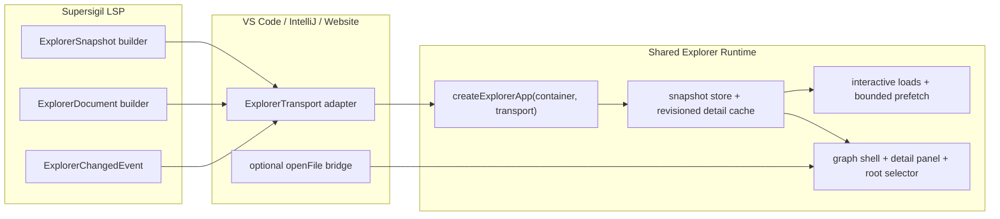

---
supersigil:
  id: graph-explorer-runtime/design
  type: design
  status: approved
title: "Graph Explorer Runtime"
---

```supersigil-xml
<Implements refs="graph-explorer-runtime/req" />
```

```supersigil-xml
<References refs="graph-explorer/design, spec-rendering/design, vscode-explorer-webview/design, intellij-graph-explorer/design, lsp-server/design" />
<TrackedFiles paths="specs/graph-explorer-runtime/*.md, website/src/components/explore/**/*.js, editors/vscode/src/explorer*.ts, editors/intellij/src/main/resources/supersigil-explorer/explorer-bridge.js, editors/intellij/src/main/kotlin/org/supersigil/intellij/GraphExplorerToolWindowFactory.kt, crates/supersigil-lsp/src/**/*.rs, crates/supersigil-verify/src/**/*.rs" />
```

## Overview

The final runtime is a single long-lived explorer application created once per
host container. The app renders immediately from an `ExplorerSnapshot`,
hydrates selected document detail lazily through `ExplorerDocument`, and
updates itself from revisioned change notifications when the host provides
them. VS Code and IntelliJ act as transport providers instead of data
orchestration layers, and the standalone website explorer uses the same
runtime through an eager browser-side transport.

## Architecture

The architecture separates summary graph state, document detail, and host
integration:



Runtime flow:

1. The host resolves the initial root context and creates `ExplorerTransport`.
   Editor hosts fetch through the LSP; the standalone website can source the
   same transport from preloaded browser data.
2. The shared runtime loads `ExplorerSnapshot` and renders the graph shell.
3. If the URL hash targets a document, the runtime requests
   `ExplorerDocument(document_id, revision)` immediately.
4. When a document is selected, the runtime serves cached detail when present
   or shows a loading detail panel while loading the document payload.
5. On `ExplorerChangedEvent`, when supported by the host, the runtime refetches
   the snapshot, invalidates only affected detail entries, and refreshes the
   selected document if needed.
6. Root switching swaps the active root, snapshot, revision, and detail cache
   inside the shared runtime instead of forcing host-managed remounts.
7. The standalone website host uses the same runtime entry point instead of
   preserving a separate one-shot mount path.

## Key Types

TypeScript host boundary:

```ts
type ExplorerTransport = {
  getInitialContext(): Promise<{
    rootId: string;
    availableRoots: Array<{ id: string; name: string }>;
    focusDocumentId?: string;
  }>;
  loadSnapshot(rootId: string): Promise<ExplorerSnapshot>;
  loadDocument(input: {
    rootId: string;
    revision: string;
    documentId: string;
  }): Promise<ExplorerDocument>;
  subscribeChanges(listener: (event: ExplorerChangedEvent) => void): () => void;
  openFile?: (target: { path?: string; uri?: string; line?: number }) => void;
};
```

Shared runtime state:

```ts
type DocumentCacheEntry =
  | { state: "idle" }
  | { state: "loading"; promise: Promise<ExplorerDocument> }
  | { state: "ready"; revision: string; document: ExplorerDocument }
  | { state: "error"; revision: string; error: string };

type ExplorerRuntimeState = {
  rootId: string;
  revision: string;
  snapshot: ExplorerSnapshot | null;
  selectedDocumentId: string | null;
  documentCache: Map<string, DocumentCacheEntry>;
};
```

Rust-side explorer payloads:

```rust
pub struct ExplorerSnapshot {
    pub revision: String,
    pub documents: Vec<ExplorerDocumentSummary>,
    pub edges: Vec<ExplorerEdge>,
}

pub struct ExplorerDocumentSummary {
    pub id: String,
    pub doc_type: Option<String>,
    pub status: Option<String>,
    pub title: String,
    pub path: String,
    pub file_uri: Option<String>,
    pub project: Option<String>,
    pub coverage_summary: CoverageSummary,
    pub component_count: usize,
    pub graph_components: Vec<ExplorerGraphComponent>,
}

pub struct ExplorerDocument {
    pub revision: String,
    pub document_id: String,
    pub stale: bool,
    pub fences: Vec<FenceData>,
    pub edges: Vec<EdgeData>,
}

pub struct ExplorerChangedEvent {
    pub revision: String,
    pub changed_document_ids: Vec<String>,
    pub removed_document_ids: Vec<String>,
}
```

Contract rules:

- `ExplorerSnapshot` is authoritative for graph shell rendering.
- `ExplorerDocument` is authoritative for detail-panel content.
- Cache entries are valid only for their matching `revision`.
- Host adapters may translate transport calls into custom requests or execute
  commands, but they must not reintroduce batch hydration semantics.
- Hosts without source-file navigation may omit `openFile`; the shared runtime
  hides editor-only controls in that case.
- The standalone website host may implement `ExplorerTransport` with eager
  in-memory snapshot and document data, but it still uses the same runtime
  state machine as the editor hosts.

## Error Handling

Snapshot load failures:

- Render an error shell in the shared runtime.
- Keep the host container alive so the user can retry.
- Do not create partial graph state from failed snapshot loads.

Document load failures:

- Preserve current shell state and selection.
- Show a detail-panel error state with a retry action.
- Do not poison unrelated cached documents.

Stale or out-of-order results:

- Discard any document response whose `revision` does not match the runtime's
  current revision.
- Ignore completion of superseded in-flight requests after root switches.

Change events while hidden:

- Hosts may defer background prefetch while hidden.
- Snapshot and cache state remain owned by the runtime; visibility changes
  should not require a fresh remount contract.

## Testing Strategy

LSP and Rust builders:

- Unit tests for `ExplorerSnapshot` and `ExplorerDocument` builders.
- Tests for revision generation and selective invalidation payloads.
- Tests ensuring snapshot summaries include graph-visible component outline and
  coverage summaries without requiring full fenced render data.

Shared runtime:

- App-level tests with a fake `ExplorerTransport`.
- Snapshot-only first-paint tests.
- URL-hash-to-document hydration tests.
- Revision-keyed cache invalidation and stale-result discard tests.
- Root-switch tests that preserve the single-app runtime model.

Host adapters:

- VS Code tests limited to transport mapping, `openFile` plumbing, and root
  context resolution.
- IntelliJ tests limited to execute-command/query bridge mapping and file
  navigation actions.
- Standalone website tests limited to eager transport wiring, missing-`openFile`
  UI gating, and parity with the shared runtime entry point.
- Remove tests that assert host-owned batch hydration, observer injection, or
  remount-based refresh behavior.

## Alternatives Considered

```supersigil-xml
<Decision id="shared-stateful-runtime">
  Replace host-owned batch/remount integrations with one shared stateful
  explorer runtime created once per editor panel.

  <References refs="graph-explorer-runtime/req#req-2-1, graph-explorer-runtime/req#req-2-2, graph-explorer-runtime/req#req-2-3, graph-explorer-runtime/req#req-6-1, graph-explorer-runtime/req#req-6-2" />

  <Rationale>
    The current editor integrations each own loading, remount, and host-only UI
    behavior. Moving runtime state into the shared explorer removes duplicated
    orchestration logic and makes behavior consistent across hosts.
  </Rationale>

  <Alternative id="keep-host-orchestration" status="rejected">
    Preserve host-owned batching and remount logic, then optimize each host
    separately. This keeps the architectural split that caused the current
    first-paint problem and still leaves VS Code and IntelliJ behavior to drift.
  </Alternative>
</Decision>
```

```supersigil-xml
<Decision id="dedicated-snapshot-contract">
  Introduce `ExplorerSnapshot` as a dedicated runtime schema instead of
  reusing `GraphJson`.

  <References refs="graph-explorer-runtime/req#req-1-1, graph-explorer-runtime/req#req-1-3, graph-explorer-runtime/req#req-5-1, graph-explorer-runtime/req#req-5-2, graph-explorer-runtime/req#req-5-3" />

  <Rationale>
    `GraphJson` carries more component structure than the shell needs while
    still lacking the revision, coverage summary, and graph-outline semantics
    needed by the new runtime. A dedicated snapshot contract makes the runtime
    boundary explicit.
  </Rationale>

  <Alternative id="reuse-graph-json" status="rejected">
    Continue using `GraphJson` and add ad hoc fields for revision and coverage.
    This preserves a blurry boundary between CLI export and editor runtime data
    and keeps snapshot semantics tied to an older payload shape.
  </Alternative>
</Decision>
```

```supersigil-xml
<Decision id="lazy-document-hydration">
  Hydrate document detail on demand through `ExplorerDocument` requests and a
  revision-keyed client cache.

  <References refs="graph-explorer-runtime/req#req-1-2, graph-explorer-runtime/req#req-3-1, graph-explorer-runtime/req#req-3-2, graph-explorer-runtime/req#req-3-3, graph-explorer-runtime/req#req-3-4" />

  <Rationale>
    `documentComponents` is already document-scoped and built from cached LSP
    state, so loading detail lazily aligns naturally with the existing data
    model while removing full-workspace hydration from the critical path.
  </Rationale>

  <Alternative id="two-phase-remount" status="rejected">
    Mount from summary data, then remount when a full render-data batch
    completes. Smaller to implement, but it keeps the host/runtime split and
    still treats detail as a workspace-wide batch.
  </Alternative>
</Decision>
```

```supersigil-xml
<Decision id="payload-change-notifications">
  Replace the bare `documentsChanged` refresh trigger for explorer panels with
  a revisioned `ExplorerChangedEvent`.

  <References refs="graph-explorer-runtime/req#req-1-4, graph-explorer-runtime/req#req-4-1, graph-explorer-runtime/req#req-4-2, graph-explorer-runtime/req#req-4-3" />

  <Rationale>
    Selective invalidation depends on knowing both the new revision and which
    documents changed or disappeared. A bare "refresh everything" event forces
    coarse behavior even when only one document changed.
  </Rationale>

  <Alternative id="bare-refresh-notification" status="rejected">
    Keep `supersigil/documentsChanged` as an empty notification and let hosts or
    the runtime always reload everything. Simpler, but it undermines revisioned
    caching and precise selection preservation.
  </Alternative>
</Decision>
```
