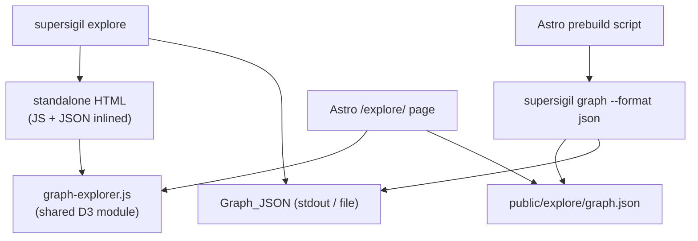

---
supersigil:
  id: graph-explorer/design
  type: design
  status: draft
title: "Visual Graph Explorer"
---

<Implements refs="graph-explorer/req" />
<DependsOn refs="inventory-queries/design, document-graph/design, cli-runtime/design" />
<TrackedFiles paths="crates/supersigil-cli/src/commands/graph.rs, crates/supersigil-cli/src/commands/explore.rs, website/src/pages/explore.astro, website/src/components/explore/**" />

## Overview

The graph explorer adds a JSON export format to the existing `graph` command
and a new `explore` command that renders an interactive D3.js visualization.
The same visualization module powers both the standalone HTML and the Astro
docs page at `/explore/`.

The design has three layers: Rust-side JSON serialization, a shared vanilla JS
visualization module (JSDoc-typed), and two thin delivery wrappers (CLI
standalone HTML and Astro page).

## Architecture



### Data Flow

1. `supersigil graph --format json` serializes the `DocumentGraph` to
   Graph_JSON on stdout (same stdout/stderr split as mermaid and dot).
2. `supersigil explore` calls graph serialization internally, inlines the
   JSON into an HTML template containing the JS module, writes to a temp
   file, and opens the browser.
3. The Astro site's prebuild script runs `supersigil graph --format json`
   and writes the output to `public/explore/graph.json`. The `/explore/`
   page loads this file at runtime.

### Module Boundary

The JS visualization module is framework-agnostic. It exposes a single
entry point that accepts a container element and a Graph_JSON object, and
manages its own D3 simulation, SVG rendering, and event handling. The
delivery wrappers (Astro page, standalone HTML) are responsible only for
loading data and mounting the module.

## JSON Schema

Graph_JSON structure produced by `graph --format json`:

```typescript
interface GraphJSON {
  documents: DocumentNode[];
  edges: Edge[];
}

interface DocumentNode {
  id: string;
  doc_type: string | null;   // raw frontmatter value
  status: string | null;
  title: string;             // from extra["title"], fallback to id
  components: Component[];
}

interface Component {
  id: string | null;         // from attributes["id"]
  kind: string;              // component name: Criterion, Task, Decision, etc.
  body: string | null;
  children?: Component[];    // Rationale, Alternative under Decision
  implements?: string[];     // Task.implements criterion refs
}

interface Edge {
  from: string;              // source document id
  to: string;                // target document id
  kind: string;              // Implements | DependsOn | References
}
```

Edges are sourced from the `DocumentGraph` reverse mappings
(`implements_reverse`, `depends_on_reverse`, `references_reverse`) to
capture all edges including those from nested components.

## Rust-Side Implementation

### `graph.rs` Changes

Add a `Json` variant to the existing `GraphFormat` enum. The JSON writer
serializes the graph using `serde_json`:

```rust
pub enum GraphFormat {
    Mermaid,
    Dot,
    Json,
}

fn write_json(
    out: &mut impl Write,
    graph: &DocumentGraph,
) -> io::Result<usize> {
    // Build GraphJson struct from graph
    // Serialize with serde_json::to_writer_pretty
    // Return edge count for stderr summary
}
```

JSON serialization types live in a `json` submodule of `commands/graph.rs`
(or `commands/graph/json.rs`) with `#[derive(Serialize)]` structs matching
the schema above. The `title` field falls back to the document ID when
`extra["title"]` is absent.

### `explore.rs`

New command module. Implementation:

1. Call the graph JSON serializer to produce a `String`.
2. Read the HTML template (embedded via `include_str!`).
3. Substitute the JSON payload into the template's `<script>` tag.
4. Write to `--output` path or a temp file.
5. Open with `open::that()` (cross-platform browser launch).

The HTML template and JS module are embedded in the binary at compile time
so `explore` has zero runtime file dependencies.

## JS Visualization Module

### File Structure

```
website/src/components/explore/
  graph-explorer.js    — entry point: mount(container, data), D3 simulation
  graph-data.js        — filtering, search, data transforms
  detail-panel.js      — sidebar DOM rendering
  impact-trace.js      — transitive closure traversal + highlight state
  url-router.js        — hash-based deep-linking
  styles.css           — explorer styles using design tokens
```

All files use JSDoc type annotations for LSP support. No build step or
framework — vanilla JS with D3 as the only dependency.

### D3 Force Simulation

The layout uses `d3-force` with these forces:

- **Charge**: `d3.forceManyBody()` for node repulsion.
- **Link**: `d3.forceLink()` for edges with distance proportional to edge
  kind (DependsOn shorter, References longer).
- **Cluster**: A custom force function that nudges nodes toward their
  cluster center (computed as the centroid of same-prefix documents).
- **Center**: `d3.forceCenter()` to keep the graph centered in the viewport.
- **Collision**: `d3.forceCollide()` to prevent node overlap.

### SVG Rendering

- **Document nodes**: `<circle>` elements with radius scaled by component
  count. Stroke color by doc type (teal for requirements, green for design,
  gold for ADR, gray for others). Fill is `--bg-card`.
- **Cluster borders**: `<rect>` with dashed stroke at low opacity, sized to
  enclose the cluster's nodes with padding.
- **Edges**: `<line>` elements with `--text-dim` stroke at 40% opacity.
  Edge labels rendered as `<text>` on hover or when zoomed in sufficiently.
- **Node labels**: `<text>` below each circle showing the document's short
  ID (last path segment).

SVG is chosen over Canvas for crisp rendering at any zoom level and direct
CSS styling with the Obsidian Glow design tokens.

### Drill-Down

Double-clicking a document cluster triggers expansion:

1. Query the document's `components` array from Graph_JSON.
2. Insert child nodes into the simulation (positioned near the parent).
3. Expand the cluster border with an animated transition.
4. Add internal edges (Task→Criterion via `implements`, Decision→children).
5. Reheat the simulation to settle the new layout.

Collapsing removes the child nodes and restores the original cluster size.

### Detail Sidebar

A 300px panel that slides in from the right. Rendered with plain DOM
manipulation (no framework). Content sections:

- **Header**: document ID, type badge (teal/green/gold chip), status badge.
- **Edges**: grouped by direction (incoming/outgoing), each showing the
  related doc ID and edge kind. Clicking an edge navigates to that node.
- **Components**: list of components with kind-colored dot indicators.
  Criterion, Task, Decision, Alternative each get distinct colors.
- **Actions**: "Trace impact" button, "Open in docs" link (if on Astro
  site).

### Filtering

Filter state is an object: `{ types: Set<string>, status: string | null }`.

Active filters are applied in `graph-data.js` which returns a `Set<string>`
of visible document IDs. The renderer sets opacity on filtered-out nodes
(~0.08) and their edges (~0.03) rather than removing them, preserving
spatial stability.

Type chips are rendered from the unique `doc_type` values present in the
data, so custom document types appear automatically.

### Impact Trace

`impact-trace.js` computes the transitive closure by walking edges in the
downstream direction (following documents that have Implements or DependsOn
edges pointing to the traced node, and documents that the traced node
References). Returns a `Set<string>` of affected document IDs.

Active trace state overrides the filter renderer: traced nodes and their
connecting edges get full opacity with gold-colored edges; everything else
dims to ~0.05 opacity.

### Search

The search input in the top bar performs fuzzy matching (substring on ID and
title). Results appear as a dropdown list below the search box, keyboard-
navigable with arrow keys and Enter.

Selecting a result calls `zoomToNode(id)` which transitions the d3-zoom
transform to center and scale to the target node, then opens its detail
panel.

### URL Deep-Linking

`url-router.js` manages bidirectional sync between view state and
`location.hash`:

- **Read**: on page load, parse the hash and apply: select node, activate
  trace, set filters.
- **Write**: on interaction (node select, filter change, trace activation),
  update the hash without triggering a re-parse.

Hash grammar: `#/doc/{id}`, `#/doc/{id}/trace`,
`#/filter/type:{csv},status:{value}`.

## Visual Design

All styling uses CSS custom properties from the existing design system.
The explorer's `styles.css` references `--bg-deep`, `--bg-surface`,
`--bg-card`, `--gold`, `--teal`, `--green`, `--text`, `--text-muted`,
`--text-dim`, `--border`, `--font-display`, `--font-body`, `--font-mono`.

Light theme support requires no additional design work — the existing
`[data-theme='light']` block in `landing-tokens.css` redefines these
variables. The explorer uses token references exclusively, never hardcoded
hex values.

The grain texture overlay (`.grain` class) is applied to the explorer page
for visual consistency with the landing page.

## Error Handling

- **Empty graph**: render a centered message ("No spec documents found.
  Run `supersigil init` to get started.") instead of an empty canvas.
- **Malformed JSON**: catch parse errors and display an error state with
  the error message. The standalone HTML embeds JSON at build time so this
  should only occur with corrupted files.
- **Missing node in URL hash**: if a `#/doc/{id}` references a node not in
  the current graph, clear the hash and show the default view. No error
  message — the spec may have been removed since the link was shared.

## Testing Strategy

### Rust

- **JSON serialization** (`graph.rs`): unit tests verifying round-trip
  serialization of the Graph_JSON schema. Test empty graph, graph with all
  component types, null fields, and edge sourcing from reverse mappings.
  Same pattern as existing mermaid/dot writer tests.
- **`explore` command**: test that the output contains valid HTML with the
  expected JSON payload embedded. String assertions, no browser testing.
- **Clap parse**: extend existing `clap_parse.rs` tests for
  `graph --format json` and the new `explore` subcommand.

### JS (vitest)

- **`graph-data.js`**: given Graph_JSON + filter state, returns correct
  visible node set. Tests for type filtering, status filtering, combined
  filters, and empty results.
- **`impact-trace.js`**: given a node ID, returns the correct transitive
  closure. Tests for linear chains, diamonds, disconnected subgraphs, and
  self-referential edge cases.
- **`url-router.js`**: hash parsing and generation round-trips. Tests for
  each hash pattern and edge cases (special characters in IDs).
- **No DOM tests for D3 rendering** — high cost, low value. The data
  transform layer is where correctness matters and is fully testable
  without a browser.

## Alternatives Considered

See `graph-explorer/adr` for the full decision record covering
visualization library choice (D3.js vs. Cytoscape.js vs. vis-network) and
graph layout approach (force-directed vs. hierarchical DAG vs. hybrid
clustered).
