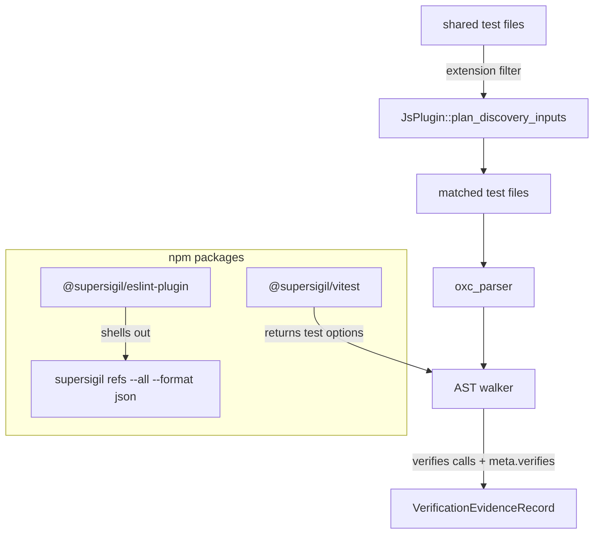

---
supersigil:
  id: js-plugin/design
  type: design
  status: approved
title: "JavaScript/TypeScript Ecosystem Plugin"
---

```supersigil-xml
<Implements refs="js-plugin/req" />
<DependsOn refs="evidence-contract/design, ecosystem-plugins/design, config/design" />
```

## Overview

The JS/TS ecosystem plugin has three components:

- `supersigil-js` — a Rust crate implementing `EcosystemPlugin` that discovers
  evidence from JS/TS test files via oxc AST parsing
- `@supersigil/vitest` — an npm package exporting a `verifies()` helper for
  annotating Vitest tests
- `@supersigil/eslint-plugin` — an ESLint plugin that validates criterion ref
  strings by shelling out to `supersigil refs`

## Architecture



## Component 1: `supersigil-js` Rust Crate

### Plugin Registration

The crate exports `JsPlugin` implementing the `EcosystemPlugin` trait. It
registers as `"js"` in the plugin name surface. The plugin assembly in
`supersigil-verify/src/plugins.rs` gains a match arm for `"js"` (the CLI
re-exports this via `supersigil-cli/src/plugins.rs`).

The known built-in plugin set in config validation includes `"js"`. The JS
plugin requires no plugin-specific config — test file paths are declared via
the project-level `tests` globs.

### File Discovery

`JsPlugin::plan_discovery_inputs` filters the shared test-file baseline to
files with JS/TS extensions (`.ts`, `.tsx`, `.js`, `.jsx`). It does not walk
the filesystem or read `.gitignore` files — that responsibility belongs to the
shared test-file resolver. If no JS/TS files exist in the baseline, discovery
succeeds with an empty evidence set.

### AST Extraction

For each discovered test file:

1. Read the file contents.
2. Pre-filter: skip files that do not contain `verifies` anywhere in the
   source text (fast path, same strategy as the Rust plugin).
3. Parse with `oxc_parser` using the appropriate source type (TypeScript,
   TSX, JavaScript, or JSX based on file extension).
4. Walk the AST looking for `CallExpression` nodes.

The walker maintains a describe-nesting stack to produce full test names.

#### Pattern Recognition

**`verifies()` call expressions (req-1-2, req-1-4):**

```typescript
// Direct call — extract string literal arguments
test('name', verifies('doc#crit'), () => {})

// Spread in options — recognize verifies() inside spread
test('name', { ...verifies('doc#crit'), timeout: 5000 }, () => {})
```

Match: `CallExpression` where `callee` is `Identifier("verifies")`. Extract
all `StringLiteral` arguments. Non-string arguments emit a diagnostic and are
skipped.

**Raw `meta.verifies` (req-1-3):**

```typescript
test('name', { meta: { verifies: ['doc#crit'] } }, () => {})
```

Match: `CallExpression` where `callee` is `test` or `it`, second argument is
an `ObjectExpression` containing a `meta` property whose value is an
`ObjectExpression` containing a `verifies` property whose value is an
`ArrayExpression`. Extract all `StringLiteral` elements.

#### Test Name Resolution (req-1-5)

- `describe('suite name', ...)` pushes onto the nesting stack.
- `test('test name', ...)` or `it('test name', ...)` produces the full name
  by joining the stack with ` > `.
- `describe` blocks are tracked for nesting only — they do not carry evidence
  annotations themselves.

#### Record Construction (req-2-1 through req-2-5)

For each recognized annotation:

- Parse each string literal as a `VerifiableRef`. Malformed refs (missing `#`
  or empty fragments) cause `PluginError::Discovery`.
- Non-string-literal arguments emit a diagnostic and are excluded from the
  target set.
- If the target set is empty after filtering (all arguments were non-string),
  drop the record and emit only a diagnostic.
- Otherwise construct a `VerificationEvidenceRecord` with:
  - `targets`: the parsed `VerifiableRef` set
  - `test`: `TestIdentity` with file path, full test name, `TestKind::Unit`
  - `source_location`: byte offset from the oxc span, converted to line/column
  - `provenance`: `PluginProvenance::JsVerifies` (new variant), from which
    `record.kind()` derives `EvidenceKind::JsVerifies` automatically

### Fault Tolerance (req-4-1, req-4-2)

Follows the same pattern as the Rust plugin:

- Per-file parse failures add a `PluginDiagnostic` and continue.
- Zero annotations across all files is a successful empty result (not an
  error).

## Component 2: `@supersigil/vitest` npm Package

A single-file package with zero dependencies:

```typescript
export function verifies(
  ...refs: string[]
): { meta: { verifies: string[] } } {
  return { meta: { verifies: refs } }
}
```

The returned object is a plain Vitest test options fragment. It can be passed
directly as the second argument to `test()`/`it()`, or spread into a larger
options object.

Package targets Vitest >= 4.1 as a peer dependency (the version that introduced
declarative `meta` in test options).

### Package Location

Published as `@supersigil/vitest` on npm. Source lives in
`packages/vitest/` in the monorepo alongside `packages/preview/`.

## Component 3: `@supersigil/eslint-plugin` npm Package

### Rule: `valid-criterion-ref`

The plugin exposes a single rule named `valid-criterion-ref`. In ESLint flat
config this becomes `@supersigil/valid-criterion-ref` (the `@supersigil/`
prefix is added automatically by ESLint from the plugin package name).

The rule validates string literals that appear as arguments to `verifies()`
calls or as elements of `meta.verifies` arrays.

#### Ref Loading

On the first file in a lint session, the rule shells out to
`supersigil refs --all --format json`. The result is parsed into a
`Map<string, Set<string>>` keyed by document ID, with criterion IDs as values.
This is cached for the lint session.

If the `supersigil` binary is not found or the command fails, the rule emits a
single warning and disables itself for the remainder of the session.

#### Validation

For each criterion ref string:

1. Check format: must contain `#`. If not, report "malformed ref, expected
   `document-id#criterion-id`".
2. Split on first `#`. Check document ID exists. If not, report "unknown
   document `{doc_id}`".
3. Check criterion ID exists within that document. If not, report "unknown
   criterion `{criterion_id}` in document `{doc_id}`".

#### Configuration

ESLint v9+ flat config:

```javascript
import supersigil from '@supersigil/eslint-plugin'

export default [
  supersigil.configs.recommended
]
```

oxlint (best-effort, alpha):

```json
{
  "jsPlugins": ["@supersigil/eslint-plugin"],
  "rules": {
    "@supersigil/valid-criterion-ref": "error"
  }
}
```

### Package Location

Published as `@supersigil/eslint-plugin` on npm. Source lives in
`packages/eslint-plugin/` in the monorepo.

## Evidence Contract Extensions

### New `EvidenceKind` Variant

```rust
pub enum EvidenceKind {
    Tag,
    FileGlob,
    RustAttribute,
    Example,
    JsVerifies,  // new
}

impl EvidenceKind {
    pub fn as_str(self) -> &'static str {
        match self {
            // ...
            Self::JsVerifies => "js-verifies",
        }
    }
}
```

### New `PluginProvenance` Variant

```rust
pub enum PluginProvenance {
    VerifiedByTag { ... },
    VerifiedByFileGlob { ... },
    RustAttribute { attribute_span: SourceLocation },
    Example { ... },
    JsVerifies {        // new — follows RustAttribute pattern
        annotation_span: SourceLocation,
    },
}
```

## Config Extensions

The JS plugin requires no plugin-specific config. JS/TS test file paths are
declared via the project-level `tests` globs (either top-level in
single-project mode or per-project in multi-project mode). The plugin is
activated by including `"js"` in `ecosystem.plugins`.

## Spec Browser and Preview Integration

JS evidence flows through the same `ArtifactGraph` as Rust evidence. The spec
browser and preview rendering need to handle the new `EvidenceKind::JsVerifies`
variant:

- Display label: "JS test" or "Vitest" alongside the test name
- Source link: points to `.ts`/`.js` file with line number
- No structural changes to the graph model or rendering pipeline

## Testing Strategy

### `supersigil-js` crate

- Fixture test files (`.test.ts`, `.test.js`) exercising each recognized
  pattern: `verifies()` call, raw `meta.verifies`, spread form, multiple refs,
  describe nesting
- Negative fixtures: non-string arguments, malformed refs, syntax errors
- Unit tests for AST extraction logic
- Integration test via eval framework with a JS scenario

### `@supersigil/vitest` package

- Unit test: `verifies('a#b', 'c#d')` returns correct shape
- Unit test: result spreads correctly with other options

### `@supersigil/eslint-plugin` package

- ESLint `RuleTester` for valid/invalid cases
- Test distinct error messages for each failure mode
- Test graceful degradation when `supersigil` binary is unavailable

### Dogfooding

The following Supersigil JS/TS test suites will be annotated with `verifies()`:

- `eval/` — evaluation framework
- `website/` — Astro site tests
- `packages/preview/` — preview rendering tests

Future dogfooding candidates (not in v1 scope, no test infrastructure yet):

- `editors/vscode/` — VS Code extension

## Decisions

```supersigil-xml
<Decision id="dec-oxc-parser">
  Use the oxc parser for JS/TS AST extraction in the Rust crate.

  <References refs="js-plugin/req#req-1-1" />

  <Rationale>
  oxc is a Rust-native JS/TS parser from Void Zero (same company as
  Vite/Vitest). It is fast, well-maintained, and avoids a Node.js runtime
  dependency. The alternative was swc, which is also Rust-native but less
  aligned with the Vitest ecosystem.
  </Rationale>
</Decision>

<Decision id="dec-vitest-meta">
  Use Vitest's declarative `meta` test option as the annotation surface,
  wrapped by a `verifies()` helper function.

  <References refs="js-plugin/req#req-5-1, js-plugin/req#req-1-2, js-plugin/req#req-1-3" />

  <Rationale>
  Vitest 4.1 introduced `meta` in test options, providing a clean declarative
  annotation that mirrors the Rust `#[verifies(...)]` pattern. The alternative
  was `context.annotate()` (imperative, inside test body) or `tags` (less
  structured). `meta` keeps annotations at the test definition site.
  </Rationale>

  <Alternative id="alt-annotate" status="rejected">
    Use `context.annotate()` inside test body. Rejected because it is
    imperative and pollutes the test body with annotation calls.
  </Alternative>

  <Alternative id="alt-tags" status="rejected">
    Use Vitest's `tags` system. Rejected because tags are flat strings without
    the structured `doc#criterion` semantics needed for traceability.
  </Alternative>
</Decision>

<Decision id="dec-eslint-refs">
  Shell out to `supersigil refs --all --format json` instead of parsing specs
  directly in JavaScript.

  <References refs="js-plugin/req#req-6-2" />

  <Rationale>
  Avoids duplicating spec parsing logic in JS, which would drift from the Rust
  implementation. The `supersigil` binary is already a prerequisite for
  Supersigil users. The output is small and cacheable per lint session. A
  direct-parsing approach was considered as a seed for a future JS SDK, but
  deferred to keep v1 simple and correct.
  </Rationale>

  <Alternative id="alt-direct-parse" status="rejected">
    Parse `supersigil.toml` and spec files directly in JavaScript. Rejected
    for v1 because it duplicates parsing logic and risks semantic drift. May
    be revisited if a JS SDK is needed in the future.
  </Alternative>
</Decision>

<Decision id="dec-no-describe-evidence">
  Only `test` and `it` calls carry evidence annotations. `describe` blocks are
  tracked for name nesting only.

  <References refs="js-plugin/req#req-1-3, js-plugin/req#req-1-5" />

  <Rationale>
  `describe` is a suite, not a test. Allowing `verifies` on `describe` raises
  inheritance questions (do child tests inherit?) that are not worth solving in
  v1. The shared evidence model is test-oriented (`TestIdentity`), not
  suite-oriented.
  </Rationale>
</Decision>
```

## Current Gaps

- The `@supersigil/vitest` helper returns plain `string[]` for refs — no
  TypeScript narrowing to valid criterion IDs. Generated types were considered
  but deferred to avoid a build-step dependency.
- oxlint JS plugin compatibility is best-effort given its alpha status. The
  ESLint plugin targets the ESLint v9+ flat config API, which oxlint aims to
  support.
- Test execution status (pass/fail) is not collected. Evidence is purely
  structural ("this test claims to verify this criterion"), matching the
  current Rust plugin behavior.
