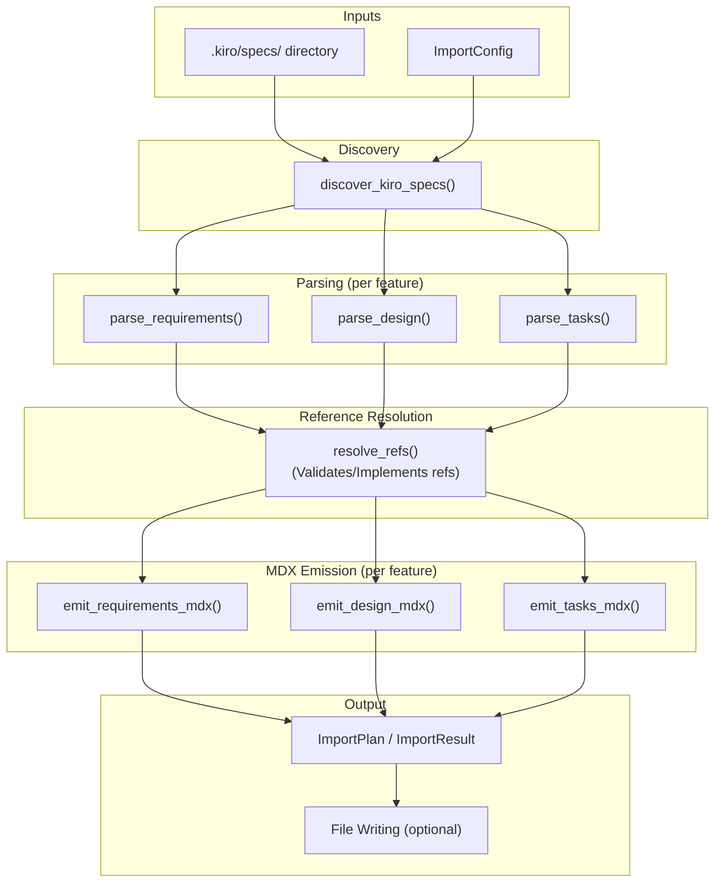

---
supersigil:
  id: design/kiro-import
  type: design
  status: draft
title: "Kiro Import"
---

<Implements refs="req/kiro-import" />

## Overview

The `supersigil-import` crate is a library that reads `.kiro/specs/` directories and converts Kiro's three-file spec format (`requirements.md`, `design.md`, `tasks.md`) into supersigil MDX documents. It is consumed by the CLI crate via `supersigil import --from kiro` but has no dependency on the CLI — all functionality is testable as a library.

The crate uses template-based MDX emission (string building) rather than constructing `SpecDocument` values and serializing them. This is the pragmatic v1 approach: the import crate reads Kiro markdown with lightweight regex/line-based parsing and emits MDX strings directly. The generated MDX can then be parsed by `supersigil-parser` for verification, but the import pipeline itself does not depend on the parser for output generation.

Each Kiro spec directory produces up to three uniquely named MDX files:
- `{feature_name}.req.mdx` — requirements with `<AcceptanceCriteria>` / `<Criterion>` components
- `{feature_name}.design.mdx` — design prose with `<Validates>` and `<Implements>` components
- `{feature_name}.tasks.mdx` — task list with nested `<Task>` components

Ambiguous conversion points are marked with `<!-- TODO(supersigil-import): ... -->` comments for human review.

## Architecture



The pipeline is:

1. **Discovery**: Scan `.kiro/specs/` for subdirectories containing at least one of the three expected files.
2. **Parsing**: For each feature, parse each present Kiro file into an intermediate representation (IR). This is lightweight line-based/regex parsing — not MDX parsing.
3. **Reference Resolution**: Map `Validates: Requirements X.Y` strings and task `_Requirements: X.Y_` metadata to criterion IDs generated from the parsed requirements. Insert ambiguity markers for unresolvable refs.
4. **MDX Emission**: Render each IR into an MDX string using template-based string building.
5. **Output**: Either return an `ImportPlan` (dry run) or write files to disk and return an `ImportResult`.

### ID Construction

Document IDs follow Requirement 16's construction rule:

- With prefix: `{id_prefix}/{type_hint}/{feature_name}` (e.g., `my-project/req/parser-and-config`)
- Without prefix: `{type_hint}/{feature_name}` (e.g., `req/parser-and-config`)

The `type_hint` is `req`, `design`, or `tasks`. Any trailing slash on the prefix is stripped.

Criterion IDs use the pattern `req-{requirement_number}-{criterion_index}` where the criterion index preserves source numbering (including alphanumeric like `8a`, `8b`).

Task IDs use `task-{N}` for top-level tasks and `task-{N}-{M}` for sub-tasks.

## Components and Interfaces

### Public API

```rust
/// Configuration for a Kiro import operation.
#[derive(Debug, Clone)]
pub struct ImportConfig {
    /// Path to the `.kiro/specs/` directory.
    pub kiro_specs_dir: PathBuf,
    /// Output directory for generated MDX files. Defaults to `specs/`.
    pub output_dir: PathBuf,
    /// Optional ID prefix (e.g., `my-project`). No trailing slash.
    pub id_prefix: Option<String>,
    /// Whether to overwrite existing files.
    pub force: bool,
}
```

```rust
/// Perform the full import: parse, convert, and write MDX files.
pub fn import_kiro(config: &ImportConfig) -> Result<ImportResult, ImportError>;

/// Return a dry-run preview without writing files.
pub fn plan_kiro_import(config: &ImportConfig) -> Result<ImportPlan, ImportError>;
```

```rust
/// Result of a completed import.
#[derive(Debug, Clone)]
pub struct ImportResult {
    /// Files that were written.
    pub files_written: Vec<OutputFile>,
    /// Total ambiguity markers across all documents.
    pub ambiguity_count: usize,
    /// Summary of conversions performed.
    pub summary: ImportSummary,
    /// Per-feature diagnostics (warnings, skipped dirs, etc.).
    pub diagnostics: Vec<Diagnostic>,
}
```

```rust
/// Dry-run preview of what the import would produce.
#[derive(Debug, Clone)]
pub struct ImportPlan {
    /// Documents that would be created.
    pub documents: Vec<PlannedDocument>,
    /// Total ambiguity markers across all documents.
    pub ambiguity_count: usize,
    /// Summary of mappings performed.
    pub summary: ImportSummary,
    /// Per-feature diagnostics.
    pub diagnostics: Vec<Diagnostic>,
}
```

```rust
#[derive(Debug, Clone)]
pub struct PlannedDocument {
    /// Intended output path (e.g., `specs/parser-and-config/parser-and-config.req.mdx`).
    pub output_path: PathBuf,
    /// Document ID (e.g., `req/parser-and-config`).
    pub document_id: String,
    /// The generated MDX content.
    pub content: String,
}

#[derive(Debug, Clone)]
pub struct OutputFile {
    pub path: PathBuf,
    pub document_id: String,
}

#[derive(Debug, Clone, Default)]
pub struct ImportSummary {
    pub criteria_converted: usize,
    pub validates_resolved: usize,
    pub tasks_converted: usize,
    pub features_processed: usize,
}
```

```rust
#[derive(Debug, Clone)]
pub enum Diagnostic {
    /// A Kiro spec dir was skipped (no recognized files).
    SkippedDir { path: PathBuf, reason: String },
    /// A warning during conversion.
    Warning { feature: String, message: String },
}
```

### Error Types

```rust
#[derive(Debug, thiserror::Error)]
pub enum ImportError {
    #[error("kiro specs directory not found: {path}")]
    SpecsDirNotFound { path: PathBuf },

    #[error("I/O error: {source}")]
    Io {
        #[from]
        source: std::io::Error,
    },

    #[error("file already exists and --force not set: {path}")]
    FileExists { path: PathBuf },
}
```

### Internal Modules

The crate is organized into these internal modules:

```
crates/supersigil-import/src/
├── lib.rs              # Public API: import_kiro, plan_kiro_import, types
├── discover.rs         # Kiro spec directory discovery
├── parse.rs            # Re-exports for parse submodules
├── parse/
│   ├── requirements.rs # requirements.md parsing
│   ├── design.rs       # design.md parsing
│   └── tasks.rs        # tasks.md parsing
├── refs.rs             # Requirement ref parsing and resolution
├── emit.rs             # Re-exports for emit submodules
├── emit/
│   ├── requirements.rs # Requirements MDX emission
│   ├── design.rs       # Design MDX emission
│   └── tasks.rs        # Tasks MDX emission
├── ids.rs              # ID construction (document IDs, criterion IDs, task IDs)
└── write.rs            # File writing with force/conflict handling
```

#### `discover` module

```rust
/// A discovered Kiro spec directory with its feature name and present files.
#[derive(Debug, Clone)]
pub struct KiroSpecDir {
    pub path: PathBuf,
    pub feature_name: String,
    pub has_requirements: bool,
    pub has_design: bool,
    pub has_tasks: bool,
}

/// Discover all Kiro spec directories under the given path.
/// Returns discovered dirs sorted alphabetically by feature name (for deterministic output)
/// and diagnostics for skipped dirs.
pub fn discover_kiro_specs(
    specs_dir: &Path,
) -> Result<(Vec<KiroSpecDir>, Vec<Diagnostic>), ImportError>;
```

#### `parse` module — Intermediate Representations

The parse module converts Kiro markdown into typed IRs. These are internal types — not exposed in the public API.

```rust
/// Parsed requirements.md
#[derive(Debug, Clone)]
pub struct ParsedRequirements {
    pub title: Option<String>,
    pub introduction: String,
    pub glossary: Option<String>,
    pub requirements: Vec<ParsedRequirement>,
}

#[derive(Debug, Clone)]
pub struct ParsedRequirement {
    pub number: String,          // e.g., "1", "2"
    pub title: Option<String>,   // e.g., "Kiro Spec Directory Discovery"
    pub user_story: Option<String>,
    pub criteria: Vec<ParsedCriterion>,
    /// Prose between user story and criteria, or after criteria.
    pub extra_prose: Vec<String>,
}

#[derive(Debug, Clone)]
pub struct ParsedCriterion {
    pub index: String,  // e.g., "1", "2", "8a", "8b"
    pub text: String,   // The EARS criterion text
}
```

```rust
/// Parsed design.md
#[derive(Debug, Clone)]
pub struct ParsedDesign {
    pub title: Option<String>,
    pub sections: Vec<DesignSection>,
}

#[derive(Debug, Clone)]
pub struct DesignSection {
    pub heading: String,
    pub level: u8,
    pub content: Vec<DesignBlock>,
}

#[derive(Debug, Clone)]
pub enum DesignBlock {
    Prose(String),
    CodeBlock { language: Option<String>, content: String },
    MermaidBlock(String),
    ValidatesLine { raw: String, refs: Vec<RawRef> },
}

/// A raw requirement reference before resolution.
#[derive(Debug, Clone, PartialEq)]
pub struct RawRef {
    pub requirement_number: String,
    pub criterion_index: String,
}
```

```rust
/// Parsed tasks.md
#[derive(Debug, Clone)]
pub struct ParsedTasks {
    pub title: Option<String>,
    pub preamble: Vec<String>,  // Overview/notes before the task list
    pub tasks: Vec<ParsedTask>,
}

#[derive(Debug, Clone)]
pub struct ParsedTask {
    pub number: String,           // e.g., "1", "2"
    pub title: String,
    pub status: TaskStatus,
    pub is_optional: bool,
    pub description: Vec<String>,
    pub requirement_refs: TaskRefs,
    pub sub_tasks: Vec<ParsedSubTask>,
}

#[derive(Debug, Clone)]
pub struct ParsedSubTask {
    pub parent_number: String,
    pub number: String,           // e.g., "1", "2"
    pub title: String,
    pub status: TaskStatus,
    pub is_optional: bool,
    pub description: Vec<String>,
    pub requirement_refs: TaskRefs,
}

#[derive(Debug, Clone, PartialEq)]
pub enum TaskStatus {
    Done,       // [x]
    Ready,      // [ ]
    InProgress, // [-]
    Draft,      // [~]
}

/// Requirement references extracted from task metadata lines.
#[derive(Debug, Clone)]
pub enum TaskRefs {
    /// Parsed ref list (e.g., `Requirements 1.2, 3.4`).
    Refs(Vec<RawRef>),
    /// Non-ref annotation preserved as a comment (e.g., `(test infrastructure)`).
    Comment(String),
    /// No metadata line found, or `N/A`.
    None,
}
```

#### `refs` module

```rust
/// Parse a requirement reference string into individual refs.
/// Handles: `Requirements X.Y`, `X.Y, Z.W`, ranges `X.Y–X.Z`.
/// Returns parsed refs and any ambiguity markers for unparseable portions.
pub fn parse_requirement_refs(input: &str) -> (Vec<RawRef>, Vec<String>);

/// Resolve a list of RawRefs against the parsed requirements to produce
/// criterion ref strings for MDX output.
/// Returns (resolved_refs, ambiguity_markers).
pub fn resolve_refs(
    raw_refs: &[RawRef],
    requirements: &ParsedRequirements,
    doc_id_base: &str,
) -> (Vec<String>, Vec<String>);
```

#### `ids` module

```rust
/// Construct a document ID from prefix, type hint, and feature name.
pub fn make_document_id(
    id_prefix: Option<&str>,
    type_hint: &str,
    feature_name: &str,
) -> String;

/// Generate a criterion ID from requirement number and criterion index.
/// Pattern: `req-{requirement_number}-{criterion_index}`
pub fn make_criterion_id(requirement_number: &str, criterion_index: &str) -> String;

/// Generate a task ID from task number.
/// Pattern: `task-{N}` for top-level, `task-{N}-{M}` for sub-tasks.
pub fn make_task_id(task_number: &str, sub_task_number: Option<&str>) -> String;

/// Check for ID collisions in a list and append disambiguation suffixes.
/// Returns the deduplicated list and any ambiguity markers.
pub fn deduplicate_ids(ids: &[String]) -> (Vec<String>, Vec<String>);
```

#### `emit` module

Each emitter takes the parsed IR, resolved references, and config, and produces an MDX string. The emitters use simple string formatting — no template engine dependency.

```rust
/// Emit a requirements MDX document.
pub fn emit_requirements_mdx(
    parsed: &ParsedRequirements,
    doc_id: &str,
    feature_title: &str,
) -> (String, usize); // (mdx_content, ambiguity_count)

/// Emit a design MDX document.
/// `resolved_validates` maps section heading (e.g., "Property 1: ...") to resolved criterion ref strings.
pub fn emit_design_mdx(
    parsed: &ParsedDesign,
    doc_id: &str,
    req_doc_id: Option<&str>,
    resolved_validates: &HashMap<String, Vec<String>>,
    feature_title: &str,
    ambiguity_markers: &[String],
) -> (String, usize);

/// Emit a tasks MDX document.
/// `resolved_implements` maps task ID (e.g., "task-1", "task-1-2") to resolved criterion ref strings.
pub fn emit_tasks_mdx(
    parsed: &ParsedTasks,
    doc_id: &str,
    resolved_implements: &HashMap<String, Vec<String>>,
    feature_title: &str,
    ambiguity_markers: &[String],
) -> (String, usize);
```

#### `write` module

```rust
/// Write generated MDX files to disk.
/// Uses best-effort semantics: writes sequentially, does not roll back on failure.
pub fn write_files(
    documents: &[PlannedDocument],
    force: bool,
) -> Result<Vec<OutputFile>, ImportError>;
```

## Data Models

### Kiro Markdown Parsing Strategy

The Kiro files are standard markdown with conventions. Parsing uses line-by-line processing with regex patterns rather than a full markdown AST parser. This keeps the import crate's dependencies minimal and avoids coupling to `markdown-rs`.

Key patterns recognized:

| Pattern | Regex | Purpose |
|---|---|---|
| Requirement heading | `^### Requirement (\w+)(?:: (.+))?$` | Extract requirement number and title |
| User story | `^\*\*User Story:\*\*\s*(.+)$` | Extract user story text |
| Acceptance criteria header | `^#### Acceptance Criteria` | Start of criteria list |
| Criterion line | `^(\d+[a-zA-Z]?)\.\s+(.+)$` | Extract criterion index (group 1) and text (group 2), supports `8a.` style |
| Design validates line | `^\*\*Validates:\s*(.+)\*\*$` | Extract validates refs from design properties |
| Task line | `^- \[([x ~-])\]\*?\s*(\d+)\.\s+(.+)$` | Top-level task with status, number, title |
| Sub-task line | `^\s+- \[([x ~-])\]\*?\s*(\d+)\.(\d+)\s+(.+)$` | Sub-task with parent.child numbering |
| Task metadata (italic) | `^\s*_(?:Requirements|Validates):\s*(.+)_$` | Italic metadata on tasks (indented under task items) |
| Task metadata (bold) | `^\s*\*\*(?:Requirements|Validates):\s*(.+)\*\*$` | Bold metadata on tasks (indented under task items) |
| Requirement ref | `(?:Requirements\s+)?(\w+)\.(\w+)` | Individual `X.Y` ref |
| Ref range | `(\w+)\.(\d+)[–-](\w+)\.(\d+)` | Range like `1.1–1.3` |
| Document title (req) | `^# Requirements Document(?:: (.+))?$` | Requirements doc title |
| Document title (design) | `^# Design(?:\s+Document)?(?:: (.+))?$` | Design doc title |
| Document title (tasks) | `^# (?:Implementation Plan&#124;Tasks)(?:: (.+))?$` | Tasks doc title (note: `&#124;` is regex alternation `\|`) |
| Optional marker | `\]\*\s` | Optional task marker (`[x]* 2.1 ...`) |
| Code block fence | `` ^```(\w*)$ `` | Fenced code block start/end |

**Known limitation:** The criterion line regex matches a single line only. Multi-line criteria (where text wraps to continuation lines) are not handled — only the first line is captured. In practice, Kiro criteria are single-line even when long, so this is acceptable for v1.

### Requirement Ref Parsing

The ref parser handles these forms (per Requirement 20):

1. `Requirements X.Y` → single ref `(X, Y)`
2. `Requirements X.Y, Z.W` → multiple refs
3. `X.Y, Z.W` → without prefix
4. `Requirements X.Y, X.Z` → multiple criteria from same requirement
5. `X.Y–X.Z` or `X.Y-X.Z` → range expansion (numeric indices only)
6. Alphanumeric indices: `8a`, `8b` are preserved as-is

Range expansion: For `X.Y–X.Z` where both Y and Z are purely numeric, expand to `X.Y, X.(Y+1), ..., X.Z`. When Y or Z is non-numeric (e.g., `8a–8c`), emit an ambiguity marker and preserve the original text.

Non-ref values: Before the ref parser is invoked, the calling context (task metadata extraction) checks for sentinel values like `N/A`, `N/A (...)`, and non-ref annotations like `(test infrastructure)`. These are handled by `TaskRefs::None` or `TaskRefs::Comment` and never reach the ref parser.

### MDX Front Matter Template

All generated MDX documents use this front matter structure:

```yaml
---
supersigil:
  id: {document_id}
  type: {doc_type}
  status: draft
title: "{title}"
---
```

The `status` is always `draft` for imported documents — they need human review.

### Ambiguity Marker Format

All ambiguity markers follow the pattern:

```
<!-- TODO(supersigil-import): {description} -->
```

Markers are inserted inline at the point of ambiguity. The total count is tracked in `ImportSummary` and `ImportPlan`.

### MDX Output Structure

#### Requirements MDX

```mdx
---
supersigil:
  id: req/feature-name
  type: requirement
  status: draft
title: "Feature Name"
---

{introduction prose}

{glossary prose, if present}

## Requirement 1: Title

{user story prose}

<AcceptanceCriteria>
  <Criterion id="req-1-1">
    WHEN ... THE System SHALL ...
  </Criterion>
  <Criterion id="req-1-2">
    WHEN ... THE System SHALL ...
  </Criterion>
</AcceptanceCriteria>
```

#### Design MDX

```mdx
---
supersigil:
  id: design/feature-name
  type: design
  status: draft
title: "Feature Name"
---

<Implements refs="req/feature-name" />

{design prose, code blocks, mermaid diagrams preserved}

### Property N: Title

{property prose}

<Validates refs="req/feature-name#req-1-1, req/feature-name#req-1-2" />
```

#### Tasks MDX

```mdx
---
supersigil:
  id: tasks/feature-name
  type: tasks
  status: draft
title: "Feature Name"
---

{preamble prose}

<Task id="task-1" status="done">
  Task 1 title

  {description}

  <Task id="task-1-1" status="done" implements="req/feature-name#req-1-1">
    Sub-task 1.1 title

    {description}
  </Task>

  <Task id="task-1-2" status="ready" depends="task-1-1" implements="req/feature-name#req-2-1">
    Sub-task 1.2 title
  </Task>
</Task>

<Task id="task-2" status="ready" depends="task-1">
  Task 2 title
</Task>
```

### Task Dependency Generation

Sequential tasks get `depends` attributes pointing to the preceding sibling:
- First top-level task: no `depends`
- Subsequent top-level tasks: `depends="task-{N-1}"`
- First sub-task within a parent: no `depends`
- Subsequent sub-tasks: `depends="task-{N}-{M-1}"`

### Task Status Mapping

| Kiro Marker | Supersigil Status |
|---|---|
| `[x]` | `done` |
| `[ ]` | `ready` |
| `[-]` | `in-progress` |
| `[~]` | `draft` |

## Correctness Properties

*A property is a characteristic or behavior that should hold true across all valid executions of a system — essentially, a formal statement about what the system should do. Properties serve as the bridge between human-readable specifications and machine-verifiable correctness guarantees.*

### Property 1: Document ID construction

*For any* optional ID prefix (with or without trailing slash) and any feature name, `make_document_id` should produce an ID matching `{stripped_prefix}/{type_hint}/{feature_name}` when a prefix is provided, or `{type_hint}/{feature_name}` when no prefix is provided. The type hint must be `req`, `design`, or `tasks` for the corresponding document type. Trailing slashes on the prefix must be stripped.

<Validates refs="req/kiro-import#req-16-1, req/kiro-import#req-16-2, req/kiro-import#req-16-3" />

### Property 2: Criterion ID generation and uniqueness

*For any* requirement number (string) and criterion index (string, possibly alphanumeric like `8a`), `make_criterion_id` should produce an ID matching `req-{requirement_number}-{criterion_index}`. *For any* list of generated criterion IDs within a document, all IDs must be unique after deduplication. When a collision occurs, the deduplication function must append a disambiguating suffix and produce an ambiguity marker for each collision.

<Validates refs="req/kiro-import#req-3-1, req/kiro-import#req-3-2, req/kiro-import#req-3-3" />

### Property 3: Task ID generation and uniqueness

*For any* task number, `make_task_id` should produce `task-{N}` for top-level tasks and `task-{N}-{M}` for sub-tasks. *For any* list of generated task IDs within a document, all IDs must be unique after deduplication. Collisions get a disambiguating suffix and an ambiguity marker.

<Validates refs="req/kiro-import#req-9-1, req/kiro-import#req-9-2, req/kiro-import#req-9-3, req/kiro-import#req-9-4" />

### Property 4: Requirement ref parsing round-trip

*For any* list of `(requirement_number, criterion_index)` pairs where both components are alphanumeric strings, formatting them as a `Requirements X.Y, Z.W` string and then parsing with `parse_requirement_refs` should recover the original pairs. This covers single refs, comma-separated lists, and the optional `Requirements` prefix.

<Validates refs="req/kiro-import#req-20-1, req/kiro-import#req-20-2, req/kiro-import#req-20-3, req/kiro-import#req-20-4" />

### Property 5: Requirement ref range expansion

*For any* range `X.Y–X.Z` where Y and Z are numeric and Y ≤ Z, `parse_requirement_refs` should expand the range into individual refs `(X, Y), (X, Y+1), ..., (X, Z)`. *For any* range where Y or Z is non-numeric, the parser should emit an ambiguity marker and preserve the original text.

<Validates refs="req/kiro-import#req-20-5" />

### Property 6: Unparseable ref detection

*For any* reference string containing a token that does not match the `X.Y` pattern (e.g., bare `X` without a dot, or non-alphanumeric characters), `parse_requirement_refs` should emit an ambiguity marker for the unparseable portion.

<Validates refs="req/kiro-import#req-20-6" />

### Property 7: Validates reference resolution

*For any* set of `RawRef` values and a `ParsedRequirements` containing matching requirement numbers and criterion indices, `resolve_refs` should produce criterion ref strings of the form `{doc_id_base}#req-{X}-{Y}` for each resolvable ref. *For any* `RawRef` whose requirement number or criterion index does not exist in the parsed requirements, `resolve_refs` should emit an ambiguity marker. When a Validates line has a mix of resolvable and unresolvable refs, the resolvable ones should be combined into a single `<Validates>` component and each unresolvable one should get a marker.

<Validates refs="req/kiro-import#req-6-1, req/kiro-import#req-6-2, req/kiro-import#req-6-3, req/kiro-import#req-7-4, req/kiro-import#req-7-5" />

### Property 8: Task implements resolution

*For any* task with resolvable `RawRef` values, the `implements` attribute on the emitted `<Task>` should contain the correct comma-separated criterion ref strings. *For any* task with unresolvable refs, an ambiguity marker should be emitted inside the `<Task>` body and the unresolvable ref should be omitted from `implements`.

<Validates refs="req/kiro-import#req-11-1, req/kiro-import#req-11-2, req/kiro-import#req-11-3" />

### Property 9: Requirements parsing completeness

*For any* well-formed Kiro `requirements.md` containing an introduction, optional glossary, and requirement sections with `### Requirement N: Title` headings, `**User Story:**` lines, and numbered acceptance criteria, the parser should extract all sections with correct requirement numbers, titles, user stories, and criterion texts. The document title should be extracted from `# Requirements Document: Title` when present, or default to the feature name.

<Validates refs="req/kiro-import#req-2-1, req/kiro-import#req-2-2, req/kiro-import#req-2-3, req/kiro-import#req-2-4, req/kiro-import#req-2-6" />

### Property 10: Tasks parsing completeness

*For any* well-formed Kiro `tasks.md` containing top-level tasks (`- [marker] N. Title`) and sub-tasks (`- [marker] N.M Title`), the parser should extract all tasks with correct numbers, titles, status markers, descriptions, and sub-task nesting. Status markers should map correctly: `[x]` → Done, `[ ]` → Ready, `[-]` → InProgress, `[~]` → Draft. Both italic (`_Requirements: ..._`) and bold (`**Validates: ...**`) metadata forms should be recognized. Non-ref metadata values (e.g., `N/A`, `(test infrastructure)`) should produce `TaskRefs::None` or `TaskRefs::Comment`, not ambiguity markers.

<Validates refs="req/kiro-import#req-8-1, req/kiro-import#req-8-2, req/kiro-import#req-8-3, req/kiro-import#req-8-4, req/kiro-import#req-8-5, req/kiro-import#req-8-6, req/kiro-import#req-8-7, req/kiro-import#req-8-8" />

### Property 11: Discovery includes valid dirs and skips empty ones

*For any* directory structure under `.kiro/specs/` where some subdirectories contain at least one of `{requirements.md, design.md, tasks.md}` and others contain none, `discover_kiro_specs` should return exactly the directories with at least one recognized file, with the feature name derived from the directory name. Directories with no recognized files should produce a `SkippedDir` diagnostic.

<Validates refs="req/kiro-import#req-1-1, req/kiro-import#req-1-2, req/kiro-import#req-1-3, req/kiro-import#req-1-5" />

### Property 12: Prose and code block round-trip fidelity

*For any* Kiro spec file containing prose paragraphs, fenced code blocks (with language tags), and mermaid diagram blocks, the corresponding MDX output should contain each prose paragraph, each code block verbatim (including language tag), and each mermaid block verbatim. The content should be findable as a substring of the output.

<Validates refs="req/kiro-import#req-19-1, req/kiro-import#req-19-2, req/kiro-import#req-19-3, req/kiro-import#req-4-2, req/kiro-import#req-4-5, req/kiro-import#req-5-2, req/kiro-import#req-5-3, req/kiro-import#req-7-3, req/kiro-import#req-12-4, req/kiro-import#req-12-5" />

### Property 13: Front matter round-trip

*For all* generated MDX documents, parsing the front matter YAML should produce a `supersigil` object with `id` matching the constructed document ID, `type` matching the document type (`requirement`, `design`, or `tasks`), and `status` equal to `draft`. The `title` field should be present outside the `supersigil` namespace. The front matter should be delimited by `---` lines.

<Validates refs="req/kiro-import#req-4-1, req/kiro-import#req-7-1, req/kiro-import#req-12-1, req/kiro-import#req-21-1, req/kiro-import#req-21-2, req/kiro-import#req-21-3" />

### Property 14: AcceptanceCriteria structure

*For any* parsed requirements with N requirement sections, the emitted MDX should contain exactly N `<AcceptanceCriteria>` blocks, one per requirement section. Each block should contain one `<Criterion>` per EARS criterion in that section, with the correct `id` attribute and criterion text as body.

<Validates refs="req/kiro-import#req-4-3, req/kiro-import#req-4-4" />

### Property 15: Design Implements emission

*For any* feature where both `requirements.md` and `design.md` exist, the emitted design MDX should contain an `<Implements refs="{req_doc_id}" />` component. *For any* feature where only `design.md` exists (no requirements), the design MDX should contain an ambiguity marker noting the missing requirements document and no `<Implements>` component.

<Validates refs="req/kiro-import#req-7-2" />

### Property 16: Task dependency chain

*For any* sequence of top-level tasks, each task after the first should have `depends="{previous_task_id}"`. *For any* sequence of sub-tasks within the same parent, each sub-task after the first should have `depends="{previous_subtask_id}"`. The first task in any sibling group should have no `depends` attribute.

<Validates refs="req/kiro-import#req-10-1, req/kiro-import#req-10-2, req/kiro-import#req-10-3" />

### Property 17: Task component structure

*For any* parsed tasks, the emitted MDX should contain a `<Task>` component for each top-level task with `id`, `status`, and optional `depends` and `implements` attributes. Sub-tasks should be nested `<Task>` components within their parent. Task description text should appear as the body of each `<Task>`.

<Validates refs="req/kiro-import#req-12-2, req/kiro-import#req-12-3" />

### Property 18: Ambiguity marker count consistency

*For any* import result (or import plan), the reported `ambiguity_count` should equal the number of `<!-- TODO(supersigil-import):` occurrences across all generated MDX documents.

<Validates refs="req/kiro-import#req-13-3, req/kiro-import#req-14-3" />

### Property 19: Import plan completeness

*For any* import plan, each planned document should have a non-empty `output_path` and a `document_id` matching the ID construction rule. The summary should report `criteria_converted` equal to the total number of criteria across all features, `tasks_converted` equal to the total number of tasks, and `validates_resolved` equal to the number of successfully resolved Validates/implements references.

<Validates refs="req/kiro-import#req-14-2, req/kiro-import#req-14-4" />

### Property 20: File writing with force semantics

*For any* set of planned documents and an output directory, when `force` is false and a target file already exists, `write_files` should return a `FileExists` error. When `force` is true, existing files should be overwritten. When the output directory does not exist, it should be created.

<Validates refs="req/kiro-import#req-15-1, req/kiro-import#req-15-3, req/kiro-import#req-17-1" />

### Property 21: Non-requirement Validates targets produce ambiguity markers

*For any* `**Validates:**` line in a design.md that references a non-requirement target (e.g., `Design Decision 5`), the parser should preserve the line as prose and emit an ambiguity marker noting the non-requirement target.

<Validates refs="req/kiro-import#req-5-4" />

### Property 22: Optional task marker handling

*For any* Kiro task line containing the optional marker (`[x]* 2.1 ...`), the task should be included in the output with an ambiguity marker noting the optional status.

<Validates refs="req/kiro-import#req-22-1" />

### Property 23: Unparseable structure preservation

*For any* task line or structural pattern that does not match the expected format, the importer should insert an ambiguity marker describing the issue and preserve the original text verbatim in the output.

<Validates refs="req/kiro-import#req-13-2" />

## Error Handling

### Fatal Errors

| Error | Trigger | Recovery |
|---|---|---|
| `SpecsDirNotFound` | `.kiro/specs/` directory does not exist | User creates the directory or provides correct path |
| `Io` | File read/write failure | User fixes filesystem permissions or disk space |
| `FileExists` | Target file exists and `force` is false | User sets `force` or removes conflicting files |

### Diagnostic Warnings

Non-fatal issues are collected as `Diagnostic` values and returned alongside the result:

| Diagnostic | Trigger |
|---|---|
| `SkippedDir` | A subdirectory under `.kiro/specs/` contains none of the three expected files |
| `Warning` | Any non-fatal conversion issue (e.g., unparseable task line, missing title heading) |

### Ambiguity Markers

Ambiguity markers are not errors — they are inline annotations in the generated MDX that flag uncertain conversion points for human review. They are counted and reported but do not prevent the import from completing.

### Best-Effort Write Semantics

When writing multiple files for a multi-feature import, files are written sequentially. A failure on a later file does not roll back previously written files. The `force` option enables re-running the import to recover from partial writes. This is documented in the `ImportResult` so the user knows which files were successfully written.

## Testing Strategy

### Property-Based Testing

The project uses `proptest` for property-based testing (already a workspace dependency). Each correctness property from the design maps to a single `proptest!` test.

**Configuration:**
- Minimum 100 cases per property test (proptest default is 256, which exceeds this)
- Each test is tagged with a comment: `// Feature: kiro-import, Property N: <title>`
- Tests live in `crates/supersigil-import/tests/` using integration test files

**Generator Strategy:**

Property tests require generators for the Kiro markdown inputs and intermediate representations:

- `arb_feature_name()` — generates valid kebab-case feature names (alphanumeric + hyphens)
- `arb_id_prefix()` — generates optional ID prefixes, some with trailing slashes
- `arb_requirement_number()` — generates alphanumeric requirement numbers (e.g., `1`, `2`, `10`)
- `arb_criterion_index()` — generates alphanumeric criterion indices (e.g., `1`, `2`, `8a`, `8b`)
- `arb_raw_ref()` — generates `RawRef` values with random requirement numbers and criterion indices
- `arb_raw_ref_list()` — generates lists of `RawRef` values for comma-separated ref strings
- `arb_parsed_criterion()` — generates `ParsedCriterion` with random index and EARS-style text
- `arb_parsed_requirement()` — generates `ParsedRequirement` with random number, title, user story, and criteria
- `arb_parsed_requirements()` — generates `ParsedRequirements` with introduction, optional glossary, and requirement sections
- `arb_parsed_task()` — generates `ParsedTask` with random number, title, status, description, and sub-tasks
- `arb_parsed_tasks()` — generates `ParsedTasks` with preamble and task list
- `arb_task_status()` — generates random `TaskStatus` values
- `arb_prose_block()` — generates random prose paragraphs (no markdown special characters that would confuse parsing)
- `arb_code_block()` — generates fenced code blocks with random language tags and content
- `arb_mermaid_block()` — generates mermaid diagram blocks
- `arb_kiro_requirements_md()` — generates a complete Kiro `requirements.md` string from `ParsedRequirements` (for round-trip testing)
- `arb_kiro_tasks_md()` — generates a complete Kiro `tasks.md` string from `ParsedTasks` (for round-trip testing)

Generators ensure valid inputs for success-path properties and intentionally invalid inputs for error-path properties (e.g., unparseable ref strings, non-numeric range indices).

### Snapshot Testing

Snapshot tests use `insta` to capture the full MDX output of the import pipeline and detect unintended changes. They complement property tests (which verify structural invariants) by asserting exact output fidelity for known inputs.

**Scope:**
- Full-pipeline snapshots: feed real `.kiro/specs/` directories from this repo (e.g., `parser-and-config`, `document-graph`) through `plan_kiro_import` and snapshot each generated MDX document
- Synthetic snapshots: hand-crafted minimal inputs covering edge cases (design-only feature, tasks with N/A metadata, optional markers, non-requirement Validates targets)

**Configuration:**
- `insta` as a dev-dependency with `yaml` feature (for structured snapshot support)
- Snapshots stored in `crates/supersigil-import/tests/snapshots/`
- Review workflow: `cargo insta review` to approve changes after intentional output modifications
- Test file: `tests/snapshots.rs`

Snapshot tests are the primary regression guard for output formatting. When emitter logic changes, the diff in the snapshot file shows exactly what changed in the generated MDX.

### Unit Testing

Unit tests complement property tests by covering:

- Specific examples from the existing `.kiro/specs/` directories in this repo (real-world inputs)
- Edge cases: empty requirements files, tasks with no sub-tasks, design files with no Validates lines
- The `N/A` and non-ref metadata sentinel handling (Req 8.7)
- Optional task marker detection (Req 22.1)
- Non-requirement Validates targets like `Design Decision 5` (Req 5.4)
- File writing conflict detection and force override
- Best-effort write semantics (partial failure)
- Discovery of the `.kiro/specs/` directory not existing (Req 1.4)

### Test Organization

```
crates/supersigil-import/
├── src/
│   ├── lib.rs
│   ├── discover.rs
│   ├── parse.rs
│   ├── parse/
│   │   ├── requirements.rs
│   │   ├── design.rs
│   │   └── tasks.rs
│   ├── refs.rs
│   ├── emit.rs
│   ├── emit/
│   │   ├── requirements.rs
│   │   ├── design.rs
│   │   └── tasks.rs
│   ├── ids.rs
│   └── write.rs
├── tests/
│   ├── generators.rs         # proptest generators
│   ├── prop_ids.rs           # Property tests for Properties 1-3
│   ├── prop_refs.rs          # Property tests for Properties 4-6
│   ├── prop_resolve.rs       # Property tests for Properties 7-8
│   ├── prop_parse.rs         # Property tests for Properties 9-11
│   ├── prop_emit.rs          # Property tests for Properties 12-17
│   ├── prop_plan.rs          # Property tests for Properties 18-19
│   ├── prop_write.rs         # Property tests for Property 20
│   ├── prop_edge.rs          # Property tests for Properties 21-23
│   ├── snapshots.rs          # Snapshot tests (insta) for full-pipeline output
│   ├── snapshots/            # insta snapshot files (auto-generated)
│   └── unit.rs               # Unit tests for examples and edge cases
└── Cargo.toml
```

### TDD Approach

Following the project's TDD guidelines:

1. Write property test (red) — define the property, implement the generator, assert the invariant
2. Write minimal implementation (green) — make the property test pass
3. Refactor — clean up, extract helpers, ensure `cargo clippy` and `cargo fmt` pass
4. Repeat for each property

Before finalizing any implementation work, run:

```shell
cargo fmt --all
cargo clippy --workspace --all-targets --all-features
cargo nextest run
```

No warnings or errors should be left.

