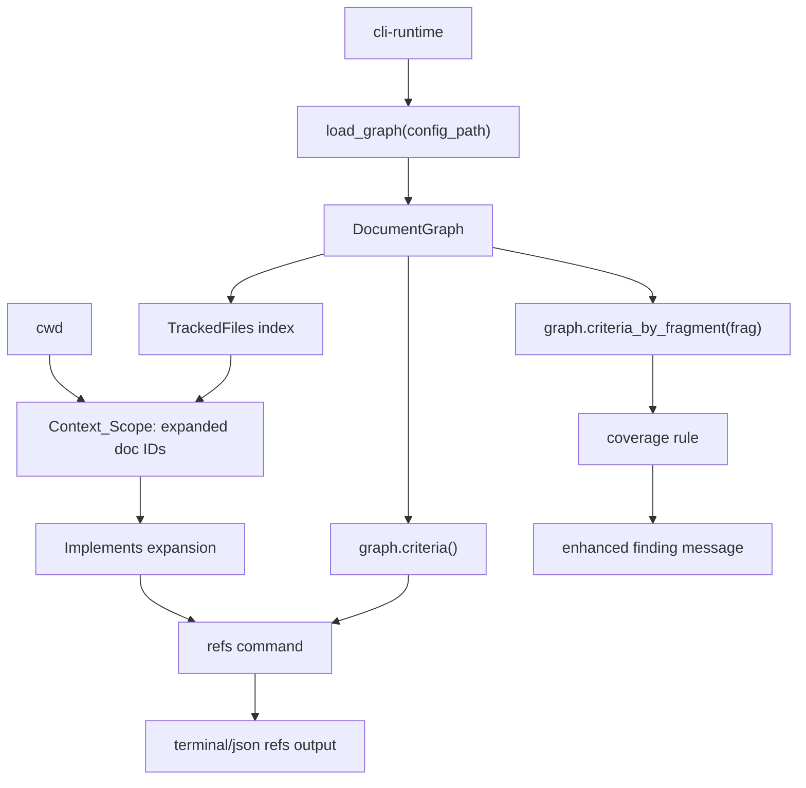

---
supersigil:
  id: ref-discovery/design
  type: design
  status: implemented
title: "Context-Aware Criterion Ref Discovery"
---

<Implements refs="ref-discovery/req" />
<DependsOn refs="document-graph/design, cli-runtime/design, verification-engine/design" />
<TrackedFiles paths="crates/supersigil-core/src/graph.rs, crates/supersigil-core/src/graph/query.rs, crates/supersigil-cli/src/commands/refs.rs, crates/supersigil-verify/src/rules/coverage.rs" />

## Overview

`ref-discovery` adds a way to discover criterion refs from the CLI, scoped to
the area of the codebase the developer is currently working in. It also provides
the graph primitive that enables verify-time "did you mean?" suggestions for
unresolved `#[verifies]` targets.

The design splits into three layers:

1. **Graph primitives** in `supersigil-core` — iterate and search the existing
   component index by fragment ID.
2. **CLI `refs` command** in `supersigil-cli` — operator-facing discovery with
   context-aware scoping via TrackedFiles.
3. **Verify suggestion** in `supersigil-verify` — enhanced finding message when
   an unresolved evidence target matches a known criterion fragment.

## Architecture



## Layer 1: Graph Primitives

Two new methods on `DocumentGraph`, both operating over the existing
`component_index: HashMap<(String, String), (String, ExtractedComponent)>`.
No new indexes are needed.

```rust
/// Iterate all referenceable components.
/// Yields (doc_id, fragment_id, &ExtractedComponent).
pub fn criteria(&self) -> impl Iterator<Item = (&str, &str, &ExtractedComponent)> {
    self.component_index.iter().map(|((doc_id, frag), (_, comp))| {
        (doc_id.as_str(), frag.as_str(), comp)
    })
}

/// Find all components whose fragment ID matches, across all documents.
pub fn criteria_by_fragment(&self, fragment: &str) -> Vec<(&str, &ExtractedComponent)> {
    self.component_index
        .iter()
        .filter_map(|((doc_id, frag), (_, comp))| {
            (frag == fragment).then_some((doc_id.as_str(), comp))
        })
        .collect()
}
```

A third method provides the forward direction of `Implements` relationships,
needed by Context_Scope expansion to follow links from design docs to their
requirement docs:

```rust
/// Get all documents that `doc_id` implements (forward direction).
pub fn implements_targets(&self, doc_id: &str) -> Vec<&str>
```

This scans the existing `implements_reverse` mapping rather than adding a new
index, since the mapping is small and the method is called only during scope
resolution.

The `criteria` and `criteria_by_fragment` methods are deliberately named for
discoverability even though the component index contains all referenceable
components (Criterion, Property, etc.). The primary consumer is criterion ref
discovery, and callers can filter by `component.name == "Criterion"` when needed.

The `criteria_by_fragment` method is a linear scan of the component index. This
is acceptable because the index is typically small (hundreds of entries at most)
and the method is called at most once per unresolved evidence record during
verification.

## Layer 2: CLI `refs` Command

### Scope Resolution

The `refs` command determines which documents to show criteria for:

1. **Explicit prefix** (`supersigil refs auth/`): filter by doc ID prefix.
2. **`--all` flag**: no filtering, show everything.
3. **Default (no args, no --all)**: compute Context_Scope from cwd.

Context_Scope resolution reuses the existing `TrackedFiles` index
(`graph.all_tracked_files()`) and performs a directory-prefix test against the
non-wildcard stem of each glob pattern.

The key design decision for `cwd_matches_glob` is that a glob like
`src/auth/**/*.rs` should match when cwd is `src/auth/` or `src/auth/handlers/`,
but not when cwd is `src/`. This is a directory-prefix test on the glob's
non-wildcard stem, not a file-level glob match.

After matching TrackedFiles, the scope is expanded by following `Implements`
relationships from each matched document. This is essential because `TrackedFiles`
typically live on design docs, while criteria live on requirement docs. Without
this expansion, context scoping would match design docs but produce zero criteria
because the criteria are on the `*/req` docs. The expansion uses the existing
`implements_reverse` mapping in the graph (accessed via `implements_targets`)
to include documents that the matched docs implement.

```rust
fn resolve_context_scope(
    graph: &DocumentGraph,
    project_root: &Path,
    cwd: &Path,
) -> Option<HashSet<String>> {
    let mut matched_doc_ids = HashSet::new();
    for (doc_id, globs) in graph.all_tracked_files() {
        for glob_pattern in globs {
            if cwd_matches_glob(cwd, project_root, glob_pattern) {
                matched_doc_ids.insert(doc_id.to_owned());
            }
        }
    }
    if matched_doc_ids.is_empty() { return None; }

    // Expand: include documents that matched docs implement.
    let expansion: Vec<String> = matched_doc_ids
        .iter()
        .flat_map(|doc_id| graph.implements_targets(doc_id))
        .map(str::to_owned)
        .collect();
    matched_doc_ids.extend(expansion);

    Some(matched_doc_ids)
}
```

### Output

Terminal mode renders a compact table:

```
Showing refs for 3 documents matching cwd. Use --all to see all refs.

auth/req/login#login-succeeds   WHEN valid email and password are submitted...
auth/req/login#login-fails      WHEN invalid credentials are provided...
auth/req/login#rate-limited     WHEN login attempts exceed the threshold...
```

JSON mode writes an array:

```json
[
  {
    "ref": "auth/req/login#login-succeeds",
    "doc_id": "auth/req/login",
    "criterion_id": "login-succeeds",
    "body_text": "WHEN valid email and password are submitted..."
  }
]
```

Results are sorted by ref string for stable output.

### Runtime Flow

1. Load the graph via the shared CLI runtime.
2. Determine the scope: explicit prefix, `--all`, or Context_Scope from cwd.
3. If using Context_Scope, expand by following `Implements` from matched docs.
4. Collect criteria from `graph.criteria()`, filter by scope.
5. For each criterion, extract body text from `component.body`.
6. Sort entries by ref string.
7. Render terminal table or JSON array.
8. If Context_Scope was used, print the scope hint to stderr.
9. If Context_Scope matched zero documents, print a fallback hint and show all.

## Layer 3: Verify Fragment Suggestion

The coverage rule in `supersigil-verify` currently emits:

> criterion `login-succeeds` has no verification evidence

When the `ArtifactGraph` contains evidence records with unresolved targets
(empty targets set), the coverage rule can use `criteria_by_fragment` on the
`DocumentGraph` to suggest corrections.

### Flow

1. Coverage rule finds criterion `(doc_id, criterion_id)` with no evidence.
2. Check `artifact_graph.unresolved_evidence()` for records with empty targets.
3. For each unresolved record, extract the raw attribute values stored in the
   evidence record's metadata.
4. Call `graph.criteria_by_fragment(raw_value)` for each raw value.
5. If matches are found, append "did you mean `doc_id#criterion_id`?" to the
   finding message.

This requires the `ArtifactGraph` to expose the underlying `DocumentGraph`
reference (already available as `artifact_graph.documents`), and evidence
records to carry the raw attribute value in metadata.

### Current Limitation

The raw attribute value (e.g. `"login-succeeds"`) is not currently stored in
evidence record metadata by the Rust plugin. The initial implementation can
fall back to the simpler approach: when unresolved evidence exists and a
criterion is uncovered, suggest the full ref for that criterion without
attempting to match it to a specific unresolved record. The precise
fragment-matching behaviour can be added when the plugin stores raw attribute
values.

## Key Types

```rust
/// A single criterion ref entry for the `refs` command output.
pub struct CriterionRefEntry {
    pub ref_string: String,      // "auth/req/login#login-succeeds"
    pub doc_id: String,          // "auth/req/login"
    pub criterion_id: String,    // "login-succeeds"
    pub body_text: Option<String>,
}

/// Scope for the refs command.
pub enum RefsScope {
    All,
    Prefix(String),
    ContextScope(HashSet<String>),
}
```

## Error Handling

- If the graph fails to load, the `refs` command fails with the standard CLI
  runtime error, same as `ls` or `context`.
- If the cwd is outside the project root, Context_Scope matching is skipped and
  all refs are shown (equivalent to `--all`).
- If a TrackedFiles glob is malformed, it is silently skipped during scope
  resolution (same as `affected`).

## Testing Strategy

### Graph primitives (`supersigil-core`)

- Unit tests in `graph.rs` or `graph/query.rs` for `criteria()` and
  `criteria_by_fragment()`:
  - yields all referenceable components
  - fragment lookup returns correct matches across multiple documents
  - fragment lookup returns empty vec for unknown fragments

### CLI `refs` command (`supersigil-cli`)

- Integration tests in `cmd_refs.rs`:
  - default output with TrackedFiles scoping
  - `--all` flag shows all refs
  - prefix filtering
  - JSON output structure
  - fallback when no TrackedFiles match cwd
  - empty result when project has no criteria

### Verify fragment suggestion (`supersigil-verify`)

- Unit tests in `rules/coverage.rs`:
  - unresolved evidence with matching fragment produces suggestion
  - unresolved evidence with non-matching fragment keeps original message
  - no unresolved evidence keeps original message

## Alternatives Considered

### Reverse index for fragment lookup

A `HashMap<String, Vec<(String, ExtractedComponent)>>` keyed by fragment
alone would make `criteria_by_fragment` O(1) instead of O(n). Rejected because
the component index is small enough that a linear scan is negligible, and a
second index adds memory and maintenance overhead with no measurable benefit.

### Adding `refs` to the `ls` command

`ls --criteria` could list criterion refs alongside documents. Rejected because
the output shape is fundamentally different (refs are sub-document granularity,
with body text) and the context-scoping behaviour would bloat the `ls` flag
surface. A separate command is cleaner.

### Fuzzy matching for verify suggestions

Using edit-distance matching to find "close" refs when a fragment doesn't
exactly match. Deferred because exact fragment matching covers the dominant
failure mode (bare fragment without document prefix), and fuzzy matching adds
complexity and false-positive risk.
