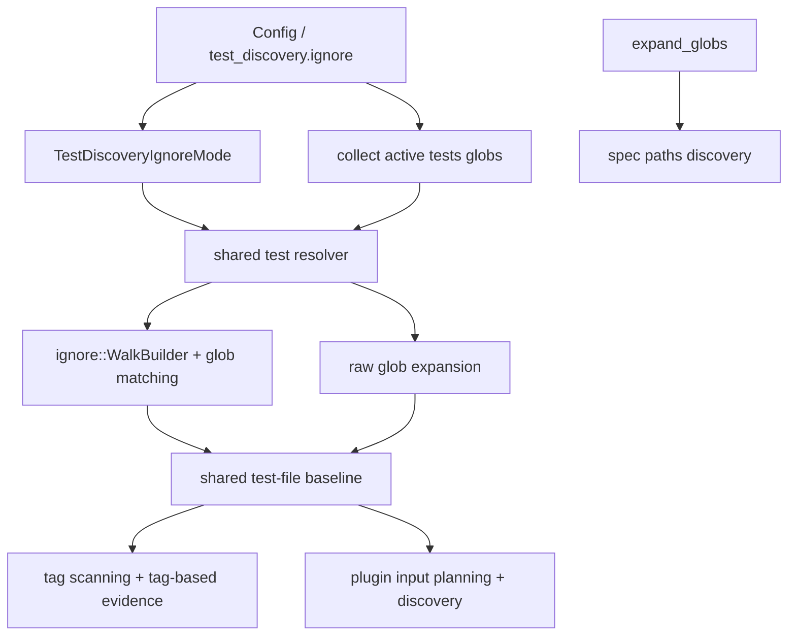

---
supersigil:
  id: shared-test-discovery/design
  type: design
  status: approved
title: "Shared Test Discovery"
---

```supersigil-xml
<Implements refs="shared-test-discovery/req" />
<DependsOn refs="config/design, verification-engine/design, workspace-projects/design, ecosystem-plugins/design, js-plugin/design" />
<TrackedFiles paths="Cargo.toml, Cargo.lock, README.md, crates/supersigil-core/src/config.rs, crates/supersigil-core/src/lib.rs, crates/supersigil-core/tests/config_unit_tests.rs, crates/supersigil-core/tests/config_property_tests.rs, crates/supersigil-verify/src/lib.rs, crates/supersigil-verify/src/rules/tests_rule.rs, crates/supersigil-verify/Cargo.toml, crates/supersigil-js/README.md, crates/supersigil-js/src/discover.rs, docs/research/polish-audit.md" />
```

## Overview

This feature narrows the shared test discovery problem to one explicit policy
surface:

- `supersigil-core` owns a typed workspace-level `test_discovery.ignore`
  setting
- `supersigil-verify` owns resolution of the shared test-file baseline from
  top-level `tests` and `[projects.*].tests`
- shared-baseline consumers use that file list for tag scanning and plugin
  input planning
- enabled plugins may still further filter or expand their own inputs after
  receiving the shared baseline
- generic raw glob helpers remain unchanged
- spec/document discovery from `paths` remains unchanged

The key design choice is to introduce a dedicated test-discovery path rather
than changing `expand_globs` globally. The existing raw glob utility is used by
other discovery surfaces, especially spec indexing, where ignore-aware
filtering would be surprising and risky.

## Architecture



### Boundary Choice

`supersigil-core` owns the typed config model:

- `test_discovery.ignore`
- enum validation and defaults

`supersigil-verify` continues to own shared test-file resolution:

- collecting top-level and per-project `tests` globs
- applying the configured resolution policy
- returning the sorted, deduplicated shared test-file baseline used by
  tag scanning and plugins

This keeps test discovery in the verification pipeline, where it already lives
today via `resolve_test_files`, and avoids turning `supersigil-core` into a
general filesystem policy layer.

### Resolution Flow

1. Load `Config` from `supersigil.toml`.
2. Determine the active discovery scope exactly as today:
   - single-project mode uses top-level `tests`
   - multi-project mode uses all `projects[*].tests`
   - project-filtered runs may narrow to one project's `tests`
3. Resolve those active test globs using the configured
   `TestDiscoveryIgnoreMode`.
4. Return one sorted, deduplicated shared file list.
5. Feed that list into:
   - tag scanning used by the tests rule and tag-based explicit evidence
   - plugin `plan_discovery_inputs`
   - plugin discovery for plugins that consume only the shared baseline

### Standard Mode

`"standard"` mode uses `ignore` crate standard behavior as the filesystem walk
boundary. Matching still comes from authored `tests` globs.

The intended implementation shape is:

- derive the literal filesystem roots implied by the active test globs
- normalize those literal roots before project-containment checks so
  parent-relative globs keep their raw-expansion reach
- walk from the ignore context root with `ignore::WalkBuilder` so parent
  ignore decisions still apply when a literal test root is itself ignored
- keep standard filters enabled
- prune traversal to the derived literal roots and match walked files against
  normalized project-resolved absolute glob patterns
- collect regular-file matches and symlinked-file matches into a
  sorted/deduplicated set

This preserves authored glob semantics, prevents traversal into ignored subtrees
such as `node_modules/` and `dist/`, and keeps relative glob patterns scoped to
the filesystem locations they resolve to from the project root.

### Off Mode

`"off"` mode preserves the current raw-glob behavior for test discovery:

- expand each active test glob literally from disk
- merge the results into the same sorted/deduplicated output shape

The feature does not treat `"off"` as a compatibility layer with extra user
messaging. It is simply the non-ignore-aware policy.

### Explicit Non-Changes

- `supersigil-core::expand_globs` and `expand_globs_checked` remain raw glob
  helpers.
- Criterion-nested `VerifiedBy strategy="file-glob"` continues to expand its
  own declared `paths` relative to the project root.
- LSP and other spec/document discovery paths continue to use raw glob
  expansion for `paths`.
- This feature does not introduce plugin-specific ignore settings.
- Plugin-owned widening beyond the shared test-file baseline remains
  plugin-defined in this pass.
- This feature does not add an explicit exclude-glob list.

## Key Types

```rust
pub struct Config {
    pub paths: Option<Vec<String>>,
    pub tests: Option<Vec<String>>,
    pub projects: Option<HashMap<String, ProjectConfig>>,
    #[serde(default)]
    pub test_discovery: TestDiscoveryConfig,
    pub id_pattern: Option<String>,
    pub documents: DocumentsConfig,
    pub components: HashMap<String, ComponentDef>,
    pub verify: VerifyConfig,
    pub ecosystem: EcosystemConfig,
    pub test_results: TestResultsConfig,
}

#[derive(Default, Serialize, Deserialize)]
pub struct TestDiscoveryConfig {
    #[serde(default)]
    pub ignore: TestDiscoveryIgnoreMode,
}

#[derive(Default, Serialize, Deserialize)]
#[serde(rename_all = "lowercase")]
pub enum TestDiscoveryIgnoreMode {
    #[default]
    Standard,
    Off,
}
```

The verify-side resolver surface stays conceptually close to today's API:

```rust
pub fn resolve_test_files(config: &Config, project_root: &Path) -> Vec<PathBuf>;

pub fn resolve_test_files_for_project(
    config: &Config,
    project_root: &Path,
    project: Option<&str>,
) -> Vec<PathBuf>;
```

Internally, those functions delegate to one policy-aware shared resolver rather
than directly calling `expand_globs`.

## Config Shape

The authored TOML surface is:

```toml
[test_discovery]
ignore = "standard" # or "off"
```

This avoids overloading the existing `tests = [...]` list key with a table of
the same name and keeps the policy clearly workspace-scoped.

The config field is intentionally defaulted at deserialization time:

- `Config.test_discovery` uses `#[serde(default)]`
- `TestDiscoveryConfig` defaults to `ignore = Standard`
- minimal configs such as `paths = ["specs/**/*.md"]` continue to deserialize
  without requiring a new section

## Ownership Notes

- `config/design` owns the existence and validation of the new config type.
- `verification-engine/design` owns how the shared test-file baseline is used
  once resolved.
- `workspace-projects/design` continues to own which project's test globs are
  active in each workspace mode.
- `ecosystem-plugins/design` and `js-plugin/design` continue to treat the
  shared test-file baseline as an input, not as plugin-owned filesystem logic.
- `verification-engine/design`, `tests_rule.rs`, and `explicit_evidence.rs`
  continue to own criterion-nested `VerifiedBy strategy="file-glob"` behavior
  independently of this feature.

## Decisions

```supersigil-xml
<Decision id="workspace-test-discovery-policy">
  Model shared test-discovery behavior as a workspace-level
  `[test_discovery]` config surface with `ignore = "standard" | "off"`.

  <References refs="shared-test-discovery/req#req-1-1, shared-test-discovery/req#req-1-2, shared-test-discovery/req#req-1-4" />

  <Rationale>
  The shared test-file baseline is workspace-owned and feeds tag scanning and
  plugin planning. A dedicated top-level table makes the policy visible and
  avoids overloading the existing `tests = [...]` list key with a table of the
  same name.
  </Rationale>

  <Alternative id="tests-table" status="rejected">
  Reuse `tests` as a table name, for example `[tests] ignore = "standard"`.
  Rejected because `tests` already means a list of glob strings in both
  single-project and multi-project mode, so the shape would be ambiguous and
  awkward to explain.
  </Alternative>

  <Alternative id="plugin-local-ignore-setting" status="rejected">
  Add ignore behavior under ecosystem plugin config such as `ecosystem.js`.
  Rejected because the shared test-file baseline is consumed before plugin-
  specific filtering and also drives tag scanning.
  </Alternative>
</Decision>

<Decision id="verification-owned-shared-resolver">
  Keep shared test-file resolution in the verification layer and introduce a
  dedicated policy-aware resolver instead of changing generic glob utilities.

  <References refs="shared-test-discovery/req#req-2-5, shared-test-discovery/req#req-3-1, shared-test-discovery/req#req-4-1" />

  <Rationale>
  Shared test discovery is already owned by `resolve_test_files` in
  `supersigil-verify`. Keeping the resolver there preserves existing pipeline
  boundaries and avoids turning `supersigil-core` into a broad filesystem
  policy layer.
  </Rationale>

  <Alternative id="replace-expand-globs-globally" status="rejected">
  Make `supersigil-core::expand_globs` ignore-aware for every caller.
  Rejected because spec/document discovery and other raw-glob callers would
  then inherit ignore semantics unintentionally.
  </Alternative>
</Decision>

<Decision id="tests-only-ignore-scope">
  Apply ignore-aware resolution only to `tests` globs and leave `paths` globs
  on raw expansion semantics.

  <References refs="shared-test-discovery/req#req-4-1, shared-test-discovery/req#req-4-2, shared-test-discovery/req#req-4-3" />

  <Rationale>
  Ignored/generated directories are common inside broad test trees, but spec
  documents are authoritative workspace inputs. Silently removing specs from
  the graph because of repository ignore files would be a riskier and more
  surprising behavior change than scanning extra test files.
  </Rationale>

  <Alternative id="ignore-all-discovery-globs" status="rejected">
  Apply the same ignore-aware policy to both `tests` and `paths`.
  Rejected because it would let repository ignore files implicitly shrink the
  workspace graph, LSP indexing set, and verification scope.
  </Alternative>

  <Alternative id="explicit-exclude-globs" status="deferred">
  Add a separate exclude-glob list to `supersigil.toml`.
  Deferred because repository ignore rules already express the dominant
  exclusion intent, and this feature does not need an additional config surface
  to solve the current problem.
  </Alternative>
</Decision>
```

## Error Handling

This feature adds one new hard failure and intentionally preserves other
lenient behaviors.

Hard failure:

- unknown `test_discovery.ignore` values fail config loading via enum
  deserialization

Preserved lenient behaviors:

- malformed or unreadable test glob matches continue to behave like the current
  resolver path rather than introducing new user-facing diagnostics
- empty discovery scopes remain valid and produce an empty shared baseline
- ignored files in `"standard"` mode disappear from discovery rather than
  generating warnings explaining why they were skipped

This keeps the behavior change focused on file inclusion semantics rather than
expanding the verification error surface.

## Testing Strategy

The implementation should be driven by tests in three layers.

### Config Tests

- `crates/supersigil-core/tests/config_unit_tests.rs`
  covers:
  - default `test_discovery.ignore = "standard"`
  - explicit `"off"`
  - unknown values rejected at load time
- `crates/supersigil-core/tests/config_property_tests.rs`
  covers round-trip serialization of the new config type

### Shared Resolver Tests

- `crates/supersigil-verify/src/lib.rs`
  or a dedicated resolver-focused test module covers:
  - ignored `node_modules/` and `dist/` matches excluded in `"standard"`
  - the same matches included in `"off"`
  - nested ignore files honored in `"standard"`
  - multi-pattern outputs remain sorted and deduplicated
  - top-level and per-project aggregation rules remain unchanged
  - criterion-nested `VerifiedBy strategy="file-glob"` behavior remains
    project-root relative and unchanged by `test_discovery.ignore`

### Pipeline Regression Tests

- `crates/supersigil-cli/src/plugins.rs`
  or CLI verification tests cover end-to-end use of the resolved shared
  baseline by tag scanning and plugins
- one JS-flavored regression test proves an ignored malformed test file does
  not produce a spurious plugin discovery warning in `"standard"` mode because
  the JS plugin consumes the shared baseline directly
- documentation/config tests cover the new user-facing config surface where
  appropriate

The supersigil repo itself provides realistic coverage for this feature because
`[projects.ecosystem] tests = ["packages/**/*.test.ts"]` interacts directly
with ignored `node_modules/` and `dist/` trees in the package workspace.

## Alternatives Considered

### Replace `expand_globs` Globally

Rejected because `expand_globs` is also used by spec/document discovery and
other raw-glob callers. Changing it globally would make repository ignore files
silently affect the workspace graph and LSP indexing.

### Add Only Explicit Exclude Globs

Rejected for this pass because repository ignore rules already encode the
dominant exclusion intent for generated and vendored directories. Making users
repeat those exclusions in `supersigil.toml` would be unnecessary overhead.

### Keep Ignore Handling in Each Plugin

Rejected because the shared test-file baseline is consumed before plugin-
specific filtering and also drives tag scanning. Per-plugin ignore handling
would leave shared-baseline behavior inconsistent across one pipeline.
