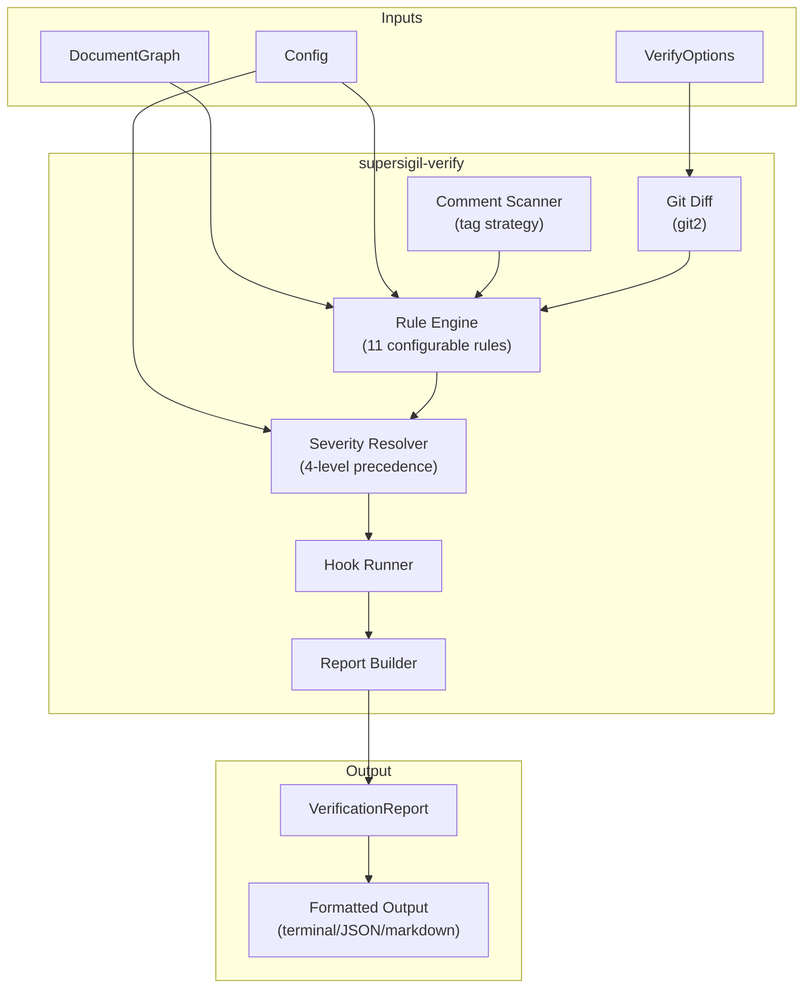

---
supersigil:
  id: design/verification-engine
  type: design
  status: draft
title: "Verification Engine"
---

<Implements refs="req/verification-engine" />
<DependsOn refs="design/document-graph" />
<TrackedFiles paths="crates/supersigil-verify/src/**/*.rs" />

## Overview

The `supersigil-verify` crate is the verification engine. It takes a `DocumentGraph` (from `supersigil-core`) and a `Config`, runs configurable rules, resolves severities, executes hooks, and produces a `VerificationReport`.

The crate boundary is clean: `supersigil-core::graph` handles structural integrity (hard errors: broken refs, duplicate IDs, cycles). `supersigil-verify` checks properties of the successfully built graph (configurable rules with tunable severity).

## Architecture



## Module Structure

```
supersigil-verify/src/
├── lib.rs              # Public API: verify(), affected()
├── rules.rs            # Rule enum, built-in defaults, runner
├── rules/
│   ├── coverage.rs     # uncovered_criterion
│   ├── tests.rs        # missing_test_files, zero_tag_matches, unverified_validation
│   ├── tracked.rs      # empty_tracked_glob, stale_tracked_files
│   ├── status.rs       # status_inconsistency
│   └── structural.rs   # missing_required_component, invalid_id_pattern,
│                       # isolated_document, orphan_test_tag
├── severity.rs         # 4-level severity resolution
├── scan.rs             # Comment-based tag scanner
├── git.rs              # git2 diff computation
├── affected.rs         # affected query (TrackedFiles x git diff)
├── hooks.rs            # External process hook execution
└── report.rs           # Finding, VerificationReport, formatters
```

## Key Types

### Finding

```rust
pub struct Finding {
    pub rule: RuleName,
    pub doc_id: Option<String>,
    pub message: String,
    pub effective_severity: ReportSeverity,
    pub raw_severity: ReportSeverity,
    pub position: Option<SourcePosition>,
}
```

`doc_id` is `None` for global findings (hook errors, timeouts). `raw_severity` is the severity before draft gating. `effective_severity` is after the full 4-level resolution. This lets the report show "would be error if not draft" for draft documents.

### RuleName

```rust
pub enum RuleName {
    UncoveredCriterion,
    UnverifiedValidation,
    MissingTestFiles,
    ZeroTagMatches,
    StaleTrackedFiles,
    EmptyTrackedGlob,
    OrphanTestTag,
    InvalidIdPattern,
    IsolatedDocument,
    StatusInconsistency,
    MissingRequiredComponent,
    HookOutput,
    HookFailure,
}
```

Each built-in variant maps to its config key (e.g., `UncoveredCriterion` ↔ `"uncovered_criterion"`). The `RuleName` enum provides the built-in default severity for each rule. `HookOutput` is used for findings parsed from hook stdout. `HookFailure` is used for hook errors (non-zero exit, timeout).

### ReportSeverity

```rust
pub enum ReportSeverity {
    Off,
    Info,
    Warning,
    Error,
}
```

`ReportSeverity` is internal to the verify crate. It extends the config `Severity` (`Off`, `Warning`, `Error`) with an `Info` level used exclusively for draft gating. `Info` findings appear in output but do not affect the report's result status. `From<Severity>` converts config values into report values.

### VerificationReport

```rust
pub struct VerificationReport {
    pub findings: Vec<Finding>,
    pub summary: Summary,
}

pub struct Summary {
    pub total_documents: usize,
    pub error_count: usize,
    pub warning_count: usize,
    pub info_count: usize,
}
```

### VerifyOptions

```rust
pub struct VerifyOptions {
    pub since: Option<String>,
    pub committed_only: bool,
    pub merge_base: bool,
    pub project: Option<String>,
    pub format: OutputFormat,
}
```

### AffectedDocument

```rust
pub struct AffectedDocument {
    pub id: String,
    pub path: PathBuf,
    pub matched_globs: Vec<String>,
    pub changed_files: Vec<PathBuf>,
}
```

## Verification Pipeline

The `verify()` function runs this sequence:

1. **Collect project scope** — If `--project` is specified, filter documents to that project. Ref resolution still uses the global index.

2. **Run rules** — Each rule module receives the graph and config, returns `Vec<Finding>`. Rules are independent and all run regardless of individual failures:
   - `coverage::check()` → `uncovered_criterion`
   - `tests::check()` → `missing_test_files`, `zero_tag_matches`, `unverified_validation`
   - `tracked::check()` → `empty_tracked_glob`, `stale_tracked_files` (only if `--since`)
   - `status::check()` → `status_inconsistency`
   - `structural::check()` → `missing_required_component`, `invalid_id_pattern`, `isolated_document`, `orphan_test_tag`

3. **Resolve severities** — For each finding, apply the 4-level precedence:
   - Draft gating: if document status is `draft`, suppress to `info`
   - Per-rule override from `[verify.rules]`
   - Global strictness from `[verify] strictness`
   - Built-in default

4. **Run hooks** — Execute `post_verify` hooks sequentially. Pass report JSON on stdin, parse stdout as additional findings, handle timeouts and non-zero exits.

5. **Build report** — Assemble `VerificationReport` with summary counts.

## Severity Resolution

```rust
fn resolve_severity(
    rule: &RuleName,
    doc_status: Option<&str>,
    config: &VerifyConfig,
) -> ReportSeverity {
    // 1. Draft gating (highest priority)
    if doc_status == Some("draft") {
        return ReportSeverity::Info;
    }
    // 2. Per-rule override
    let rule_key = rule.config_key();
    if let Some(sev) = config.rules.get(rule_key) {
        return ReportSeverity::from(sev);
    }
    // 3. Global strictness
    if let Some(sev) = &config.strictness {
        return ReportSeverity::from(sev);
    }
    // 4. Built-in default
    rule.default_severity()
}
```

`ReportSeverity` is a verify-internal enum (`Off`, `Info`, `Warning`, `Error`). It is distinct from `supersigil-core::config::Severity` (`Off`, `Warning`, `Error`), which remains unchanged. `Info` is only produced by draft gating — it is not a valid user config value.

## Comment-Based Tag Scanner

The scanner is a simple regex-based search. For a given tag string, it constructs a pattern that matches across common comment styles:

```
(?:^|[[:space:]])(?:///?|#|--|/\*)\s*supersigil:\s+{tag_literal}(?:\s|$|\*/)
```

The scanner:
- Reads each file in the configured test paths
- Skips non-UTF-8 files silently
- Returns matches with file path, line number, and matched tag
- Is used by both `zero_tag_matches` (specific tag search) and `orphan_test_tag` (collect all tags)

For `orphan_test_tag`, the scanner collects all tags found across test files and compares against the set of tags declared in `VerifiedBy` components.

## Git Diff Module

Uses `git2` to compute changed file paths:

```rust
pub fn changed_files(
    repo_path: &Path,
    since_ref: &str,
    committed_only: bool,
    use_merge_base: bool,
) -> Result<Vec<PathBuf>, GitError> {}
```

The implementation:
1. Open the repository at `repo_path`
2. Resolve `since_ref` to an OID (rev-parse)
3. If `use_merge_base`, compute `merge-base(ref, HEAD)`
4. Diff the resolved commit tree against HEAD tree
5. If not `committed_only`, also diff HEAD tree against the working directory and index
6. Collect all changed file paths (added, modified, deleted, renamed)
7. Return deduplicated paths

## Hook Execution

Hooks run as child processes with a contract:

- **Input**: Report JSON on stdin (via `Stdio::piped()`)
- **Output**: stdout parsed as a JSON array of `[level, message]` pairs (two-element arrays). Each pair becomes a `Finding` with `rule: HookOutput`. Invalid JSON produces a warning finding with `rule: HookFailure`. Stdout/stderr each truncated to 64 KB.
- **Lifecycle**: `run_hooks()` is a reusable utility. `verify()` runs `post_verify` hooks only. CLI orchestrates `post_lint` and `export` groups.
- **Timeout**: configurable, default 30s. Exceeded → kill + error finding.
- **Exit code**: non-zero → error finding with command and exit code.

## Affected Query

The `affected()` function is separate from `verify()` — it's a query, not a rule. It uses the same git diff module:

1. Compute changed files since the ref
2. For each document with `TrackedFiles`, check if any glob matches a changed file
3. Return matched documents with their globs and changed files

This powers both `supersigil affected --since [ref]` and the `stale_tracked_files` rule (which calls the same matching logic internally).

## Design Decisions

### Rules as functions, not trait objects

Each rule is a plain function `fn check(graph, config, ...) -> Vec<Finding>`. No trait, no dynamic dispatch. The rule set is fixed at compile time and small (11 rules). Trait-based extensibility is unnecessary — hooks provide runtime extensibility.

### ReportSeverity vs ConfigSeverity

The config `Severity` enum (`Off`, `Warning`, `Error`) stays in `supersigil-core` unchanged. The verify crate defines its own `ReportSeverity` (`Off`, `Info`, `Warning`, `Error`) with an additional `Info` level for draft gating. `Info` is visible in output but doesn't affect the result status. Keeping these as separate types prevents `Info` from leaking into user-facing config.

### Affected is a query, not a rule

`affected` returns structured data directly — it's not a finding. It shares the git diff logic with `stale_tracked_files` but has a different output shape. Keeping it separate avoids conflating "verify" (checking for problems) with "query" (returning data).

### Tag scanner is in-process, not shelled out

The comment scanner is a simple regex search. Shelling out to `grep` or `rg` would add platform dependencies and complicate testing. In-process scanning with `BufReader` is fast enough for test directories.
