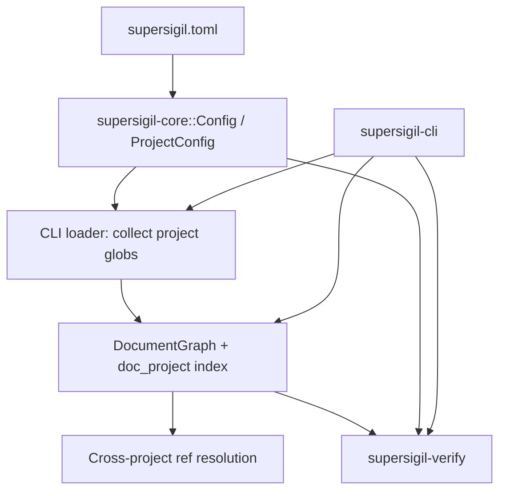

---
supersigil:
  id: workspace-projects/design
  type: design
  status: implemented
title: "Workspace Projects"
---

```supersigil-xml
<Implements refs="workspace-projects/req" />
<TrackedFiles paths="supersigil.toml, crates/supersigil-core/src/config.rs, crates/supersigil-core/src/graph/index.rs, crates/supersigil-core/src/graph/resolve.rs, crates/supersigil-cli/src/commands.rs, crates/supersigil-cli/src/commands/ls.rs, crates/supersigil-cli/src/commands/verify.rs, crates/supersigil-cli/src/commands/new.rs, crates/supersigil-verify/src/lib.rs, crates/supersigil-core/tests/config_unit_tests.rs, crates/supersigil-core/tests/config_property_tests.rs, crates/supersigil-core/src/graph/tests/prop_ref_resolution.rs, crates/supersigil-core/src/graph/tests/prop_task_implements.rs, crates/supersigil-verify/src/lib.rs, crates/supersigil-cli/tests/clap_parse.rs" />
```

## Overview

Multi-project support is implemented as a workspace-level concern rather than a
per-command special case. `supersigil-core` owns the configuration model and
project isolation rules, `supersigil-cli` exposes project-aware command
surfaces, and `supersigil-verify` handles project-scoped verification on top
of a workspace-wide graph.

The important current property is that project partitioning changes discovery
and reporting boundaries, but does not eliminate the global workspace graph.
Refs still resolve against the full workspace unless the source project opts
into `isolated = true`.

## Architecture



### Resolution Model

1. Load one workspace config from the repo root.
2. Choose either top-level `paths`/`tests` or named `projects.*`.
3. In Multi_Project_Mode, collect all project `paths` and discover one flat
   document set across the workspace.
4. Assign Project_Membership by matching document file paths against the static
   prefixes implied by each project's path globs.
5. Build one `DocumentGraph` across every discovered document.
6. During ref resolution, consult the source document's project. Non-isolated
   projects may resolve globally; isolated projects may only resolve within the
   same project.
7. During verification, resolve shared test-file inputs from all configured
   project test globs for workspace-wide runs. When `--project` is supplied,
   the verifier may instead resolve selected-project test inputs and skip
   out-of-scope per-document checks that cannot affect the selected project's
   result. In both cases, rules continue to use the workspace graph for
   non-isolated resolution and final reporting scope.

## Key Types

```rust
pub struct ProjectConfig {
    pub paths: Vec<String>,
    pub tests: Vec<String>,
    pub isolated: bool,
}

pub struct Config {
    pub paths: Option<Vec<String>>,
    pub tests: Option<Vec<String>>,
    pub projects: Option<HashMap<String, ProjectConfig>>,
    pub id_pattern: Option<String>,
    pub documents: DocumentsConfig,
    pub components: HashMap<String, ComponentDef>,
    pub verify: VerifyConfig,
    pub ecosystem: EcosystemConfig,
    pub test_results: TestResultsConfig,
}

pub struct VerifyOptions {
    pub project: Option<String>,
    pub since_ref: Option<String>,
    pub committed_only: bool,
    pub use_merge_base: bool,
}
```

- `Config` encodes the workspace mode and the shared top-level config.
- `ProjectConfig` carries the per-project discovery and isolation boundary.
- `DocumentGraph` stores document membership in a `doc_project` map, which the
  CLI and verify layers use for filtering.

## Repository Application

For this repository, the project model is intentionally domain-oriented rather
than crate-per-crate. The first recovered project is the root `workspace`
project for cross-cutting behavior. The staged target layout is:

```text
workspace  -> specs/**/*.md
foundation -> crates/supersigil-core/specs/**/*.md
              crates/supersigil-parser/specs/**/*.md
cli        -> crates/supersigil-cli/specs/**/*.md
verify     -> crates/supersigil-verify/specs/**/*.md
import     -> crates/supersigil-import/specs/**/*.md
ecosystem  -> crates/supersigil-evidence/specs/**/*.md
              crates/supersigil-rust/specs/**/*.md
              crates/supersigil-rust-macros/specs/**/*.md
```

The `workspace`, `foundation`, and `verify` projects now have recovered
documents in place. `foundation` currently hosts `parser-pipeline`, `config`,
and `document-graph` in crate-local spec roots, `verify` hosts
`verification-engine` under `crates/supersigil-verify/specs`, and the `cli`
project now has `cli-runtime`, `work-queries`, `inventory-queries`, and
`authoring-commands` under `crates/supersigil-cli/specs`. The stale root
`specs/cli/*` monolith is retired. The `import` project now hosts the
recovered `kiro-import` domain under
`crates/supersigil-import/specs/kiro-import/`, and the stale root
`specs/kiro-import/*` set is retired. The `ecosystem` project is now split by
domain: root `specs/ecosystem-plugins/*` captures the cross-cutting plugin
layer, while crate-local `evidence-contract`, `rust-plugin`, and
`verifies-macro` docs live under the evidence and Rust crates. The staged
workspace-topology migration is now fully recovered.

The combined crate-local `ecosystem` project is intentionally temporary. Once
the repo has a second built-in ecosystem family, the planned follow-up split
is:

```text
workspace         -> specs/ecosystem-plugins/**/*.md
ecosystem-common  -> crates/supersigil-evidence/specs/**/*.md
ecosystem-rust    -> crates/supersigil-rust/specs/**/*.md
                     crates/supersigil-rust-macros/specs/**/*.md
ecosystem-<name>  -> crates/supersigil-<name>/specs/**/*.md
```

That preserves one cross-cutting workspace doc set while giving each plugin
family a project-sized domain of its own.

## Error Handling

- Mixed single-project and multi-project keys are configuration errors.
- Missing `paths` inside a project is a TOML/config load error.
- Cross-project refs from isolated projects fail as broken refs during graph
  construction.
- Project filters with no matching documents are treated as empty scope, not as
  graph-construction failures.

## Testing Strategy

- `crates/supersigil-core/tests/config_unit_tests.rs`
  covers config shapes, defaults, and validation failures.
- `crates/supersigil-core/tests/config_property_tests.rs`
  covers round-tripping and mode-validity invariants.
- `crates/supersigil-core/src/graph/tests/prop_ref_resolution.rs`
  covers non-isolated and isolated cross-project refs.
- `crates/supersigil-core/src/graph/tests/prop_task_implements.rs`
  covers project isolation for task `implements`.
- `crates/supersigil-verify/src/lib.rs`
  covers multi-project test-glob discovery.
- `crates/supersigil-cli/tests/clap_parse.rs`
  covers the `verify --project` parse surface.

## Current Gaps

- `init` still writes a single-project config. It does not scaffold
  `projects.*`.
- `new` still writes into root `specs/...` and is not project-aware.
- Project-filtered verification can now narrow shared test inputs before some
  rule passes, but ecosystem-specific widening beyond those shared inputs
  remains plugin-defined rather than centrally modeled.

## Alternatives Considered

- Crate-per-crate projects everywhere. Rejected for now because it forces a
  structure decision before the recovered domain boundaries are clear.
- Keeping the repo single-project until every existing spec is moved. Rejected
  because it prevents dogfooding the workspace feature while recovering the
  rest of the graph.
