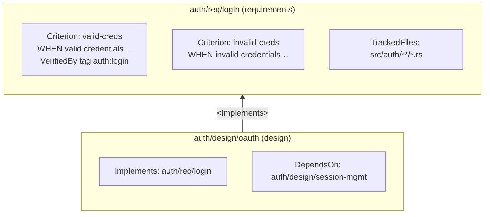

import { Aside } from '@astrojs/starlight/components';

```supersigil-xml
<TrackedFiles paths="crates/supersigil-core/src/graph.rs" />
```

The component graph is the core data structure behind Supersigil. It is what makes specifications verifiable instead of just readable.

## Structure

Every Supersigil document produces nodes in the graph. The document itself is a node. Referenceable components inside it (`<Criterion>`, `<Task>`, `<Decision>`) are also nodes. References between components form directed edges.



## References and Fragments

References use document IDs. To target a specific component within a document, use fragment syntax:

```
auth/req/login#valid-creds
└─── document ─┘ └ fragment ┘
```

Multi-value references use comma-separated strings:

```xml
<Implements refs="auth/req/login#valid-creds, auth/req/login#invalid-creds" />
```

<Aside type="caution">
  All attributes must be plain string literals. JSX expression attributes (`{...}`) are rejected as hard lint errors. This is intentional -- string-only attributes are trivially parseable and unambiguous.
</Aside>

## Edge Types

Each built-in component creates specific edges in the graph:

### References

Informational links between documents or criteria. No verification semantics.

```xml
<References refs="auth/req/login#valid-creds, auth/design/session-mgmt" />
```

### VerifiedBy

Maps a criterion to test evidence. Must be nested inside a `<Criterion>`. Two strategies:

```xml
<Criterion id="login-success">
  User sees the dashboard after entering valid credentials.
  <VerifiedBy strategy="tag" tag="auth:login-success" />
</Criterion>

<Criterion id="login-failure">
  Error message shown for invalid credentials.
  <VerifiedBy strategy="file-glob" paths="tests/auth/login_failure_test.rs" />
</Criterion>
```

- **`strategy="tag"`** -- Scans test files for a `supersigil: <tag>` comment. Matches produce evidence.
- **`strategy="file-glob"`** -- Resolves file glob patterns relative to the project root. Matched files are evidence.

### Implements

Declares that a document (typically a design) addresses criteria from another document (typically requirements).

```xml
<Implements refs="auth/req/login" />
```

### DependsOn

Declares document-level ordering dependencies. Used for topological sorting and `supersigil plan`.

```xml
<DependsOn refs="auth/design/session-mgmt" />
```

### TrackedFiles

Declares file paths (globs) that this spec cares about. Used for staleness detection.

```xml
<TrackedFiles paths="src/auth/**/*.rs, tests/auth/**/*.rs" />
```

### Task

A trackable work item with its own edges to criteria and other tasks.

```xml
<Task id="impl-login" status="done" implements="auth/req/login#login-success">
  Implement the login endpoint.
</Task>

<Task id="add-rate-limiting" status="in-progress" depends="impl-login">
  Add rate limiting to the login endpoint.
</Task>
```

- `implements` creates edges from the task to criteria (same fragment syntax as refs).
- `depends` creates ordering edges between tasks within the same document.

## Unidirectional Design

References in Supersigil are always unidirectional. Concrete things point at abstract things:

- Designs point at requirements (via `<Implements>`), never the reverse.
- Tests are mapped by criteria (via `<VerifiedBy>`), not by the tests themselves.
- Tasks point at the criteria they implement.

This prevents synchronization drift. Adding a design document never requires editing the requirement it implements. You can restructure your design docs without touching a single requirement file.

## Reverse Mappings

Supersigil computes reverse mappings automatically during graph construction. When you query a requirement, the tool shows you:

- Which designs implement it (reverse of `<Implements>`)
- Which documents reference it (reverse of `<References>`)
- Which documents depend on it (reverse of `<DependsOn>`)

You never declare these reverse relationships. They are derived from the forward edges.

## Cycle Detection

Cycles are hard errors. If document A depends on B, B depends on C, and C depends on A, graph construction fails immediately:

```
error: dependency cycle in document graph: A → B → C → A
```

The same applies to `<Task>` dependencies within a document. Task ordering uses topological sort -- cycles make ordering impossible, so they are always fatal.

## Querying the Graph

Several CLI commands query the graph:

| Command | Purpose |
|---------|---------|
| `supersigil context <id>` | Focused view of a document and its relationships |
| `supersigil graph --format mermaid` | Full graph as Mermaid diagram |
| `supersigil graph --format dot` | Full graph as Graphviz DOT |
| `supersigil plan [id]` | Outstanding work in topological order |
| `supersigil affected --since <ref>` | Specs affected by file changes since a git ref |

### Context

`supersigil context` provides an agent-friendly view of a single document and everything connected to it:

```bash
supersigil context auth/req/login
```

The output includes the document's criteria, which documents implement it, which tests cover it, and which tracked files have changed. Reverse mappings are included automatically.

### Graph Visualization

`supersigil graph` outputs the full document dependency graph in either Mermaid or Graphviz format:

```bash
# Mermaid (default)
supersigil graph > deps.mmd

# Graphviz DOT
supersigil graph --format dot > deps.dot
```

### Plan

`supersigil plan` shows outstanding work across the project or for a specific document, ordered topologically by dependencies:

```bash
# All outstanding work
supersigil plan

# Specific document or prefix
supersigil plan auth/req/login
```

<Aside type="tip">
  Use `supersigil plan --full` to see all criteria and full task details, not just the summary.
</Aside>

### Affected

`supersigil affected` finds specs whose tracked files have changed since a git ref:

```bash
supersigil affected --since main
supersigil affected --since HEAD~3
supersigil affected --since main --committed-only
supersigil affected --since main --merge-base
```

This integrates naturally with PR reviews: run it in CI to flag specs that may need updating when their tracked source files change.
