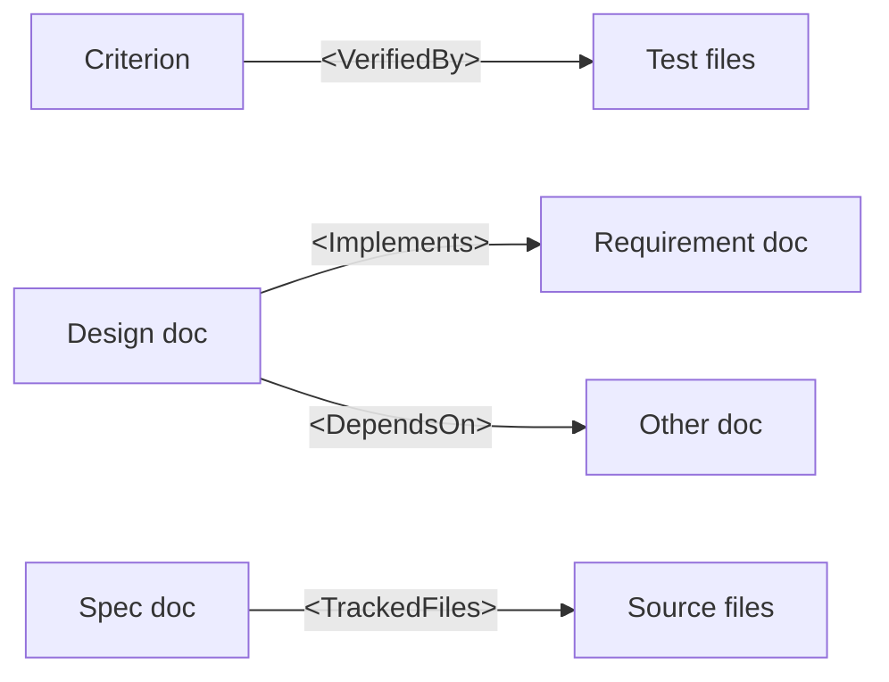

import { Aside, Card, CardGrid } from '@astrojs/starlight/components';

Supersigil turns Markdown spec files into a verifiable graph of criteria, evidence, and test mappings. Specs live in your repository alongside code. They are reviewed in pull requests and checked by CI, just like source code.

## Core Principles

1. **Everything-as-code.** Specs are Markdown files committed to your repository. No external system of record. No sync to keep in place. Git is the source of truth.

2. **Verifiable by default.** Cross-references are typed and checked. Criterion-to-test mappings are discovered and reported. Staleness, orphans, and coverage gaps surface as warnings and errors.

3. **Workflow-agnostic.** Write requirements first, design first, or start with the criterion you care about. Supersigil tells you what is missing -- it does not prescribe an order.

4. **JSON everywhere.** Every CLI command supports `--format json`. The same graph that powers human-readable output feeds agent workflows.

## Documents

A Supersigil document is any Markdown file with a `supersigil:` namespace in its front matter:

```md
---
supersigil:
  id: auth/req/login
  type: requirements
  status: approved
---

# User Authentication

Your Markdown content goes here.
```

**Required fields:**
- `id` -- A stable, unique identifier for this document. Convention: `{feature}/{type_short}` (e.g., `auth/req`, `auth/design`). The `supersigil new` command generates IDs in this format automatically. Deeper nesting (e.g., `auth/req/login`) is also valid for large feature areas.

**Optional fields:**
- `type` -- Classification tag. Four built-in types: `requirements`, `design`, `tasks`, `adr`. Custom types can be defined in config.
- `status` -- Current state (e.g., `draft`, `review`, `approved`). Documents with `status: draft` get relaxed verification.

<Aside type="note">
  Document types are classification tags. Verification operates on the **component graph**, not document types. A `Criterion` works the same way regardless of which document type contains it. Components carry semantics, not doc types.
</Aside>

## Components

Components are XML elements that carry specification semantics. Supersigil ships with 11 built-in components:

| Component | Purpose |
|-----------|---------|
| `<AcceptanceCriteria>` | Groups testable criteria |
| `<Criterion>` | A single verifiable statement with a unique ID |
| `<References>` | Informational traceability links to other docs or criteria |
| `<VerifiedBy>` | Maps a criterion to test evidence (by tag or file glob) |
| `<Implements>` | Declares this document implements criteria from another |
| `<DependsOn>` | Declares document-level ordering dependencies |
| `<TrackedFiles>` | File paths (globs) tracked for staleness detection |
| `<Task>` | A trackable work item with status, implements, and depends edges |
| `<Decision>` | A recorded architectural choice with rationale and alternatives |
| `<Rationale>` | Justification for a Decision |
| `<Alternative>` | A considered option for a Decision that was not chosen or was deferred |

Each component is a typed node in the specification graph. References between components form edges that Supersigil traverses and verifies.

## The Graph

Documents and their components form a directed graph:



Key properties:
- **References are unidirectional.** Designs point at requirements (via `<Implements>`), not the reverse. Adding a design never requires editing the requirement it implements.
- **Reverse mappings are computed automatically.** When you query a requirement, Supersigil shows you which designs implement it and which tests cover its criteria -- without those being declared in the requirement itself.
- **The graph is queryable.** `supersigil context <id>` returns a focused view of any document and its relationships.

## Verification

`supersigil verify` performs whole-graph analysis: structural checks, cross-document references, coverage, test mappings, staleness, and cycles. This is the CI command.

Hard errors (broken refs, duplicate IDs, dependency cycles) are always fatal. Configurable rules (uncovered criteria, missing tests, staleness) have default severities that you can override in `supersigil.toml`. Draft documents get relaxed verification automatically.

<CardGrid>
  <Card title="The Component Graph" icon="random">
    How documents and components form a directed graph with typed edges, reverse mappings, and cycle detection.
    [Read more](/supersigil/concepts/component-graph/)
  </Card>
  <Card title="Verification" icon="approve-check">
    The full verification system -- rules, severity levels, draft gating, output formats, and CI integration.
    [Read more](/supersigil/concepts/verification/)
  </Card>
  <Card title="Evidence Sources" icon="magnifier">
    How criteria become covered through tags, file globs, and ecosystem-discovered evidence.
    [Read more](/supersigil/concepts/evidence-sources/)
  </Card>
  <Card title="Architecture Decisions" icon="document">
    Record architectural choices as first-class graph nodes with rationale, alternatives, and traceability to requirements.
    [Read more](/supersigil/guides/architecture-decisions/)
  </Card>
</CardGrid>
