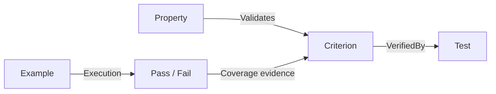

import { Aside, Steps } from '@astrojs/starlight/components';
import { TrackedFiles } from '../../../components/supersigil';

<TrackedFiles paths="crates/supersigil-verify/src/examples/*.rs" />

Executable Examples turn code samples in your specs into tests. Instead of documentation snippets that silently rot, your examples run on every `supersigil verify` and fail when they no longer match reality.



## The `<Example>` Component

The `<Example>` component embeds a runnable code sample in any spec document:

````mdx
<Example id="greeting" runner="sh" verifies="cli/req/help#shows-version">

```sh
supersigil --version
```

<Expected status="0" contains="supersigil" />

</Example>
````

The code block inside `<Example>` is extracted and executed by the specified runner. If the example has a `verifies` attribute, a passing result produces verification evidence that counts toward criterion coverage.

### Attributes

| Attribute | Required | Description |
|-----------|----------|-------------|
| `id` | yes | Unique identifier within the document |
| `runner` | yes | Execution strategy: `sh`, `cargo-test`, `http`, or a custom runner name |
| `lang` | no | Language of the code block. If omitted, derived from the fenced code block's language tag |
| `verifies` | no | Comma-separated criterion refs (e.g., `doc/req#crit-1, doc/req#crit-2`). Passing examples with `verifies` produce coverage evidence |
| `references` | no | Comma-separated criterion refs. Informational only -- creates reference edges but does not produce coverage evidence |
| `timeout` | no | Max execution time in seconds. Overrides the global default |
| `env` | no | Comma-separated `KEY=VALUE` pairs injected as environment variables |
| `setup` | no | Path to a setup script (relative to project root) run before the example |

<Aside type="tip">
Use `verifies` when the example is a deterministic test that should count toward spec coverage. Use `references` when the example demonstrates related behavior but is not a rigorous verification.
</Aside>

## The `<Expected>` Component

`<Expected>` is a child of `<Example>` that declares the golden output. When the example runs, its output is compared against this expectation.

````mdx
<Expected status="0" format="json">

```json
{
  "id": "<any-string>",
  "count": 42
}
```

</Expected>
````

### Attributes

| Attribute | Required | Description |
|-----------|----------|-------------|
| `status` | no | Expected exit code (for shell runners) or HTTP status code (for the `http` runner) |
| `format` | no | Matching mode: `json`, `text`, `regex`, or `snapshot`. Defaults to `text` |
| `contains` | no | Substring the output must contain. Simpler alternative to full body matching |

All specified checks are conjunctive -- status, contains, and body must all pass for the example to succeed.

### Matching Modes

**`text`** -- Exact match after trimming leading and trailing whitespace from both expected and actual output.

**`json`** -- Deep JSON comparison with wildcard support for non-deterministic fields:

| Wildcard | Matches |
|----------|---------|
| `<any-string>` | Any JSON string value |
| `<any-number>` | Any JSON number value |
| `<any-uuid>` | Any UUID string (e.g., `550e8400-e29b-41d4-a716-446655440000`) |
| `<any-iso8601>` | Any ISO 8601 datetime string |

Arrays are compared element-by-element (same length required). Objects are compared key-by-key (same keys required).

**`regex`** -- The expected body is compiled as a regex and matched against the full output.

**`snapshot`** -- Same as text matching on normal runs. When `--update-snapshots` is passed, a mismatch rewrites the expected body in the source MDX file instead of failing.

<Aside>
The `json` matcher with wildcards is the most common mode for API examples. It lets you assert on structure and deterministic fields while ignoring generated IDs, timestamps, and other dynamic values.
</Aside>

## Runners

Runners are the execution engines for examples. Each runner knows how to take the code block, execute it, and capture output for matching.

### Built-in Runners

**`sh`** -- Writes the code block to a temp file and runs it with `sh`. Stdout is captured for matching. The exit code is available for `status` checks.

**`cargo-test`** -- Scaffolds a minimal Cargo project in a temp directory, writes the code block as a test file, and runs `cargo test`. If the code block does not contain `#[test]`, the runner wraps it in a test function automatically.

**`http`** -- A native runner (no subprocess). Parses the code block as an HTTP request and sends it. The format is:

````mdx
<Example id="create-task" runner="http" env="BASE_URL=http://localhost:3000">

```http
POST /api/v1/tasks
Content-Type: application/json

{"title": "Buy milk"}
```

<Expected status="201" format="json">

```json
{
  "id": "<any-uuid>",
  "title": "Buy milk"
}
```

</Expected>

</Example>
````

The first line is `METHOD URL`. Subsequent lines until the first blank line are headers. Everything after the blank line is the request body. Relative URLs are prefixed with the `BASE_URL` environment variable.

### Custom Runners

Define custom runners in `supersigil.toml` using command templates with placeholders:

```toml title="supersigil.toml"
[examples.runners.pytest]
command = "python -m pytest {file} -v"

[examples.runners.node]
command = "node {file}"
```

| Placeholder | Value |
|-------------|-------|
| `{file}` | Path to the temp file containing the code block |
| `{dir}` | Path to the temp directory |
| `{lang}` | The `lang` attribute value |
| `{name}` | The `id` attribute value |

User-defined runners take precedence over built-ins if there is a name conflict.

## Execution Flow

When `supersigil verify` runs:

<Steps>

1. **Structural checks run first.** All rules except coverage are evaluated: broken refs, missing attributes, and so on.

2. **If structural errors exist, examples are skipped.** There is no point running examples against a broken spec graph. Coverage is evaluated against whatever evidence exists without examples.

3. **If no structural errors, examples execute.** Examples run concurrently up to the configured parallelism (default: half of available CPU threads). Each example gets a fresh temp directory, optional setup script, runner execution, and output matching.

4. **Passing examples with `verifies` produce evidence.** This evidence is merged into the artifact graph.

5. **Coverage is evaluated.** With example evidence included, criteria that were previously uncovered may now be satisfied.

6. **The final report includes everything.** Structural findings, example results, and coverage findings are combined into the verification report.

</Steps>

## Configuration

```toml title="supersigil.toml"
[examples]
# Default timeout for all examples in seconds (default: 30)
timeout = 30

# Maximum concurrent example executions (default: half of CPU threads, min 1)
parallelism = 4

# Custom runners
[examples.runners.pytest]
command = "python -m pytest {file} -v"
```

## CLI Commands

**List examples:**
```bash
supersigil examples                  # Scoped to cwd via TrackedFiles
supersigil examples --all            # All examples (no scoping)
supersigil examples auth/            # Filter by document ID prefix
supersigil examples --format json    # Machine-readable output
```

**Run verification (includes examples):**
```bash
supersigil verify
```

**Skip examples during verify:**
```bash
supersigil verify --skip-examples
```

**Update snapshots:**
```bash
supersigil verify --update-snapshots
```

**Override parallelism:**
```bash
supersigil verify -j 1              # Force sequential
supersigil verify --parallelism 8   # Run 8 examples concurrently
```

## Walkthrough

Let's add an executable example to a spec and see it run.

<Steps>

1. **Start with a requirement that has a criterion**

   ```mdx title="specs/cli/req/help.mdx"
   ---
   supersigil:
     id: cli/req/help
     type: requirement
     status: approved
   ---

   # CLI Help Output

   <AcceptanceCriteria>
     <Criterion id="shows-version">
       WHEN a user runs the CLI with --version
       THE SYSTEM SHALL print the version string to stdout
     </Criterion>
   </AcceptanceCriteria>
   ```

2. **Add an example that verifies the criterion**

   ````mdx title="specs/cli/req/help.mdx" ins={4-14}
   </AcceptanceCriteria>

   ## Examples

   <Example id="version-check" runner="sh" verifies="cli/req/help#shows-version">

   ```sh
   supersigil --version
   ```

   <Expected status="0" contains="supersigil" />

   </Example>
   ````

   This example runs `supersigil --version`, checks that the exit code is 0, and checks that the output contains "supersigil".

3. **List examples to confirm it was picked up**

   ```bash
   supersigil examples
   ```

   ```
   DOCUMENT       EXAMPLE          LANG  RUNNER  EXPECTED  VERIFIES
   cli/req/help   version-check    sh    sh      yes       cli/req/help#shows-version

   1 examples
   ```

4. **Run verification**

   ```bash
   supersigil verify
   ```

   If the example passes, its `verifies` ref produces evidence for the `shows-version` criterion. The coverage report reflects this.

5. **See what happens when an example fails**

   Change the `<Expected>` to expect something wrong:

   ```mdx
   <Expected status="0" contains="nonexistent-string" />
   ```

   Now run verify again:

   ```bash
   supersigil verify
   ```

   The output reports the example failure with the specific check that failed (contains mismatch), showing what was expected and what was actually produced.

</Steps>

## Error Handling

| Failure | Behavior |
|---------|----------|
| Unknown runner name | Example fails with an error finding |
| Runner process times out | Example fails with a timeout diagnostic |
| Setup script exits non-zero | Example fails before the runner runs |
| JSON parse failure in matcher | Example fails with a parse error |
| Invalid regex in Expected body | Example fails with a compile error |
| `verifies` ref pointing to nonexistent criterion | Caught at graph build time as a broken reference (hard error) |
| Zero or multiple code blocks in Example | Caught at structural verify time as a lint error |

Example failures are non-fatal to the overall verify pipeline. They produce findings but do not abort the run -- other examples and checks continue.

## Best Practices

**Keep examples minimal.** Each example should test one scenario against one or two criteria. Complex setup belongs in a `setup` script.

**Use JSON wildcards for non-deterministic fields.** Fight against flaky tests by using `<any-uuid>`, `<any-iso8601>`, and friends instead of hardcoding generated values.

**Use `--skip-examples` during rapid iteration.** If example execution is slow (e.g., HTTP runner against a real service), skip them while iterating on spec structure and run the full verify in CI.

**Put examples close to the criteria they verify.** An example in the same document as its criterion makes the spec self-contained and easier to review.
